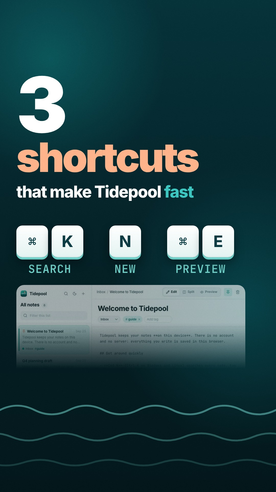

# 05 · Vertical short: 3 Tidepool shortcuts (Reels, 15 s)



**Video:** [`final.mp4`](final.mp4) · 1080x1920 · 30 fps · 15.00 s · 6.9 MB · -14.0 LUFS / -1.5 dBTP
(re-rendered for the stricter check: see "Re-render" at the end of the review round)

## The request

> "Make a 15-second vertical short for Reels: 3 keyboard shortcuts that make Tidepool fast"
> 1080x1920, hook in first 2 s, karaoke captions from the voiceover, safe zones, punchy music, SFX on cuts.

**Mode:** quick (no questions asked). The opening line stated the assumptions:
Cmd+K, N and Cmd+E as the three shortcuts, a synthetic voice-over (`af_bella`) with bold-pop karaoke
captions, a composed upbeat-tech bed, and SFX on every cut and key press.

Tidepool is a **fictional** local-first notes app that lives in [`../_apps/tidepool`](../_apps/tidepool).
The end card says so, and so does `share.txt`.

## What it demonstrates

- **Real UI, not a mock-up.** The app was driven by a script (`showtime demo record`) and the
  clean recording is placed in the composition as a `<video>`. A camera, written as a pure function
  of time, pushes into the palette, the new note and the preview.
- **Timing comes from the voice.** `voice script --fit` sized the narration, then `retime --from-voice`
  set every scene length, placed each line as its own voice track, ducked the music and moved the
  caption words. No `data-dur` was edited by hand.
- **Short-form rules.** Frame 0 already holds the whole hook: the title, all three keycaps and a faded
  strip of the real app window below them (a still from the same recording). It is
  also the cover (`poster: 0`) and the loop point, so autoplay and every loop start on the same picture.
  In the first 2.8 s only emphasis moves: "3" and "fast" bump (to 1.22x) on the spoken word, and the key row
  is pressed at 2.3, 2.5 and 2.7 s. Captions are centred at 64 % height, and all text stays inside the
  x 64-916 / y 220-1440 safe box (`check` reports 0 safe-zone warnings). The ending loops because the
  close reuses the hook's key row in the same place.
- **A product-world spine.** The tide line from Tidepool's logo drifts under every scene on the global
  clock. Key presses send out ripple rings. Every cut, including the one into the end card, is a
  0.4 s push.
- **One sound family in A minor.** A composed bed (riser into the drop on the first cut, outro on the
  close), a swoosh on each cut, a keyclick on each shortcut, pops on "3" and "fast", a keyclick on each hook key, and a
  logo sting on the end card. The bed ducks under the voice (voice-to-music 12.3 dB).

## Commands, in order

`showtime` is `skills/showtime/bin/showtime`. `<job>` is
`showtime-out/tidepool-shortcuts-short-20260926-134453`.

```bash
showtime doctor --quick
showtime job init tidepool-shortcuts-short --platform reels --mode quick \
  --goal "15-second vertical Reels short: 3 keyboard shortcuts that make Tidepool fast. ..." \
  --assumed "Shortcuts shown: Cmd+K (palette), N (new note), Cmd+E (preview)" \
  --assumed "Voice-over af_bella (synthetic), bold-pop karaoke captions" \
  --assumed "Composed upbeat-tech bed, no library music" \
  --assumed "Tidepool is fictional; shown as such in share copy"

# real UI: script the three shortcuts against the static app
showtime demo init <job>/work/starter.mjs                       # to read the helper list
showtime demo record <job>/work/shortcuts.mjs <job>/work/demo --serve examples/_apps/tidepool
showtime footage scenes <job>/work/demo/demo.mp4 --every 0.5 -o <job>/work/demo-sheet   # look at it

# project, voice, fonts
showtime new short <job>/project --duration 15
showtime voice script <job>/project/narration.md -o <job>/project/voice --fit 13.5
showtime assets font inter --copy-to <job>/project/fonts
showtime assets font "JetBrains Mono" --copy-to <job>/project/fonts
showtime demo record <job>/project/shortcuts.mjs <job>/work/demo --serve examples/_apps/tidepool  # re-record: longer preview hold
#   (demo.mp4 copied to project/media/shortcuts.mp4)
showtime footage probe <job>/project/media/shortcuts.mp4

# timing from the voice
showtime retime <job>/project --from-voice <job>/project/voice/timeline.json --dry-run
showtime retime <job>/project --from-voice <job>/project/voice/timeline.json

# first look, fix, look again
showtime check <job>/project                                    # 5 warnings -> fixed (hook size, footnote overlap)
showtime snap <job>/project --at 0.8,2.3,4.3,7.6,10.9,14.5
showtime snap <job>/project --at 0.25,3.3,10.9,12.0
showtime check <job>/project                                    # 1 safe-zone warning -> hook moved down
showtime check <job>/project --no-timeline                      # PASS, 0 warnings
showtime snap <job>/project --at 2.65                           # cover frame without a caption
showtime job note <job> --stage first-look --verified "..." --next "final render"

# final, verify, deliver
showtime render <job>/project --job <job>
showtime qa <job>
showtime review-pack <job>
showtime deliver exports <job> --targets reels,tiktok,shorts
# review round 1 (see "Review round" below): edit, check, re-render, qa, export, qa
showtime snap <job>/project --at 0,0.5,1.5,2.4,2.75,4.0,4.387,6.976,9.0,9.671,11.558,11.69 --sheet
showtime check <job>/project                                    # PASS, 0 warnings
showtime render <job>/project --job <job>                       # final-2.mp4
showtime qa <job>
showtime deliver exports <job> --targets reels,tiktok,shorts
showtime review-pack <job> --platform reels                     # round 2
showtime render <job>/project --job <job>                       # final-3.mp4 (caption wrap fix)
showtime qa <job>
showtime deliver exports <job> --targets reels,tiktok,shorts
showtime qa <job>/exports/final-3.reels.mp4 --platform reels --project <job>/project
showtime qa <job>/exports/final.reels.mp4 --platform reels --project <job>/project
showtime job note <job> --stage deliver --verified "..."
# review round 2 fixes (see "Review round" below)
showtime snap <job>/project --at 0.45,4.4,5.0,5.2,5.3,5.4,6.35,6.65,8.2,8.6,11.45,11.55,11.62,13.3 --sheet   # before
~/.showtime/bin/ffmpeg -ss 0.2 -i <job>/project/media/shortcuts.mp4 -frames:v 1 \
  -vf "crop=1800:700:0:0,scale=1344:-2" <job>/project/media/app-peek.jpg                        # hook app strip
showtime check <job>/project                                    # PASS, 0 warnings
showtime snap <job>/project --at 0,0.47,1.9,4.4,5.0,5.2,5.3,5.4,6.35,6.65,7.2,8.2,8.6,9.3,11.45,11.55,11.62,13.3,14.5 --sheet   # after
showtime render <job>/project --job <job>                       # final-4.mp4
showtime qa <job>
showtime deliver exports <job> --targets reels,tiktok,shorts
showtime qa <job>/exports/final-4.reels.mp4 --project <job>/project
showtime audio meter <job>/exports/final-4.reels.mp4
```

The published `final.mp4` is `exports/final-4.reels.mp4`. The CRF 16 master came out at 20.8 MB, and
the Reels export is 7.1 MB, re-normalised to -14 LUFS.

## Timings

Measured on a shared 6-core Intel i5-8500 with about three other renders running at the same time.

| Step | Time |
|---|---|
| `demo record` (378 frames, 900x1100 @2x) | 32 s |
| `voice script --fit 13.5` (5 lines, 36 words) | 24 s |
| `check` (full timeline pass) | 48-51 s |
| `render` final (450 frames, 3 workers) | 1 min 51 s: capture 1 min 07 s at 6.7 fps, encode 29 s |
| `qa` | 10 s |
| `review-pack` | 22 s |
| `deliver exports` (3 targets) | 1 min 13 s |
| review round: `check` / `render` / `qa` / `deliver exports` | 45-56 s / 1 min 34-55 s / 6-11 s / 1 min 13 s |

## QA summary

`showtime qa` returned **PASS (0 fail, 0 warn, 0 note)** on both the master and the Reels export:

- file: h264 High, yuv420p, 1080x1920 at 30 fps, faststart, BT.709
- duration: 15.00 s, matching the expected 15 s
- aspect: fits Reels
- loudness: -14.0 LUFS, true peak -1.5 dBTP (master: -14.0 LUFS, -1.6 dBTP); `audio meter`: -13.99 LUFS, TP -1.47 dBTP
- audio: no silent gaps
- frame 0: has a picture (the hook, which is also the poster)
- no black or frozen stretches
- captions: burned in (`data-caption`)
- no attribution required

The mix report has no warnings, LRA 1.6 LU and voice-to-music 12.3 dB. These are the numbers for
the round-2 render (`final-4`). The current `final.mp4` is the re-render at the end of "Review round"
(qa PASS, 0 fail, 0 warn, 0 note, -14.0 LUFS, -1.5 dBTP on the Reels export).

## Files

```
final.mp4            the Reels export (qa PASS)
poster.jpg           cover frame = frame 0 (the fully built hook)
share.txt            post copy + posting notes
project/
  index.html         five scenes (hook, palette, new, preview, close) + caption layer + camera/waves script
  showtime.json      1080x1920, 30 fps, 15 s, poster 0, expect: reels
  audio/mix.json     composed bed, SFX, one voice track per line (written by retime)
  narration.md       the voice script (one `## <scene id>` per line)
  voice/             timeline.json, captions.words.json, per-line WAVs and word timings, vo.srt
  shortcuts.mjs      the demo script that drives Tidepool
  media/             shortcuts.mp4 (the recording), app-peek.jpg (a still from it, for the hook), logo.svg (Tidepool's mark)
  fonts/             Inter, JetBrains Mono (OFL-1.1, with licences)
```

To re-render: `showtime render examples/05-short-vertical/project`.

## Review round

A critic pass on the first final (`review-pack` round 1) said "ship after fixes": no blockers, 4
should-fix items and 6 polish items. I snapped each cited time first and every finding was there.
The critic step was done in the same session against `CRITIC.md`, because no separate reviewer agent
could be started. Changes:

1. **One-frame flash at the start and at every loop (0.000-0.033 s), should-fix.** Frame 0 was the
   baked 2.65 s poster and frame 1 was an almost empty hook that then built up again. Now the hook is
   fully built from frame 0 and `poster` is 0, so frame 0 is both the cover and the real first frame.
2. **"COMMAND / K SEARCHES" and "COMMAND / E FLIPS" (4.0 s, 9.0 s), should-fix.** The caption line
   used `text-wrap: balance`, which moved the key to the next line. A one-line project CSS rule
   (`.st-cap .st-cap-line { text-wrap: wrap }`) gives "COMMAND K / SEARCHES" and "COMMAND E / FLIPS".
   Joining the words with a no-break space also worked, but it changed how the cards were grouped
   ("SEARCHES EVERY / NOTE AS"), so I dropped that approach.
3. **The hook said its sentence twice (0.3-2.2 s), should-fix.** The karaoke caption for the hook line
   is off (those words are `type: "hidden"` in `voice/captions.words.json`), so the title carries it
   for muted viewers.
4. **The typed query was the smallest text (3.5-5 s), should-fix.** The palette camera now pushes to
   1.5x on the search field and result rows (app region x 145, y 135, 413 px wide) while typing, and
   eases back out for the note opening.
5. **Hook held still for about 1.3 s (1.4-2.8 s), polish.** The hook keys are pressed at 2.3, 2.5 and
   2.7 s with ripple rings and a keyclick each. "3" and "fast" bump on the spoken word.
6. **Card crops cut through UI (6.976 s, 9.671 s), polish.** The new-note and preview cards fade into
   the card colour over their last 56-64 px on the right and bottom edges. The palette card fades on
   the right only.
7. **"TIDEPOOL." caption under the wordmark (11.69 s), polish.** That one caption word is hidden.
8. **Ripple too strong (11.45-11.6 s), polish.** The transition is 0.4 s instead of 0.7 s. The shader
   has no amplitude option, so the dark centre still showed for a few frames; the second critic
   pass below replaced it with a push.
9. **Uneven caption word gaps (6.976 s, 14.967 s), polish: not changed.** The active-word pop is a
   transform scaled from the word's centre, so it doesn't change the layout. The wider-looking gaps
   follow the letter shapes ("H" and "N" have straight stems, "Y" is open), not the spacing.
10. **README accuracy.** The claim "all three keycaps land by 1.4 s" was replaced; the hook is now
    complete in frame 0.

Round 2 (`review-pack` round 2 on `final-2`) found that the no-break-space approach from item 2 had
regrouped the captions. That led to the `text-wrap` fix and `final-3`. `check` passed with 0 warnings
before each render. `qa` passed (0 fail, 0 warn) on `final-3.mp4` and on the published Reels export.

### Second critic pass (on `final-3`)

A second critic pass on the published `final-3` Reels export said "ship after fixes": no blockers,
2 should-fix items and 6 polish items. It confirmed round-1 items 1-4, 6 (mostly) and 7, and accepted
the disagreement on item 9. I snapped each cited time first; every finding was there. Changes, in
`final-4`:

1. **Three caption cards flickered past in 0.5 s (6.27-6.73 s: "HIT N", "FOR A" for about 5 frames,
   "FRESH NOTE."), should-fix.** The caption layer drops to two words per card when speech is dense
   and has no manual break, so the fix is in the data: in `voice/captions.words.json` the pairs
   "Hit N", "for a" and "fresh note." are single timed tokens. The line is now one 1.4 s card,
   "HIT N FOR A / FRESH NOTE.", highlighted in three steps on the spoken times.
2. **Local user name and scratch paths in the published JSON, should-fix.** The `source`, `script`
   and `lexicon` fields of `voice/timeline.json`, `vo.words.json`, `captions.words.json` and
   `lines/*.words.json` are now relative (`vo.wav`, `../narration.md`, `01-hook.wav`, ...). Nothing reads
   them at render time.
3. **The note opened while the camera was still at 1.5x (5.27-5.43 s), polish.** The palette zoom-out
   now starts at 4.83 s and ends at 5.26 s, before Enter (5.28 s), so the note appears framed on its title.
4. **The ripple into the end card read as mud (11.47-11.67 s), polish.** That cut is now the same 0.4 s
   push as the other cuts, and its water-drop sound became the same swoosh.
5. **The hook was close to a static title card with an empty lower band (0.4-2.3 s), polish.** The
   "3" and "fast" bumps go to 1.22x (was 1.12x) and last 0.6 s. A faded strip of the real app window
   (a still from the recording) fills y 1112-1440, so frame 0 and the first second show a notes app.
6. **Grey backdrop smear under the palette footer (3.5-5.2 s), polish.** The zoomed palette view is
   380 app px wide instead of 413, so the crop ends at the footer.
7. **"KEPT ON" card for 0.35 s (13.15-13.47 s), polish.** Same token merge as item 1 ("on your", "own
   machine."): the close is "YOUR NOTES," then "KEPT ON YOUR / OWN MACHINE.", held to the end.
8. **The Markdown "before" state was small (8.0-8.8 s), polish.** The preview camera pushes in on the
   Markdown source (470 app px wide) before Cmd+E, so the flip at 8.78 s shows a readable before and
   after, then eases out over the rendered view.

`check` passed with 0 warnings before the render. `qa` passed (0 fail, 0 warn, 0 note) on
`final-4.mp4` and on the published Reels export.

**Known issues:** "HIT N" is one caption token, so its whole pair stays in the accent colour (only the
key is coloured in "COMMAND K"), and its pop scale leaves a slightly narrow gap before "FOR". The merged
tokens are a data workaround: the caption layer has no manual line or card break.

### Re-render: stricter check (2026-09-28)

`showtime check` was made stricter after this example shipped: readable text must be at least 2.2 % of
the frame height (43 px on a 1920 px tall frame). On the unchanged project it gave one warning covering
10 texts at 26-30 px: the key names under the hook and end-card keycaps ("SEARCH", "NEW", "PREVIEW",
28 px), the step counters ("01 / 03", "02 / 03", "03 / 03", 30 px) and the "A fictional demo app" pill
(26 px). There was no contrast finding.

- **Changes (index.html only):** `.step` 30 -> 44 px (letter-spacing .08 -> .06em, margin under it
  26 -> 18 px so the keycap row stays above the app card), `.grp small` 28 -> 44 px (gap to the keycaps
  30 -> 24 px, letter-spacing .06 -> .04em), `.fiction` 26 -> 44 px (letter-spacing .04 -> .02em).
  Layout, timing, sound and captions are unchanged.
- **check:** PASS, 0 errors, 0 warnings.
- **Render:** a Linux x64 machine (32 cores): 41 s for 450 frames (capture 36 s at 12.4 fps, encode
  3.4 s), 23.0 MB CRF 16 master; `deliver exports --targets reels` -> 7.0 MB, which is `final.mp4`.
  The review-round renders on the 6-core Mac took 1 min 34-55 s. **qa** on the Reels export: PASS
  (0 fail, 0 warn, 0 note), -14.0 LUFS, -1.5 dBTP. `poster.jpg` is frame 0 (poster 0, baked).
- **Review:** `review-pack` on the Reels export, then a self-review of the contact sheet and the
  full-size text crops (no separate critic ran). The larger labels read at phone size and sit clear of
  the keycaps, the app card and the caption band. No new findings. The known issue above ("HIT N" as
  one caption token) is unchanged.

### Critic review of the re-render (2026-09-28)

A separate critic reviewed the re-rendered Reels file: not ready, because of one blocker.

- **Blocker, 5.967 s (frame 179):** for one frame the "01 / 03 Find any note" header vanished and the
  card showed the app's "All notes / Welcome to Tidepool" screen. Frames 180-184 went back to the
  "Standup, Sep 24" note, then the push began. **Cause:** the `new` scene starts at 2.807 + 3.16 =
  5.967 s, 0.33 ms after frame 179 (5.96667 s). The stage treats a clip edge within 1 ms of a frame as
  on that frame, so at frame 179 it already showed `new` and hid `palette`. The showtime runtime used
  for this render did not apply that 1 ms rule to the transition window, which therefore opened at
  frame 180. So frame 179 showed `new` alone and not pushed, at its local time 0: header not built in
  yet, and the recording at 4.017 s framed wide. The current runtime applies the same rule to the
  window. **Change (works on both runtimes):** `palette` `data-dur` 3.16 -> 3.1596, so the cut is at
  5.9666 s, on frame 179 exactly. The later scenes move by 0.4 ms (no frame changes). The swoosh stays at
  5.967 s.
- **Proof:** a scan of every pair of consecutive frames (mean absolute difference, 240 px wide gray)
  looked for frames that differ from both neighbours while the neighbours match. In the previous file
  it flags frame 179 (10.33 and 10.34 to its neighbours, 0.86 between them). In this file it flags no
  frame. At all four cuts (2.807, 5.967, 7.984, 11.357 s) the difference changes smoothly, from under
  1/255 before the cut to the push.
- **Polish, 6.98 s:** in "HIT N FOR A" the gap after "N" was about 25 px against about 45 px elsewhere:
  an emphasised caption token keeps its 1.14x pop scale after it is spoken, and on a wide token ("Hit N")
  the scale takes most of the space. **Change:** an emphasised token returns to 1x once spoken
  (`.st-cap-bold-pop .st-cap-emph[data-state="spoken"] { transform: none !important; }`) and keeps
  its accent colour. It still pops while it is spoken. The gaps are now even.
- **Not changed:** the last frame shows the payoff caption half faded (polish, the same as the old file).
- **check:** PASS, 0 errors, 0 warnings. **Render:** Linux x64 box, 450 frames in 33 s, 22.9 MB master,
  `deliver exports --targets reels` -> 6.9 MB, which is `final.mp4`. **qa** on it: PASS (0 fail, 0 warn,
  0 note), -14.0 LUFS, -1.5 dBTP. `poster.jpg` is frame 0.

## Sources and licences

- **App and logo:** Tidepool, a fictional demo app in this repo (`examples/_apps/tidepool`). It has no
  real users, numbers or testimonials, and the video makes no claims beyond what the app does.
- **Voice:** synthetic, Kokoro-82M `af_bella` (Apache-2.0 weights), run locally.
- **Music:** composed locally with `upbeat-tech` style, 124 bpm, A minor, seed 3. No samples, no library tracks.
- **SFX:** procedural (`pop`, `swoosh-in`, `keyclick`, `logo-sting`).
- **Fonts:** Inter and JetBrains Mono, SIL OFL-1.1.
- No CC-BY assets, so no `credits.txt` is needed.
