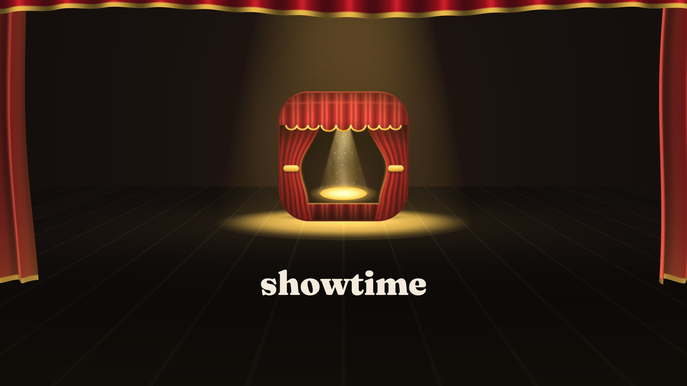

# 20 · Studio mode: a Curtain Call motion pack (3D sting, lower thirds, stingers)

A motion pack for showtime's own brand, **Curtain Call** (`assets/brand/`): a new 5-second 3D logo sting in
three native layouts (16:9, 1:1, 9:16) with a sound logo, four lower thirds and two transition stingers with
alpha for an editor, plus web versions of the sting. It was made in **studio mode**: concepts on a local board
first, then a storyboard and animatic sign-off, then the build.

The existing brand sting (`assets/brand/motion/sting.mp4`) is **not replaced**. This pack is new work kept in
this folder; adopting it as sting v2 is a separate decision for the brand owner (decision D-006 and D-015).



| file | what it is |
|---|---|
| [`final.mp4`](final.mp4) | the sting, 16:9: 1920x1080, 30 fps, 5.00 s, H.264 + AAC, 2.4 MB |
| [`final-1x1.mp4`](final-1x1.mp4) | the sting, 1:1: 1080x1080, 5.00 s, 1.6 MB (rendered through the MCP server, see below) |
| [`final-9x16.mp4`](final-9x16.mp4) | the sting, 9:16: 1080x1920, 5.00 s, 2.8 MB |
| [`poster.jpg`](poster.jpg) | the lockup at 4.6 s (frame 0 of the video is the curtain slit, on purpose) |
| [`pack/lower-thirds/`](pack/lower-thirds) | 4 lower thirds, 1920x1080, 6.00 s each: `lt-bar`, `lt-card`, `lt-kicker`, `lt-pill` as VP9 `.webm` with alpha (60-96 KB), and `lt-bar/card/pill.mov` as ProRes 4444 with alpha (15-18 MB) |
| [`pack/stingers/`](pack/stingers) | 2 transition stingers, 1920x1080, 1.00 s, VP9 `.webm` with alpha: `stinger-curtain` (CSS curtain sweep), `stinger-chromatic` (velvet into the lit stage through the WebGL `chromatic-split`) |
| [`pack/sfx/`](pack/sfx) | a whoosh for each stinger (WAV, `audio sfx`): place it at the stinger's in-point and its hit lands on the cut (0.50 s curtain, 0.45 s chromatic); 1.2 s and 1.1 s long, each with a `.sfx.json` sidecar |
| [`loops/`](loops) | the sting as a silent web hero loop: `sting.loop.webp` (960x540, 15 fps, 0.84 MB) and `sting.loop.gif` fallback (806x454, 10 fps, 4.6 MB) |
| [`html/curtain-call-sting-embed.html`](html/curtain-call-sting-embed.html) | the sting as one self-contained HTML file for embedding: no controls, autoplays muted, loops (0.96 MB, no network requests) |
| [`html/sting-embed-site/`](html/sting-embed-site) | the same embed as a hosting folder (`index.html` + `assets/`, 2.9 MB) |
| [`html/curtain-call-sting-player.html`](html/curtain-call-sting-player.html) | the sting in the full HTML player (0.85 MB, exported through the MCP server) |
| [`studio-board.html`](studio-board.html) | the studio board, rev 5, as one self-contained HTML file (3.6 MB): the four concepts with their frames and beds, the storyboard, the animatic, the pack parts, and the decision log D-002..D-017 |
| [`share.txt`](share.txt) | post copy for X/Bluesky, LinkedIn, YouTube and a README |
| [`project/`](project) | the showtime projects: `sting-16x9/` (the master), `sting-1x1/`, `sting-9x16/`, `lower-thirds/`, `stingers/`, `sync-aspects.py`, and `trimfade.py` (caps a whoosh with a fade) |
| [`studio/`](studio) | `brief.md`, `decisions.md`, `board.json` + every revision in `boards/`, the style-frame compositions in `comps/`, `feedback.json` and the simulated reviewer rounds in `feedback-sim/` |
| [`crew/`](crew) | the crew hand-offs: creative director (`concepts.md/json`, the W1 frame project), brand designer (kit, contrast table, extractor diff), sound designer (bed notes and mixes) |
| [`review/`](review) | `FINDINGS.md` of the two self-review rounds, and `round-3/`: before/after sheets for the fixes from the third, separate critic pass |
| [`mcp/`](mcp) | the stdio MCP client used for part of the build, the call lists and a transcript summary |

Three ProRes files are over the repository's 20 MB per-video limit and are not in this folder:
`lt-kicker.mov` (24.8 MB), `stinger-curtain.mov` (32.4 MB) and `stinger-chromatic.mov` (26.6 MB). Each is one
command from `project/` (about 30-60 s here):

```bash
showtime render lower-thirds --page kicker.html --alpha prores --no-audio -o lt-kicker.mov
showtime render stingers --page curtain.html --alpha prores --no-audio -o stinger-curtain.mov
showtime render stingers --page chromatic.html --alpha prores --no-audio -o stinger-chromatic.mov
```

## The request

> Using our Curtain Call brand, give me a motion pack: a new 3D logo sting in wide, square and vertical, four
> lower thirds my editor can drop into Premiere, and a couple of branded transitions. Show me concepts first.

**Mode:** studio ("show me concepts first", SKILL.md *Modes*). Nothing was asked in chat: the brand is in the
repo (`assets/brand/brand.json`, `BRAND.md`, `LICENSE.md`), so the look, the rules and the files came from
there. Everything about look, sound and timing went on the board.

The reviewer in this example is **simulated**. The brief for this example said "the board decides": the agent
played the user, wrote each round's reactions as a `feedback.json` (`studio/feedback-sim/`), brought them in with
`showtime studio feedback --import` (the same path a reviewer on another machine uses), and recorded every pick
with its rationale in `studio/decisions.md`. The rationale for the concept pick is written there in full (D-002).

**Crew.** The brief called for the creative director, brand designer, sound designer and motion designer, and a
critic. This session had no sub-agent tool, so the agent did each hand-off itself from the same task brief and
says so in each file (`crew/*/TASK.md`, `review/*/FINDINGS.md`), as `references/crew.md` section 3 prescribes.
The critic's two rounds are therefore **self-reviews**; a second look by a person is still worth having.

## How the studio session went

**Round 1: concepts (board rev 1).** Three directions that differ in device, plus a wildcard, each with style
frames and a 10 s bed in D (the brand sound logo's key):

| tag | concept | style frames from | bed |
|---|---|---|---|
| C1 | **Velvet curtain** *(recommended)*: a real 3D stage, velvet curtains part, the mark is flown in from the flies and lands in the spotlight pool | a working three.js draft of the sting (`studio frame --project`) | `piano-emotional` + `logo-sting` on the landing |
| C2 | **Marquee**: bulbs chase around an empty marquee board, then the lockup lights up | a composition (`comps/c2-marquee.html`) | `synthwave` |
| C3 | **Spotlight**: no curtain, one follow-spot searches a dark stage and finds the mark | a composition (`comps/c3-spotlight.html`) | `ambient-pad` + `swell` into a hit |
| W1 | **Arcade marquee** *(wildcard)*: an 8-bit "NOW SHOWING" marquee pixel-dissolves into the mark | a small project with the WebGL `pixel-dissolve` (`crew/pitch-cd/w1-arcade/`) | `retro-8bit` |

The board also asked four build questions (lower-third type, which WebGL stinger, which sound logo, replace v1
or not). The simulated reviewer picked **C1** and its bed, liked the curtain-slit hook ("keep frame 0 like
this"), asked that the mark land squarely and that the wordmark sit on the dark floor, not on the gold, parked W1
("a pixelated mark breaks our own brand rules"), answered Fraunces 900 names, `chromatic-split`, a new logo
motif in D, and "ship as a pack first".

**Round 2: storyboard, animatic and the pack (rev 2).** A four-shot storyboard with thumbs from the real draft
(`studio frame --storyboard`), the half-size animatic with the real mix, and the rest of the pack in C1's look as
two extra cards (LT: the four lower thirds; TR: the two stingers). The reviewer approved the animatic ("the
landing on the logo note is the moment, keep it exactly here"), kept the placeholder names and asked for a
bigger gold dot on the pill lower third, which was done before the renders (D-012).

**Revs 3-4: build, review, ship.** The three stings, the lower thirds and the stingers were rendered and
checked; the first review round found two craft defects on the curtains (next section), which were fixed and
re-rendered; round 2 said ship. Rev 4 carries the decision log onto the board. **Rev 5** follows a third, separate
critic pass (see QA): its fixes are D-017, and D-016 corrects the simulated feedback's timestamps; rev 5 is the one
exported here.

## The sting, shot by shot (5.0 s)

| time | picture | sound | job |
|---|---|---|---|
| 0.00-0.15 | velvet curtains almost closed; a slit of gold light (about 12 % of the width in every layout) shows the pool already lit on the boards (frame 0 is this) | piano pickup, a low D drone | instant recognition in a feed: a stage before the show |
| 0.15-2.30 | the drapes ease open (the hem trails the top by 0.14 s, the leading edges follow their folds), the camera dollies in 7 % | a heavy velvet whoosh | the brand idea itself: the curtain opens |
| 2.05-2.80 | the mark is flown in from the flies, turning to face the camera, and lands in the pool at 2.80 s; the pool flares once | `logo-sting` motif in D with its tonic on 2.80, a thock and a soft boom, the piano's chorus downbeat | the logo, on the hit |
| 3.05-5.00 | the wordmark wipes up on the dark apron (it draws over about 0.3 s and is fully readable from about 3.5 s) and holds; dust keeps turning in the beam | a shimmer, the piano fades | the name, readable before the cut |

**How it is built.** One three.js scene (`project/sting-16x9/sting.js`) driven by `ST.three(...)` with
`preserveDrawingBuffer: true`. Every value is a closed-form function of time (no physics stepping): the drapes are
subdivided planes whose folds, gathering and hem lag come from the vertex shader, shaded as velvet (sheen at
grazing angles, darker troughs, a gold hem braid, warm light from the gap and the footlights); the beam is an
additive cone with drifting haze and 260 seeded dust motes that stay inside the cone (and fade where they would cross the landed mark); the floor shader draws the boards, the pool and the
mark's contact shadow. The mark is a tile extruded with `ExtrudeGeometry` (rounded corners 21/92, as in the SVG)
whose face is the official `mark-hero.svg`, drawn once into a texture and shown unlit, so it keeps its exact
colours; its sides are velvet deep. It is dimmer while it flies above the beam and shows its true colours in the
pool. The wordmark is the official outlined `wordmark-on-dark.svg`, revealed with the `logo-reveal` component
(`mask` style, its glow switched off). Grain at 3.5 % keeps the dark gradients from banding.

**Three native layouts.** Each aspect is its own project with its own `showtime.json` size; the scene reads the
stage size and a per-layout camera (visible width at the mark, height, target) and closed gap, so frame 0 is the same slit in
every layout; the wordmark position is set per page. `sync-aspects.py` copies the shared files from the 16:9 master. In 9:16 the mark is about 55 % of the width
(30 % in 1:1) and the wordmark sits at 66 % of the height, inside the feed safe zone.

**Brand rules (BRAND.md), how they are kept.** Velvet is only ever a shape (curtains, valance, the lower-third
bar), never text; gold is used on dark grounds only; the mark and the wordmark are the official files, not redrawn
or recoloured; the mark rests square to the camera from 2.80 s (it only turns while it is flown in); no glow or
drop shadow on the mark or the wordmark (the floor shadow belongs to the stage). The W1 wildcard was parked
because pixelating the mark would break the "no effects on the mark" rule.

## Lower thirds and stingers

**Lower thirds** (`project/lower-thirds/`): one page per variant on the `lower-third` component, with a
`curtain-call.css` theme that maps the brand kit onto showtime's component tokens. Names are Fraunces 900
(~56 px), roles Inter (~28 px), cream and Programme on Stage/Wings plates, so they read over any footage:

| variant | look |
|---|---|
| bar | a velvet bar (a shape) beside a Stage plate that wipes open with the name |
| card | a Wings card that wipes in, with a Spotlight-gold underline |
| kicker | a gold "NOW SHOWING" badge (Stage text on gold, 10.3:1), the name on a Stage plate, a gold rule |
| pill | a Wings pill with a gold "spotlight" dot |

The component draws the box, the name and the exit; an **anime.js timeline** (`ST.anime`) staggers the role
line in letter by letter (16 ms apart). The component's own fade of the role line is switched off in `lt.css` and
every letter starts hidden, so no letter shows before its turn. Each starts at 0.35 s (frame 0 is empty for a clean edit); the name is in place
about 0.75 s later and the role line types in right after; it holds 4 s, exits in 0.4 s and is gone by
5.6 s. (The brief asked for an entrance of 0.5 s or less; the component's entrance is fixed at 0.85-1.0 s, logged
as a friction.) The text is sample
text: `Speaker Name`, `Guest Name`, `Host Name` are placeholders, and the kicker uses the brand's real tagline.
Change `names.json` and re-render the variant:

```bash
showtime render project/lower-thirds --page card.html --alpha prores --no-audio -o lt-card.mov   # Premiere, Final Cut, Resolve
showtime render project/lower-thirds --page card.html --alpha webm --no-audio -o lt-card.webm    # web, Chrome/Firefox
```

The pages show a preview plate (a frame of the sting) behind the lower third in `snap` and `preview`; alpha
renders hide it.

**Stingers** (`project/stingers/`), 1 s each, fully transparent on the first and last frames, fully covered at the cut point:

- `curtain.html` (CSS/DOM): two velvet drapes close from both sides (0-0.42 s), hold (cut under them at 0.5 s),
  and part again, gathering as they open.
- `chromatic.html` (CSS + WebGL): a velvet drape slides in from the right, the WebGL `chromatic-split` turns it
  into the lit stage (0.30-0.60 s; cut at 0.45 s), and the stage slides out to the left (0.63-0.92 s). The shader window sits
  between two full-frame plates on purpose: showtime's WebGL compositor draws opaque pixels, so a shader window
  over a transparent scene would turn black in an alpha render (logged as a friction). The stage plate is a still
  of the empty lit stage from the sting.

**For the editor.** ProRes 4444 `.mov` files carry straight alpha; `footage probe` reports
`prores`, `yuva444p12le`, `has_alpha: true` (the brief expected `yuva444p10le`; FFmpeg's ProRes decoder reports
4444 as 12-bit). The VP9 `.webm` files carry alpha as a side channel (`ALPHA_MODE=1`; probe: `vp_alpha: true`;
plain ffprobe shows `yuv420p` because its built-in VP9 decoder ignores the alpha plane). WebM alpha plays in
Chrome and Firefox, not in Safari; use the `.mov` files in Premiere. Both are converted with the BT.709 matrix
and tagged BT.709, so an editor decoding them as tagged gets the brand colours back exactly (velvet `#B3121F`, gold
`#E9B949`).

## MCP server

Part of the build went through showtime's MCP server (`skills/showtime/mcp/server.mjs`) instead of the CLI: in
this session the plugin's MCP connection had timed out, so a small stdio JSON-RPC client (`mcp/mcp-client.mjs`)
started the server itself, listed its 18 tools and called them in order. `mcp/transcript-summary.json` has every
call; paths in it are shortened to `<job>` and `project/`.

| session | tool | result | what it did |
|---|---|---|---|
| 1 | `new_project` | OK (0.4 s) | scaffolded a throwaway 2 s 1:1 project (`dom` template), to check the tool path; not part of the pack |
| 1 | `audio_sfx` x2 | OK (1.6 s each) | the first whooshes (whoosh-heavy, hit 1.132 s; whoosh, hit 0.648 s); replaced in review round 3 because their hits fell after the stingers' cuts |
| 1 | `render` | OK (11.4 s) | the 1:1 sting (first build) |
| 1 | `qa` | OK (2.9 s) | PASS |
| 1 | `deliver_exports` | FAILED (exit 1) | my mistake: `from`/`to` only apply to the image loops, and I asked for `web` in the same call; the error said so and named the fix |
| 1 | `export_html` | OK (8.4 s) | a player HTML of the first build |
| 2 | `deliver_exports` x2 | OK | `web`, then `webp` + `gif`, of the first build |
| 3 | `render` | OK (11.3 s) | the 1:1 sting after review round 1 |
| 3 | `qa` | OK (4.9 s) | PASS for `square` |
| 3 | `deliver_exports` x2 | OK (15.4 s, 44.3 s) | `web`, then `webp` + `gif` of the 16:9 sting after round 1 |
| 3 | `export_html` | OK (22.4 s) | a player HTML after round 1 |
| 4 | `render` | OK (11.1 s) | **`final-1x1.mp4`**, after the review round 3 fixes |
| 4 | `qa` | OK (2.8 s) | PASS for `square`: -14.0 LUFS, -1.5 dBTP, 0 warnings |
| 4 | `deliver_exports` | OK (23.0 s) | the **`loops/`** (`webp`, `gif`) of the final 16:9 sting |
| 4 | `export_html` | OK (8.0 s) | **`html/curtain-call-sting-player.html`** |

Session 4 made the shipped 1:1 sting, loops and player; sessions 1-3 were superseded by the review fixes. The `web`
target MP4 (11.9 MB, session 3) is not shipped: it came out almost five times the size of the 2.5 MB master it was made from, with no gain
(logged as a friction); `final.mp4` is the web file.

## Commands, in order

Everything ran through `skills/showtime/bin/showtime` (written `showtime`), from a work folder;
`<job>` is `showtime-out/curtain-call-pack-20260927-152547/`, `REPO` the repository root.

```bash
showtime doctor --quick
showtime job init curtain-call-pack --mode studio --goal "Using our Curtain Call brand, give me a motion pack: ..."
showtime studio init <job>
showtime brand init --from REPO -o brandcheck/brand.json        # extractor check: it missed the canonical kit (crew/brand/extractor-diff.md)
export SHOWTIME_BRAND=REPO/assets/brand/brand.json              # the canonical kit instead
showtime brand show
showtime brand css > brand.css
showtime assets font fraunces --weights 900
showtime assets font inter --weights 400,600,700
showtime studio font <job> "Fraunces"
showtime studio font <job> "Inter"

# round 1: concept beds (sound designer)
showtime audio compose --style piano-emotional --dur 10 --key D --sections 0:intro,5:chorus -o beds/bed-c1-piano.wav
showtime audio compose --style synthwave --dur 10 --key Dm --sections 0:intro,5:drop -o beds/bed-c2-synthwave.wav
showtime audio compose --style ambient-pad --dur 10 --key D -o beds/bed-c3-pad.wav
showtime audio compose --style retro-8bit --dur 10 --key D -o beds/bed-w-8bit.wav
showtime audio mix crew/sound-beds/c1-mix.json -o bed-c1.wav     # + logo-sting in D at 6.0 s
showtime audio mix crew/sound-beds/c3-mix.json -o bed-c3.wav     # + swell and thock at 6.0 s
showtime audio master <bed>.wav -o <job>/studio/media/audio/<bed>.mp3        # x4

# round 1: the C1 draft (three.js) and the other concepts' frames
showtime snap project/sting-16x9 --at 0,1.5,2.6,2.9,4.6 --width 960 --format jpg   # many rounds, all three aspects
showtime audio sfx logo-sting --key D -o ls.wav                  # read the hit: the tonic at 0.28 s
showtime audio compose --style piano-emotional --dur 8 --key D --bpm 86 --sections 0:intro,2.8:chorus --no-sfx --no-stems -o project/sting-16x9/audio/piano.wav
showtime audio mix project/sting-16x9/audio/mix.json -o project/sting-16x9/audio/mix.wav   # x3, balancing the hit
showtime render project/sting-16x9 --preview -o scratch/sting-draft1.mp4
showtime snap scratch/sting-draft1.mp4 --count 16 --cols 4
showtime snap crew/pitch-cd/w1-arcade --at 0.6,2.3 --width 960 --format jpg
#   (wrote board.json: 4 concepts, the bed group, 4 questions, 2 dials; comps/c2-marquee.html, comps/c3-spotlight.html)
showtime studio frame <job> --concept C1 --project project/sting-16x9 --at 0,2.45,4.6 --caption "..."
showtime studio frame <job> --concept C2 --html <job>/studio/comps/c2-marquee.html --shots hook,end --caption "..."
showtime studio frame <job> --concept C3 --html <job>/studio/comps/c3-spotlight.html --shots hook,end --caption "..."
showtime studio frame <job> --concept W1 --project <job>/crew/pitch-cd/w1-arcade --at 0.6,2.3 --caption "..."
showtime studio board <job>
showtime studio open <job>                                       # a real session ends its turn here
showtime studio feedback <job> --import <job>/studio/feedback-sim/feedback-round1.json
showtime studio feedback <job> --new
showtime studio decide <job> 'Concept: C1 "Velvet curtain" ...' --kind picked --from "board rev 1 ..." --why "..."   # D-002..D-010

# round 2: storyboard, animatic, the pack parts
showtime studio frame <job> --concept C1 --project project/sting-16x9 --at 0,1.3,2.8,4.6 --storyboard
showtime render project/sting-16x9 --preview --scale 0.5 -o <job>/studio/media/animatic/c1.mp4
showtime snap project/lower-thirds --page <variant>.html --at 0.45,0.6,0.9,1.4,5.5 --width 960 --format jpg   # x4, several rounds
showtime snap project/stingers --page <stinger>.html --at 0.1,0.25,0.4,0.5,0.6,0.8,0.95 --width 480 --format jpg
showtime render project/stingers --page chromatic.html --preview --scale 0.5 -o <job>/studio/media/animatic/tr-chromatic.mp4
showtime render project/lower-thirds --page bar.html --preview --scale 0.5 -o <job>/studio/media/animatic/lt-bar.mp4
showtime studio board <job>                                      # rev 2
showtime studio feedback <job> --import <job>/studio/feedback-sim/feedback-round2.json
showtime studio feedback <job> --new                             # APPROVED
showtime studio decide <job> "Animatic approved ..." ...         # D-011..D-013 (locked)
showtime job note <job> --stage understand ... ; showtime job note <job> --stage plan ...

# build
showtime check project/sting-16x9 ; showtime check project/sting-1x1 ; showtime check project/sting-9x16   # PASS, 0 warnings each
showtime render project/sting-16x9 --job <job>                   # first build (final.mp4)
showtime qa <job>/final.mp4 --project project/sting-16x9         # PASS
node mcp/mcp-client.mjs <server.mjs> calls-1.json ...            # MCP session 1 (table above)
node mcp/mcp-client.mjs <server.mjs> calls-2.json ...            # MCP session 2
showtime render project/sting-9x16 --job <job>
showtime qa <job>/final-3.mp4 --project project/sting-9x16 --platform reels
showtime render project/lower-thirds --page <variant>.html --alpha prores --no-audio -o <job>/pack/lower-thirds/lt-<variant>.mov    # x4
showtime render project/lower-thirds --page <variant>.html --alpha webm --no-audio -o <job>/pack/lower-thirds/lt-<variant>.webm     # x4
showtime render project/stingers --page <stinger>.html --alpha prores|webm --no-audio -o <job>/pack/stingers/stinger-<stinger>.mov|webm  # x4
showtime footage probe <job>/pack/lower-thirds/lt-bar.mov        # prores, yuva444p12le, has_alpha
showtime footage probe <job>/pack/lower-thirds/lt-bar.webm       # vp9, vp_alpha
showtime snap <job>/pack/stingers/stinger-curtain.webm --at 0.5 ; showtime snap <job>/pack/lower-thirds/lt-kicker.mov --at 3
#   (fixed the kicker's gold rule, hidden under its plate; re-rendered lt-kicker.mov/.webm)
showtime export html project/sting-16x9 --controls none --autoplay-muted --loop -o <job>/html/curtain-call-sting-embed.html
showtime export html project/sting-16x9 --controls none --autoplay-muted --loop --folder -o <job>/html/sting-embed-site

# review round 1 (self-review) -> fixes -> final renders
showtime review-pack <job>/final.mp4 --project project/sting-16x9   # FINDINGS: no gold hem, straight drape edges
#   (fixed: the hem sat below the boards and used reversed smoothstep edges; the leading edges now follow their folds)
showtime render project/sting-16x9 -o <job>/sting-16x9.mp4         # -> final.mp4 here
showtime render project/sting-9x16 -o <job>/sting-9x16.mp4         # -> final-9x16.mp4
node mcp/mcp-client.mjs <server.mjs> calls-3.json ...            # MCP session 3: final-1x1.mp4, qa, loops, player HTML
showtime qa <job>/sting-16x9.mp4 --project project/sting-16x9 --platform youtube
showtime qa <job>/sting-9x16.mp4 --project project/sting-9x16 --platform reels
showtime export html project/sting-16x9 --controls none --autoplay-muted --loop -o <job>/html/curtain-call-sting-embed.html            # again, final
showtime export html project/sting-16x9 --controls none --autoplay-muted --loop --folder -o <job>/html/sting-embed-site
showtime review-pack <job>/sting-16x9.mp4 --project project/sting-16x9    # round 2: ship
showtime job note <job> --stage verify ...
showtime studio decide <job> "Review fixes ..." ; showtime studio board <job>                  # rev 3
showtime studio feedback <job> --import <job>/studio/feedback-sim/feedback-round3.json         # ship
showtime studio decide <job> "Pack shipped as example 20; sting v1 unchanged"                  # D-015
showtime studio board <job>                                      # rev 4: the decision log on the board
showtime studio export <job> --inline                            # rev 4
showtime studio stop <job>

# review round 3 (a separate critic pass; review-pack stops at two rounds, so no new pack) -> fixes
#   (showtime itself: render --alpha now converts with the BT.709 matrix it tags; see the QA section)
#   (sting.js: per-layout slit, curtains ease in from 0.15 s, dust kept in the beam; index.html: softer wordmark wipe;
#    lt.css/lt.js: role letters only revealed by the stagger; chromatic.html: slide-out 0.63-0.92 s; names without "v2")
python project/sync-aspects.py
showtime snap project/sting-<aspect> --at 0,0.5,3.2,3.4,3.6,3.85,4.6 --format png   # frame-0 slit, wipe, dust
showtime snap project/lower-thirds --page <variant>.html --at 0.9,1.0,1.1,1.25,1.5,1.8,3.0 --format png
showtime check project/sting-16x9 ; showtime check project/sting-1x1 ; showtime check project/sting-9x16  # PASS, 0 warnings
showtime render project/sting-16x9 -o <job>/sting-16x9-r3.mp4    # -> final.mp4, poster.jpg
showtime render project/sting-9x16 -o <job>/sting-9x16-r3.mp4    # -> final-9x16.mp4
node mcp/mcp-client.mjs <server.mjs> calls-4.json ...            # MCP session 4: final-1x1.mp4, qa, loops, player HTML
showtime qa <job>/sting-16x9-r3.mp4 --project project/sting-16x9 --platform youtube
showtime qa <job>/sting-9x16-r3.mp4 --project project/sting-9x16 --platform reels
showtime render project/lower-thirds --page <variant>.html --alpha prores|webm --no-audio -o <job>/pack-r3/lower-thirds/lt-<variant>.mov|webm  # x8
showtime render project/stingers --page <stinger>.html --alpha prores|webm --no-audio -o <job>/pack-r3/stingers/stinger-<stinger>.mov|webm   # x4
showtime audio sfx whoosh-heavy --dur 0.82 --intensity 0.6 --seed 4 -o wh.wav   # hit 0.498 s (cut 0.50)
showtime audio sfx whoosh --dur 0.856 --intensity 0.7 --seed 7 -o w.wav         # hit 0.452 s (cut 0.45)
python project/trimfade.py wh.wav <job>/pack-r3/sfx/stinger-curtain-whoosh.wav 1.2 0.3     # needs numpy + soundfile (showtime's venv)
python project/trimfade.py w.wav <job>/pack-r3/sfx/stinger-chromatic-whoosh.wav 1.1 0.3
showtime export html project/sting-16x9 --controls none --autoplay-muted --loop -o <job>/html-r3/curtain-call-sting-embed.html
showtime export html project/sting-16x9 --controls none --autoplay-muted --loop --folder -o <job>/html-r3/sting-embed-site
showtime snap <new> --at <t> --compare <old> -o <job>/review/round-3/compare/<name>   # the before/after sheets
showtime studio decide <job> "Correction: the simulated feedback events are restamped ..."   # D-016
showtime studio decide <job> "Review round 3 fixes: ..."                                      # D-017
showtime studio board <job> ; showtime studio export <job> --inline   # rev 5 -> studio-board.html
```

## Features shown

- **Studio mode, end to end:** `studio init`, `board`, `frame` (`--html` compositions, `--project` from a real
  draft, `--storyboard` thumbs), `font`, `open`, `feedback` (`--import`, `--new`), `decide`, `status`, `export
  --inline`, `stop`; four board revisions with history; 3 concepts + 1 wildcard; picks, likes, timecoded comments,
  answers, dials and an approval.
- **Crew hand-offs** (done inline, labelled): creative director, brand designer, sound designer, motion designer
  (the lower thirds), critic.
- **Brand kit:** `brand init --from <repo>` as an extractor check (its draft is diffed against the canonical kit
  in `crew/brand/extractor-diff.md`), `brand show`, `brand css`, `SHOWTIME_BRAND`; a component theme built from it.
- **three.js** through `ST.three` (`preserveDrawingBuffer`), closed-form animation, extruded geometry with an SVG
  texture; `logo-reveal`; `grain`.
- **lower-third** in all four variants, with an **anime.js** timeline (`ST.anime`) for the role stagger.
- **Alpha renders:** `render --alpha prores` and `--alpha webm`, pages picked with `--page`; `footage probe`.
- **WebGL transitions:** `chromatic-split` in a stinger, `pixel-dissolve` in the W1 concept frames.
- **Native aspect layouts** (16:9, 1:1, 9:16), each checked and qa'd against its platform.
- **Sound:** `audio compose` (`piano-emotional`, `synthwave`, `ambient-pad`, `retro-8bit`), `audio sfx`
  (`logo-sting --key D`, `whoosh`, `whoosh-heavy`, `thock`, `boom`, `shimmer`, `swell`, `drone`), `audio mix` with
  `align: hit` and a duck under the logo, `audio master`.
- **MCP server** over stdio: `new_project`, `audio_sfx`, `render`, `qa`, `deliver_exports`, `export_html`.
- **Web delivery:** `export html --controls none --autoplay-muted --loop` (one file) and `--folder`;
  `deliver exports --targets web` and the `webp` / `gif` loops; `assets font fraunces`.

## QA

| file | verdict | loudness | notes |
|---|---|---|---|
| `final.mp4` (16:9, `--platform youtube`) | **PASS** (0 warn) | -14.0 LUFS, -1.5 dBTP | frame 0 flows into frame 1, no frozen or black stretches |
| `final-1x1.mp4` (`--platform square`, via MCP) | **PASS** (0 warn) | -14.0 LUFS, -1.5 dBTP | |
| `final-9x16.mp4` (`--platform reels`) | **PASS** (0 warn) | -14.0 LUFS, -1.5 dBTP | aspect fits Reels |

`showtime check` on each sting project: PASS with 0 warnings (deterministic, no network, no still holds). The
wordmark is an image, so there is no live text to measure; the brand contrast table (cream on Stage 16:1) is in
`crew/brand/contrast.txt`. The poster (4.6 s) is not baked into frame 0 because the video opens on the curtain
slit (render: "it differs from the opening frame"), which is what the reviewer asked for.

Review (self-review, no sub-agent tool): round 1 on the first build, **ship after fixes** (no gold hem visible
on the curtains; the drapes' inner edges were straight lines); both fixed; round 2, **ship**. See `review/`.

**Review round 3** (a separate critic pass over everything shipped, not a self-review): **ship after fixes**. It
kept the 16:9 sting (the hem, the landing exactly on the note, the lockup) and found one blocker, six should-fix
items and three polish items in the rest of the pack. All were fixed and re-rendered; `review-pack` stops at two
rounds, so the evidence is before/after sheets (`showtime snap --compare`) in `review/round-3/`:

| # | found | fixed | checked |
|---|---|---|---|
| 1 | **blocker**: `stinger-chromatic`'s last frame was 32 % opaque (the stage still sliding out) | slide-out 0.63-0.92 s | alpha 0 on frame 0 and frames 28-29, ProRes and WebM (`compare-chromatic.jpg`) |
| 2 | all four lower thirds: the whole role line showed, then a gap of missing letters swept across it | the component's role fade off, letters start hidden; only the stagger reveals them | snaps 0.9-1.8 s, ProRes at 0.93/1.23 s (`compare-lt-bar.jpg`) |
| 3 | the `.mov` files were BT.601 inside but tagged BT.709 (velvet decoded as `#C1221D`); the WebM had no tags | a showtime bug: `render --alpha` now converts with the BT.709 matrix and tags both formats (with a test) | decoded as tagged: `#B3121F` and `#E9B949` exactly |
| 4 | the whooshes' hits fell after the stingers' cuts (1.13 s and 0.65 s vs 0.50 and 0.45 s) | re-made with `--dur` so the hit is on the cut, capped at 1.2/1.1 s | envelope peaks 0.502 s and 0.445 s |
| 5 | 9:16 frame 0 was a third open (1:1 18 %), not the slit of D-007 | closed gap set per layout | frame-0 gap 11.9 / 11.6 / 11.8 % of the width (`compare-9x16-frame0.jpg`) |
| 6 | the sting called itself "sting v2" in titles, the embed, `share.txt` and two projects | "Curtain Call motion pack sting" until the brand owner adopts it | HTML re-exported |
| 7 | the simulated reviewer events were stamped after the files that hold them (22:52Z-00:08Z) | restamped with each round's real write/import time; D-016 records it (decisions.md is append-only) | `studio/feedback*.json` |
| 8 | polish: the wordmark wipe read as a 4-frame pop; the README said "readable from 3.85" | gentler ease (the wipe is 0.8 s in the component): it now draws over about 0.3 s; README corrected | wipe coverage per frame |
| 9 | polish: nearly static until 0.35 s | the curtains ease in from 0.15 s; the landing is unchanged | gap at 0.5 s 229 -> 267 px |
| 10 | polish: a small cluster of dust motes beside the mark at 4.6 s | motes stay inside the beam; those in front of the landed mark fade | `compare-16x9.jpg` at 4.6 s |

After the fixes all three stings are PASS with 0 warnings at -14.0 LUFS / -1.5 dBTP (table above) and `showtime
check` is PASS with 0 warnings on each project. A second look by a person is still worth having.

The HTML files make no network request (a Content-Security-Policy with `default-src 'none'` is in each).

## Sources and licenses

- **Brand assets:** `assets/brand/` (the mark, the wordmark, `brand.json`, `BRAND.md`). They are owned by the
  showtime project and are **not** covered by the MIT license (`assets/brand/LICENSE.md`; a copy ships in each
  sting project as `assets/BRAND-LICENSE.md`). The pack is the brand owner's own work on their own mark. Anyone
  else may use the sting "unmodified" at the start or end of a video made with showtime, as the license says;
  the project files are not a license to make changed versions of the mark.
- **Fonts:** Fraunces and Inter, SIL Open Font License 1.1, installed as files (`showtime assets font`); the
  wordmark itself is outlined in the SVG.
- **Libraries:** three.js (MIT), anime.js (MIT), installed by showtime setup, not vendored.
- **Sound:** everything is synthesised locally by `showtime audio compose` and `showtime audio sfx`; no samples
  or library tracks, so there is nothing to credit (qa: "no attribution required").
- **Sample text:** the lower-third names are placeholders; the kicker's line is the brand's own tagline.

No `credits.txt` is needed.
