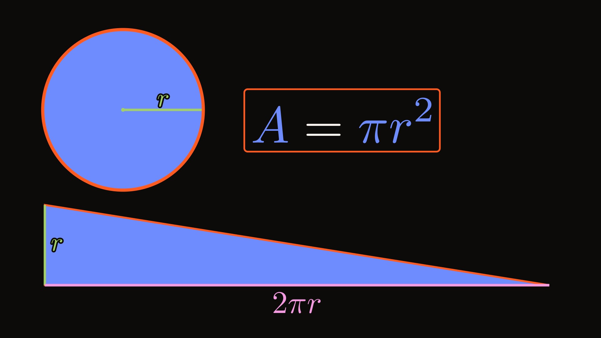

# 22 · Manim math explainer: why a circle's area is πr² (70 s)



**Video:** [`final.mp4`](final.mp4) · 1920x1080 · 30 fps · 70.00 s · 7.8 MB · -14.0 LUFS / -1.9 dBTP
· sidecar captions [`captions.srt`](captions.srt) (minimal style)
**Shorts cut:** [`shorts-9x16.mp4`](shorts-9x16.mp4) · 1080x1920 · 30 fps · 70.00 s · 7.7 MB · -14.0 LUFS / -1.9 dBTP
· captions burned in (90 px, at most 4 words and 2 lines, bottom at 1402 px) · cover [`poster-9x16.jpg`](poster-9x16.jpg) (frame 0)

## The request

> "Make a narrated 70-second math explainer showing why the area of a circle is pi r squared,
> with real animated equations."

**Mode:** quick, publish-bound (researcher and critic). The opening line stated the assumptions:

> Quick mode: 70 s, 16:9 plus a 9:16 re-layout for Shorts, Manim with real LaTeX. The argument: cut
> the disc into thin rings, straighten them, stack them into a triangle (height r, base 2πr),
> stated as a limit. Voice af_nicole, a very quiet pizzicato bed, soft clicks on the ring steps and
> a chime on the payoff; no history claims.

**The contract:** cut a circle into thin rings, straighten each ring, and they stack into a triangle
whose height is r and whose base is 2πr; half base times height is πr².

## The story, beat by beat

One narration line per beat; every reveal waits for its word (`self.at("word")`), so the picture
lands on the voice's clock.

| Time | Scene · beat | On screen | Job |
|---|---|---|---|
| 0-4.5 s | Hook | A blue disc and "Why πr²?" (words and math on one baseline, see review round 2); the radius r sweeps once round and the swept area lights up | The question, picture first |
| 4.5-9.1 s | Rings · cutting | A ripple runs outward and cuts the disc into 8 rings; "rings 8" counts up, one soft click per ring; on "onion" the layers pulse outward | The rings are the pieces |
| 9.1-15.1 s | Rings · ringlength | One ring lit, the rest dimmed; an ember fill runs its whole length behind a glowing dot; on "very thin" its two edges light up in heavy white strokes beside a brace | "About as long as its circumference, and very thin" |
| 15.1-24.0 s | Unroll · unrolling | The disc moves aside; copies of the rings peel off and straighten one by one into strips, shortest on top | The move that makes it computable |
| 24.0-29.1 s | Unroll · pileup | The pile flashes (9:16: the pile turns a quarter turn and grows); a dashed triangle outline and a translucent veil show the steps that stick out, and the bits that stick out flash orange once | "Close to a triangle", not equal |
| 29.1-33.3 s | Refine · refining | `refine()`: every ring and every strip splits in two, 8 → 16 → 32 | Thinner rings, smaller steps |
| 33.3-40.9 s | Refine · limit | 64 rings; the steps vanish: rings → a smooth disc, stair → a triangle | In the limit it is exact |
| 40.9-44.5 s | Label · heightline | Fills dim; a copy of the radius flies onto the triangle's side and its "r" follows | Symbols label what is already on screen |
| 44.5-52.2 s | Label · baseline | The outermost ring lights up pink and drains away as its edge unrolls onto the base, labelled 2πr | The base is the outermost ring |
| 52.2-57.2 s | Payoff · halfbh | A = ½ · 2πr · r is assembled from copies of the triangle's two labels | Half base times height |
| 57.2-62.9 s | Payoff · result | The fills dim; ½ and 2 fade out together and πr · r closes up, then A = πr² as the fills come back, boxed, chime | The result, earned |
| 62.9-70 s | Payoff · ending | The triangle, then the disc, outlined; both flash with the boxed result; end on the image | Same area |

**Honesty choices** (from the researcher's notes): the strips are as long as each ring's *outer*
circumference, so the bottom strip is exactly 2πr at every ring count and the stair sits slightly
*over* the triangle; the overshoot visibly shrinks from 8 to 64 rings. The narration says "close
to a triangle" before the ladder and "as the rings get thinner … becomes a triangle" after it. The
strips are left-aligned, so the limit is a right triangle, but the narration only says "a
triangle". No numbers appear on screen except r, 2πr, πr² and the ring counts. No history claims.

**The 3D coda was cut** (the brief's optional "stack discs into a cylinder, V = πr²h"): it answers
a different question (volume), it would push the video past the brief's 75 s cap, and ending on the
circle-and-triangle image is the payoff. ManimGL is therefore **not shown** in this example. The
optional engine was smoke-tested here (a tilted disc in a `ThreeDScene` renders headless on this
Mac through `showtime manim render file.py`); the CE `Show3DScene` fallback was not needed.

## What it demonstrates

- **`manim new --template refine`**, then a hand-written six-scene `scenes.py` with the beat sheet
  as its docstring. `manim check` (cue words, holds, word budgets, colours, LaTeX) ran after every
  edit and ends at 0 errors, 0 warnings.
- **Narration sync:** `voice script --fit 70` (124 words, af_nicole at x1.09; before the fit the
  script ran 74.1 s), `manim cues` for the numbered words, and every scene on the voice clock.
  `voice ipa` checked "pi r squared" and "circumference" (pi = paɪ, r = ɑːɹ); no lexicon entry was
  needed.
- **The st_manim kit:** `eq()` with concept colours from `manim.json` (area = blue for the disc,
  rings, strips, triangle, A and πr²; r = green; the circumference 2 and πr = pink), `morph()` for
  both equation steps (one change per step, `key_map` turning πr into πr²), `refine()` for the
  ladder, `place`/`fit_width`/`is_portrait` for layout, `title`, `label`, `backstroke`, `glow_dot`,
  `highlight`, `counter`/`count_to`, and `TransformFromCopy` from shape to symbol.
- **Words and math on one line:** `mixed_line("Why", tex(r"\pi r^2"), "?", size=88)` sets the
  question on one baseline, scales πr² to the display font's x-height and sets it bold to match the
  heavy display weight; `align_baseline(label, counter)` keeps "rings 8" on one baseline while the
  number counts. `manim check` measures every such line (`baseline_mismatch`, `xheight_mismatch`,
  `mixed_type`).
- **Custom geometry, same kit:** one function (`band_points`) bends a ring's outer edge from a
  circle to a straight line while keeping its length, so a ring truly unrolls into its strip, and
  the circumference unrolls onto the base with the same code.
- **Draft → final:** seven 480p15 drafts with contact sheets (16:9 and 9:16), then 1080p30 finals.
  Scenes cache separately: a Payoff-only change re-rendered in about 37 s.
- **`--aspect 9:16`:** the same scenes re-lay themselves out for a vertical frame. A base of 2πr
  across 1080 px keeps a horizontal diagram tiny, so the strips stack small and horizontal while
  the voice says "shortest on top", then on "They pile up" the whole picture turns a quarter turn
  and grows (r from 1.0 to 1.6 units): the base runs down the left edge (about 1360 px), the disc
  sits beside it and the equation below the disc, clear of the Shorts buttons and the captions.
  All stair and triangle geometry is written in the frame's own axes (along the base, up the
  height), so one set of functions draws both layouts.
- **Sound:** `--mix audio/mix.json` with a composed `playful-pizzicato` bed (GeneralUser GS
  SoundFont, seed 4, ducked 8 dB under the voice with carve 0.4), 11 synthesized soft `click`s
  (the 8-ring cut and the 16/32/64 steps) and a `chime` in the bed's key (D) as A = πr² is boxed.
- **Captions:** a `minimal` SRT sidecar for the 16:9 upload; `clean` captions burned into the
  Shorts cut at 90 px, at most 4 words (Shorts take no sidecar and are mostly watched muted).
  `showtime captions` has no size flag, so the review round called its `build()` with a size
  override and burned with showtime's ffmpeg (see the review round below).

## Commands, in order

`showtime` is `skills/showtime/bin/showtime`; `<job>` is `showtime-out/circle-area-20260927-113957`
and `<m>` is `<job>/manim` (this folder's `project/`).

```bash
showtime doctor --quick                                   # 21 pass (manim, latex, manimgl present)
showtime job init circle-area --mode quick --platform youtube \
  --goal "Make a narrated 70-second math explainer showing why the area of a circle is pi r squared, with real animated equations." \
  --assumed "..."                                          # 4 assumptions, see the quote above
showtime manim new <job>/manim --template refine
showtime voice ipa "Why is the area of a circle pi r squared? two pi r, times r. circumference" -v af_nicole
showtime voice script <m>/narration.md -o <m>/voice/        # 82.5 s -> cut to 124 words (74.1 s)
showtime voice script <m>/narration.md -o <m>/voice/ --fit 70   # speed x1.09, 70.00 s
showtime manim cues <m>
showtime manim check <m>                                  # line ids that are also words ("thinner", "half",
                                                          #   "base") resolved as lines -> ids renamed
showtime manim render <m>                                 # draft 1: refine overlay bug, tiny labels
showtime manim render <m>                                 # drafts 2-5: labels, z-order, equation size, mix
showtime manim render <m> --aspect 9:16                   # drafts 6-7: vertical layout
showtime snap <m>/out/circle-area-draft-N.mp4 --at ... --sheet   # after every draft
showtime job note <job> --stage plan ...  ;  showtime job note <job> --stage first-look ...
showtime manim render <m> --quality final -o <job>/final.mp4      # final.mp4
showtime qa <job>                                         # FAIL: frozen 23.0-30.3 s and 48.4-54.5 s
#   -> each beat now changes a large area on its word (focus dims, the pile flash, the veil, the
#      radius sweep, the ring fill); final-2 WARN, final-3 PASS; final-4 fixes the disc vanishing at 60.5 s
showtime review-pack <job>                                # round 1, self-review (FINDINGS.md): ship
showtime manim render <m> --quality final --fresh -o <job>/final.mp4   # final-6: ring counter moved
showtime manim render <m> --quality final -o <job>/final.mp4            # final-7: triangle outline on its own edges
showtime qa <job>                                         # PASS, 0 warnings, -14.0 LUFS, -1.9 dBTP
showtime captions <m>/voice/vo.words.json --style minimal --size 1920x1080 -o <job>/captions.ass --srt <job>/captions.srt
showtime manim render <m> --quality final --aspect 9:16 --fresh -o <job>/vertical-9x16.mp4
showtime captions <m>/voice/vo.words.json --style clean --max-words 4 --burn <job>/vertical-9x16-2.mp4 -o <job>/shorts-9x16.mp4
showtime qa <job>/shorts-9x16.mp4 --platform shorts       # WARN, see below
showtime job note <job> --stage verify ...  ;  showtime job note <job> --stage deliver ...
showtime clean <job> --yes                                # freed 7.9 MB
# review round 1 (critic: 16:9 ship, 9:16 ship after fixes) -> see "Review round 1" below
showtime manim render <m> --aspect 9:16 --fresh           # draft 8: quarter-turn layout
showtime manim render <m> --quality final --fresh -o <job>/final.mp4    # final-8..11 (qa PASS)
showtime manim render <m> --quality final --aspect 9:16 --fresh -o <job>/vertical-9x16.mp4   # -3..-5
# captions: st.footage.captions.build(style clean, max_words 4, portrait size 0.0833 = 90 px), burned onto vertical-9x16-5.mp4
showtime qa <job>/shorts-9x16.mp4 --platform shorts --captions <job>/shorts-9x16.ass
showtime snap <job>/final-11.mp4 --at ...  ;  showtime snap <job>/shorts-9x16.mp4 --at ...
# review round 2 (a person: the opening title's math sits low) -> see "Review round 2" below
showtime manim check <m>                                  # before: 15 WARN (baseline_mismatch 34 %,
                                                          #   xheight_mismatch 80 %, mixed_type; "rings 8" 30 %)
showtime manim check <m>                                  # after mixed_line / align_baseline: 0 warnings
showtime manim render <m> --quality final -o <job>/final.mp4                       # final-12
showtime manim render <m> --quality final --aspect 9:16 -o <job>/vertical-9x16.mp4 # -6, then -7 (9:16 spacing)
# captions: the same shorts-9x16.ass burned onto vertical-9x16-7.mp4 -> shorts-9x16-3.mp4
showtime qa <job>/final-12.mp4  ;  showtime qa <job>/shorts-9x16-3.mp4 --platform shorts --captions <job>/shorts-9x16.ass
showtime snap <job>/final-12.mp4 --at 0,1.5,7,20 --compare <job>/final-11.mp4
showtime snap <job>/shorts-9x16-3.mp4 --at 0,7 --compare <job>/shorts-9x16.mp4
```

`--fresh` was needed twice: the per-scene cache does not see edits to module-level helper classes
(here `Lay`, the layout), so a layout-only change otherwise reuses stale scenes.

## QA summary

- **16:9 `final.mp4`: PASS**, 0 warnings. -14.0 LUFS integrated, -1.9 dBTP true peak; no silent
  gaps, no black or frozen stretch over 2.5 s; `captions.srt` 27 cues, readable lengths. One INFO:
  the last 3.4 s are the designed still hold on the poster image.
- **9:16 `shorts-9x16.mp4`: PASS** when checked on its own (0 warnings; burned
  `shorts-9x16.ass` 33 cues, readable; no frozen stretch over 2.5 s; -14.0 LUFS, -1.9 dBTP).
  Checked inside the job folder, qa still adds three caption WARNs about the job's 16:9 sidecars
  (`captions.ass`/`captions.srt`: 41-character lines, 115 px from the bottom), which do not ship
  with the Short; `--captions` adds a file but does not drop the job's own.
- **Mix report:** voice 22.9 dB over the bed. 8 of the 11 soft clicks land on spoken syllables and
  are flagged as likely masked; they are texture under the cut, not cues. The chime is 11 dB clear.
- **Critic (self-review, no sub-agent tool in this session):** verdict "ship". Fixed on the way:
  the disc vanishing during the last morphs (60.5 s), two frozen FAILs, the ring counter touched by
  the peeling rings, an outline that overshot the triangle's 9° tip. A second look by a person is
  still welcome.

## Review round 1

A critic reviewed the shipped files (not the self-review pack): **16:9 ship, 9:16 ship after
fixes.** Every should-fix and the cheap polish were applied, re-rendered, qa'd and checked with a
still at each cited time.

- **9:16 diagram too small from 16 s** (should-fix; the cause of the old frozen WARN): the quarter
  turn described above. The disc is now 432 px across (was 269 px), the stair and triangle about
  1360 x 216 px (was 848 x 136 px). The equation's right edge is at about 910 px (was 972 px).
- **9:16 burned captions small** (should-fix): 90 px Inter (was 56 px), at most 4 words and 2 lines,
  bottom at 1402 px. The hook disc and its "rings 8" moved up so the counter clears the captions.
- **9:16 cover** (polish): `poster-9x16.jpg` is now frame 0, "Why πr²?" over the big disc.
- **"Very thin" brace** (polish): the ring's two edges light up in 7 px white strokes with the brace.
- **Still stretches near 2 s** (polish): "onion" pulses the rings (7.3-9.4 s hold gone); the
  overhanging steps flash against a brighter veil in the pileup pause (27.9-30.0 s hold gone). The
  circumference unroll (46-48.7 s) and the 9:16 cancellation (57.4-59.9 s) now change a large area
  too (the outermost ring drains away; the fills dim for the algebra). Longest hold now 2.3 s.
- **Cancellation** (polish): ½, its dot and the 2 fade out together before πr moves, so "πr2" never
  reads.
- **"A =" writes in as outlines** (polish): it fades in.
- **Doubled ring on the poster** (polish): the final outline is drawn on the circumference itself.
- **Mixed "r" styling** (polish): the triangle's r uses the disc's size and backstroke and sits
  inside the triangle, well inside the title-safe margin.
- Not changed: the voice, narration, mix and 16:9 captions (same timeline). The 9:16 turn briefly
  passes behind the caption "They pile up into" (24.0-25.3 s).

## Review round 2: the type detail pass

A person caught what the critic, the self-review and every check missed: in the opening title
"Why πr²?" the math sat on a lower baseline than "Why" and "?" (34 % of the cap height, about
37 px at 1080p), about a size smaller (x-height 80 % of the display font's) and in a much lighter
weight. The line had been built with `arrange(aligned_edge=DOWN)`, which lines up the lowest
points of the boxes: the descender of "y" pulled the words down, and a hand nudge moved the math
further. Contact sheets shrink this away, so nobody looked at it at full size. "rings 8" had the
same flaw (the "g" of "rings" lowered the label; the number sat 30 % of the cap height off).

- **Fix:** the question is a `mixed_line()` (one baseline measured on the glyphs, πr² at the
  display font's x-height, `\boldsymbol` plus a thin outline in its own colour to match the
  ULTRABOLD display weight); "rings 8" uses `align_baseline()`. In 9:16 the question is set at 80
  (was 88) and kept 0.3 units above the disc, so the "y" stays clear of it.
- **Checked:** `manim check` 0 warnings (15 before); 16:9 qa PASS (0 warnings, -14.0 LUFS,
  -1.9 dBTP); the Short's own captions PASS (the same three 16:9-sidecar WARNs as above). Full-size
  crops before and after: the title at 0 s and "rings 8" at 7 s, in both aspects.
- **Process:** review packs now cut the largest text lines out of full-size frames
  (`frames/text-*.png`) and the critic brief has a type detail pass (baselines, sizes and weights of
  words, math and numbers on one line; kerning; widows).

## Sources and licenses

- **Math:** every narrated sentence uses wording the researcher cleared against
  https://en.wikipedia.org/wiki/Area_of_a_circle (the "Onion proof" and "Triangle proof"
  sections: A = πr², C = 2πr, triangle area ½ · base · height, the ring picture as a limit argument),
  accessed 2026-09-27. Written in our own words; no third-party media.
- **Voice:** Kokoro-82M v1.0, `af_nicole` (Apache-2.0), synthesized locally.
- **Music:** composed locally with `showtime audio compose` (`playful-pizzicato`, seed 4), rendered
  with the GeneralUser GS 2.0.3 SoundFont (GeneralUser GS License v2.0: free use, no attribution
  clause). **Effects:** `click` and `chime` synthesized by `showtime audio sfx` (no samples).
- **Equations:** LaTeX (TeX Live 2026), Computer Modern from amsfonts (SIL OFL).
  **Type:** Bricolage Grotesque and Inter (SIL OFL 1.1).
- **Animation:** Manim Community Edition 0.21 (MIT). ManimGL 1.7.2 (MIT) was smoke-tested only.
- **Credits:** nothing requires attribution, so there is no `credits.txt`
  (qa: "no attribution required").

## Files

- `final.mp4`, `poster.jpg` (the marked poster frame, 66.6 s), `captions.srt`, `share.txt`
- `shorts-9x16.mp4`, `poster-9x16.jpg`
- `project/`: `manim.json` (scenes, concept colours, mix), `scenes.py` (six scenes plus the beat
  sheet), `narration.md`, `audio/mix.json`, `voice/timeline.json`, `voice/vo.words.json`,
  `voice/vo.srt`. The voice audio, Manim caches and drafts are rebuilt by the commands above.
