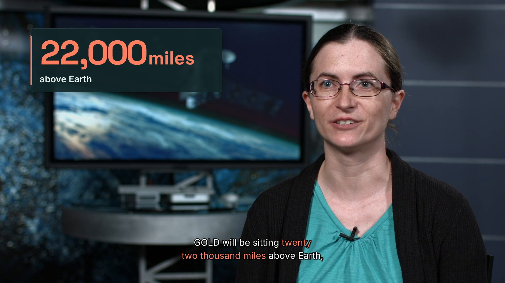

# 23 · Talking head, dressed: cards that appear when the words are said (16:9 + 9:16)



**Videos:**
- [`final.mp4`](final.mp4): 16:9 · 1920x1080 · 30 fps · 55.2 s · 9.0 MB repo copy · -14.0 LUFS · clean captions with
  emphasis, [`final.srt`](final.srt) as a sidecar
- [`final-9x16.mp4`](final-9x16.mp4): 9:16 · 1080x1920 · 30 fps · 55.2 s · 9.0 MB repo copy · -14.0 LUFS · bold-pop
  captions under her chin, [`final-9x16.srt`](final-9x16.srt)

These are the versions after one critic round (see *Review round*), plus one word behind the speaker added in
0.4.1 (see *A word behind the speaker*), both rendered again with the 0.4.1 build (see *Rendered again for 0.4.1*).

## The request

> "Dress up this NASA interview with Sarah Jones about the GOLD mission: name tag, a data callout, a pull-quote,
> a list or chapter, a side panel and captions with emphasis; a 16:9 and a 9:16 cut"

**Mode:** quick. No questions. The footage is untouched apart from the cut: every card is drawn over it, anchored
to the words in the transcript, so a later re-cut moves the cards with the words.

**The footage** is a raw 69 s interview from NASA Goddard (public domain): GSFC item
[`GSFC_20180124_m12825_SarahJones`](https://images.nasa.gov/details/GSFC_20180124_m12825_SarahJones), recorded in
January 2018 for the GOLD mission. A black title slate names her ("Sarah Jones, Mission Scientist, NASA's
Goddard Space Flight Center") and four black slates carry the interviewer's questions; she answers each on
camera. It was found with `showtime assets media search "soundbites" --type video --source nasa`.

## What it demonstrates

- **Cards anchored to phrases, not seconds.** The EDL's `cards` list (`project/edit/edl.json`) has eight cards.
  Each names a phrase she says (`"say": "twenty two thousand miles"`); `edit check` prints where each lands on the
  output timeline:

  | Card | Anchor (what she says) | On screen (16:9) | Content (where it comes from) |
  |---|---|---|---|
  | title | "GOLD measures the upper atmosphere" | 0.0-5.4 s | kicker "NASA's GOLD mission"; the first question slate: "Why is GOLD measuring the upper atmosphere?" |
  | lower-third | "directly affected by the sun" | 2.3-8.0 s | the title slate: name and role |
  | list | "it directly affects" | 10.9-20.1 s | her three examples, each appearing as she names it: satellites, astronauts, GPS navigation; it leaves on the next cut |
  | stat | "twenty two thousand miles" | 21.1-23.6 s | 22,000 miles above Earth, counted up as she says it |
  | panel | "a whole half of the Earth" until "play out below" | 24.4-35.0 s | her words: all of the Western Hemisphere, over one point on Earth, watching the atmosphere below |
  | chapter | "I am excited about this mission" | 35.0-38.0 s | the third question slate: "Why are you excited about GOLD?" |
  | behind | "faster than ever before" | 40.4-43.6 s | her word "faster", big behind her (0.4.1) |
  | quote | "the most comprehensive view we've ever had" | 49.6-55.2 s | her last line, word by word on its spoken times; it stays to the last frame |

  Every name, number and label is hers or comes from NASA's slates and item title. The panel's title "Half of
  Earth in one view" and kicker "From 22,000 miles up" condense what she says in the same answer; "NASA's GOLD
  mission" comes from the item and her own "this mission".
- **The side panel changes the framing.** For the panel the render splits the range at the panel's first and last
  frame (no new cut, the sound runs on) and frames her, face-tracked, into the right half; the panel fills the
  left half on the look's ground.
- **Captions never cover her face.** In 9:16 her face fills the upper half of the frame, so the captions (bold-pop,
  asked for in the middle) are moved, window by window, to just below her chin (19 stretches); the name tag sits
  under them. In 16:9 the clean captions at the bottom never reach her face. `edit check` and qa (`caption_face`)
  would say if a caption could not be moved off the face.
- **9:16 cards with no room become splits.** Below her chin there is room for the captions and the name tag, not
  for the list, the data callout, the chapter or the quote: each of those becomes a split (she moves to the
  lower 45 %, the card fills the top, the captions sit in the card's area just above the seam). Splits less than
  1.5 s apart keep the split between them, so the frame does not flip to the close-up and back.
- **An ending with air.** The last range holds its last frame 1.5 s (`"hold": 1.5`, the sound fading out), and
  the pull-quote stays up to the end.
- **Caption emphasis.** `"emphasis": ["space weather", "twenty two thousand miles", "Western Hemisphere", "faster
  than ever before", "most comprehensive"]`: five terms, said six times, coloured in the look's coral accent
  (Tidewater).
- **One EDL per aspect.** The 9:16 EDL (`edl-916.json`, made by `project/tools/make_916.py`) keeps the cut and the
  cards; it sets bold-pop captions a little smaller (0.095 of the width), starts the name tag after the title
  (both would need the space under her chin) with the role on one line ("Mission Scientist, NASA Goddard").

## A word behind the speaker (0.4.1)

One card was added to both EDLs after the review round: `{"type": "behind", "say": "faster than ever before",
"text": "Faster"}`, the word she leans on in her third answer, big behind her while she says it. The render cuts
her out of its own frames (MODNet portrait matting on the CPU, a matte per frame, smoothed over time and refined
at full size) and composites, in order: the plate, the word from the card reel, then her, under the captions.

- **16:9** (`project/review/behind-16x9.jpg`): she sits right of centre, so the word goes on the free side, left,
  in the look's coral, its foot on her chin line and its last letter half behind her head; the plate is the shot
  itself. The render measured 3 % of the word's ink behind her (the widest hidden stretch 4 % of the word) and a
  matte flicker of 0.02 % of her area per still frame (qa's limit is 2 %).
- **9:16** (`project/review/behind-9x16.jpg`): the close-up leaves no room above her head, so for the card she
  moves down 10 % of the frame (a reframe-only split, the sound runs on, no new cut), the plate becomes the
  look's ground (there is no shot above her to show), and the word spans the top of the safe box with her hair
  over the foot of its middle letters: 15 % hidden, flicker 0.00 %. The captions split at the card's edges and
  follow her chin down and back up.
- **Looked at:** all 95 frames of the card in both finals (thumbnail strips), frames at the card's first, middle
  and last frame and one either side, and her hair and cheek edges at full size over the word.

```bash
showtime edit check <job>/edit/edl.json       # "Faster" ends behind the speaker, on the shot; about 6 % (estimated)
showtime edit check <job>/edit/edl-916.json   # centred, on the look's ground, the speaker moves down (10 %)
showtime edit render <job>/edit/edl.json -o <job>/final.mp4             # 81 s on a 64-core Linux machine
showtime edit render <job>/edit/edl-916.json -o <job>/final-9x16.mp4    # 160 s (53 s again after a change)
showtime qa <job>/final.mp4 --platform youtube          # WARN: 0 fail, 6 warn (the same as before), behind 3 %
showtime qa <job>/final-9x16.mp4 --platform shorts      # WARN: 0 fail, 8 warn, 2 notes (the same as before)
```

The matte took 5 s for the card's 95 frames at 1080p (19.5 fps; 1080x1920: 12.9-18.7 fps), cached for later
renders. Both qa verdicts list the same warnings as before the card (`caption_fast` in the sidecars,
`level_jump` at the two loud answer starts); qa's pass line adds "1 behind card(s): Faster 3 % behind the
speaker, matte flicker 0.02 %" (16:9). No critic round was run on this addition.

## Rendered again for 0.4.1

Both finals were rendered again from the same EDLs on the 0.4.1 build, after its last fixes (among them: each
card is placed frame for frame, so the 9:16 behind card holds its word through the frame before the cut). A fresh
job on a 64-core Linux machine with no GPU, each render alone on it; the source as fetched by its id (sha256 as
in `project/raw/*.license.json`):

```bash
showtime edit render <job>/edit/edl.json -o <job>/final.mp4             # 79 s
showtime edit render <job>/edit/edl-916.json -o <job>/final-9x16.mp4    # 110 s
showtime qa <job>/final.mp4 --platform youtube          # WARN: 0 fail, 6 warn, 1 note (as before)
showtime qa <job>/final-9x16.mp4 --platform shorts      # WARN: 0 fail, 8 warn, 2 notes (as before)
showtime snap <job>/final.mp4 --at 40.3,40.433,40.6,41,42,43,43.333,43.567,43.6 --sheet        # review/behind-16x9.jpg
showtime snap <job>/final-9x16.mp4 --at 40.3,40.433,40.6,41,42,43,43.333,43.567,43.6 --sheet   # review/behind-9x16.jpg
showtime deliver exports <job>/final.mp4 --targets github --max-mb 9.5
showtime deliver exports <job>/final-9x16.mp4 --targets github --max-mb 9.5
```

- Both masters are 55.20 s, -14.0 LUFS and -1.6 dBTP; the behind card measured the same (16:9: 3 % of "Faster"
  behind her, matte flicker 0.02 %; 9:16: 15 %, 0.00 %); the SRT sidecars are byte for byte the ones before.
- **The 9:16 behind card now holds to the cut.** Frame 1307 (43.567 s), the last before the cut at 43.600 s, used
  to show her on the bare ground; it now shows the word like the frames before it (56,313 pixels of the coral
  word, against 0 before; frame 1306 has 56,316). Frame 1308 is the next shot, as before.
- **Every card's first frame now shows.** A card's first reel frame used to be skipped, so each card ran one frame
  ahead; now each starts on its own first frame. The 16:9 data callout counts up from 0 at 21.33 s and lands on
  22,000 at 22.17 s (was 22.13 s), then holds it 1.43 s to the card's exit at 23.60 s. Compared frame by frame
  with the earlier renders, only frames in card entrances, exits and the count-up differ (58 frames in 16:9, 96 in
  9:16: the same animation a frame later); every other frame matches.
- The repo copies are 9.0 MB each, -14.1 LUFS and -1.5 dBTP. The poster (the 16:9 frame at 0:23) did not change
  and was kept.

## Commands, in order

`showtime` is `skills/showtime/bin/showtime`. `<job>` is `showtime-out/gold-talking-head-20261007-113824`.

```bash
showtime assets media search "soundbites" --type video --source nasa
showtime assets media fetch "nasa:GSFC_20180124_m12825_SarahJones" -o raw/      # 1080p, 69 s, public domain
showtime footage scenes raw/GSFC_20180124_m12825_SarahJones.mp4 --every 4        # black slates: 0-7, 27.6, 45.6, 59.9 s
showtime job init gold-talking-head --platform youtube --goal "Dress up this NASA interview ..."
showtime transcribe raw/GSFC_20180124_m12825_SarahJones.mp4 --edit-dir <job>/edit --speakers 1
python project/tools/fix_spelling.py <job>/edit/transcripts/GSFC_20180124_m12825_SarahJones.json   # GOLD, ICON
showtime pack <job>/edit
showtime edit cut <job>/edit/transcripts/GSFC_20180124_m12825_SarahJones.json --max-pause 0.5 --captions clean \
    -o <job>/edit/edl.json                                      # the slates hold no speech, so they go too
showtime edit cards suggest <job>                               # stat, list, quotes, chapters, stressed words
#   hand edit: "look", "captions.emphasis", the seven "cards" and the last range's "hold" (project/edit/edl.json)
showtime edit check <job>/edit/edl.json                         # each card's output times, no problems
python project/tools/make_916.py <job>/edit/edl.json <job>/edit/edl-916.json
showtime edit check <job>/edit/edl-916.json                     # 5 splits, captions moved off the face
showtime edit render <job>/edit/edl.json --preview
showtime edit render <job>/edit/edl-916.json --preview -o <job>/edit/preview-916.mp4
showtime snap <job>/edit/preview-916.mp4 --at 1.5,8,20.5,21,24,36,53,54.5,55.15 --sheet
showtime edit render <job>/edit/edl.json -o <job>/final.mp4
showtime edit render <job>/edit/edl-916.json -o <job>/final-9x16.mp4
showtime qa <job>/final.mp4 --platform youtube
showtime qa <job>/final-9x16.mp4 --platform shorts
showtime review-pack <job>/final.mp4 --platform youtube         # then a critic per pack (see Review round)
showtime review-pack <job>/final-9x16.mp4 --platform shorts -o <job>/review/9x16
#   fixes in showtime and the EDLs, then the two finals again, qa again
showtime edit view <job>/edit/edl.json --video <job>/final.mp4  # one band per card: project/review/card-timing-*.jpg
showtime snap <job>/final.mp4 --at 1.5,6.5,11.5,19.8,20.4,23,30,36.6,46,53.5,55.15 --sheet   # review/cards-16x9.jpg
showtime snap <job>/final-9x16.mp4 --at 0.2,3,8.5,13,19.8,21,22.8,30,36.5,41,53.5,55.15 --sheet   # review/cards-9x16.jpg
showtime deliver poster <job>/final.mp4 --at 23
showtime deliver exports <job>/final.mp4 --targets github --max-mb 9.5
showtime deliver exports <job>/final-9x16.mp4 --targets github --max-mb 9.5
```

## Timings

Measured on a 6-core Intel Mac shared with several other agents (load average 85-165 during the run).

| Step | Time |
|---|---|
| Fetch (52 MB) | about 45 s |
| Transcribe, Parakeet (69 s of audio) | 38 s |
| `edit cards suggest` | a few seconds |
| Previews (720p, cards rendered at that size) | 150-310 s each |
| Finals 16:9 / 9:16 (1080p; the card reel is about 42 s of alpha graphics) | 422 s / 555 s (first pass: 328 s / 353 s at a lower load) |
| `qa` 16:9 / 9:16 | 57 s / 43 s |
| Critic round (two critics in parallel) | about 6 min |
| Repo copies (`deliver exports --targets github --max-mb 9.5`) | under a minute each |

The card reel is the longest step of a render: every frame of every card is captured in a browser. It is cached
by its content, so a re-render that changes the cut but not the cards' text and lengths reuses it.

## QA summary (after the review round)

- **16:9 master (`<job>/final.mp4`, 55.20 s), verdict WARN** (0 fail, 6 warn). Render report: `frames_ok` true, no
  warnings, captions timing all zeros, no card problems. qa: "loudness -14.0 LUFS (target -14), true peak -1.6
  dBTP"; "7 card(s) clear of the captions, each other and the safe box, each long enough to read; captions clear
  of the speaker's face".
  - `caption_fast` (4 cues of the SRT sidecar at 20-24 characters/s): she speaks fast in places (peaks over 250
    words a minute); the sidecar keeps her words verbatim.
  - `level_jump` at the cuts at 20.1 s and 47.0 s (+8.7 and +7.5 LU in qa's short windows): each answer ends
    softly and the next one starts strong. Measured on the source, the answers sit within 2 LU of each other
    (-19.0, -20.1, -18.6, -20.5 LUFS); the edit changes no gain, so this was left as delivered.
- **9:16 master (`<job>/final-9x16.mp4`, 55.20 s), verdict WARN** (0 fail, 8 warn, 2 notes): the same
  `level_jump` pair and six `caption_fast` cues in the sidecar. qa: "loudness -14.0 LUFS (target -14), true peak
  -1.6 dBTP"; "captions clear of the speaker's face (moved off it in 19 stretch(es))". `upscale` is a note: the
  1080p source fills a 1080x1920 frame at 1.78x whatever the crop, and the EDL accepts it (`allow_upscale`).
- **Looked at:** every card in both finals (`project/review/cards-*.jpg`), the card timing views (each card's in
  and out against the words and the waveform), frames at full size where captions and the face meet.
- **Not checked:** listening; the sound was judged from qa's loudness, true peak and level numbers.

## Review round

Two critics, one per aspect, each got only its review pack's brief. Both: **ship after fixes**, no blockers,
"would post: yes". Each finding was checked before anything changed.

| Finding | Change |
|---|---|
| 9:16 S1: split, then the close-up for 5 frames, then the split, then 0.83 s of close-up, on continuous footage | showtime: splits less than 1.5 s apart keep the split between them (a ground-only bridge) |
| 9:16 S2: the chapter question and its scrim sit over her eyes | showtime: in 9:16 a chapter is a split (no scrim over the face) |
| 9:16 S3, 16:9 S2: the video ends on her last syllable; the pull-quote is gone before the end | showtime: a range `hold` (freeze frame, sound faded); a card that would leave in the last second stays to the last frame. EDL: `"hold": 1.5` on the last range |
| 9:16 S4, 16:9 S1: nothing says what GOLD is at the start; 9:16 frame 0 has no words | kicker "NASA's GOLD mission" (both); the 9:16 keeps the title (as a split) and starts the name tag after it |
| 9:16 S5, 16:9 S5: no source in the pack for "Mission Scientist" | it is on the source's title slate and in NASA's item title; recorded in the job (`job note --verified`) |
| 16:9 P4, 9:16 P4: the list stays up into the next answer | showtime: a card's default hold ends on the next cut once it has had its time |
| 16:9 S3: captions over 20 characters/s | kept: her own speed, verbatim captions (see QA summary) |
| 16:9 S4: the picture looks frozen under the chapter card (qa freeze at 35.8-36.7 s) | dismissed: the footage moves under the scrim (mean frame difference 0.6-1.1 against 1.2-2.1 in the source at the same moments); the scrim's dimming tripped the freeze detector |
| Polish: jump cuts at 20.1 and 47.0 s, level jumps, "twenty two thousand" vs 22,000 in the captions, the quote typing out the spoken words, ICON not introduced | kept: jump cuts are left on a talking head (editing.md §6), captions stay verbatim, the quote reads along with her, nothing sourced to say about ICON |

## What went wrong on the way

- The first 9:16 preview put every card in a band at the top of the frame: on this framing that is her face.
  Cards in tall frames now go to the stretch the face and the captions leave free, or become splits.
- The first 9:16 finals put bold-pop captions on her lips and, under a panel, on her hairline (a director's
  review). Captions are now moved off the tracked face in every edit with cards.
- A list plate showed its heading over a tall empty box for seconds before the items were said; the plate now
  grows as each item arrives.
- An independent review found 9:16 captions on her hair for 0.2-0.6 s at four split edges (5.2, 10.9, 37.9 and
  49.5 s): a caption that started in one layout kept its place after the frame switched. A caption is now cut at
  every such edge, each piece in its own place; the 9:16 was rendered again (`project/review/cards-9x16.jpg` has
  frames at those edges). The 16:9 data callout counted for 1.2 s and rested 1.3 s; showtime now shortens the
  count, and the 0.4.1 render lands on 22,000 at 22.17 s and holds it 1.43 s, to the card's exit at 23.60 s.
- The first 16:9 preview centred the captions across the panel's edge during the side panel; they now centre on
  the speaker's half.
- The data callout was still counting when it left; the count now lands while the number is being said.
- `assets media fetch` failed on NASA ids with spaces in them (`What is a NASA Spinoff`, tried while looking for
  footage); the asset URLs are now quoted.

## Files

- `final.mp4`, `final-9x16.mp4`: repo copies under 10 MB (the masters are 31 MB and 28 MB);
  `final.srt`, `final-9x16.srt`: their caption sidecars.
- `poster.jpg`: the frame at 0:23 (the data callout).
- `share.txt`: post copy and notes; `credits.txt`: the source credit.
- `project/edit/edl.json`, `project/edit/edl-916.json`: the two EDLs, cards included.
- `project/edit/transcripts/GSFC_20180124_m12825_SarahJones.json`: the word-level transcript (spelling fixed:
  "Gold" is GOLD, "golden icon" is "GOLD and ICON"; times untouched); `project/edit/takes_packed.md`.
- `project/raw/*.license.json`: the license record from the fetch (sha256, URLs).
- `project/tools/fix_spelling.py`, `project/tools/make_916.py`: the two helper scripts above.
- `project/review/`: contact sheets of every card in both finals and the card timing views (from before the
  behind card), and `behind-16x9.jpg`, `behind-9x16.jpg`: the behind card, from the frame before it to the frame
  after.

The source video is not committed. To rebuild: fetch it into `project/raw/`, then `showtime edit render
project/edit/edl.json` (and `edl-916.json`).

## Sources and license

- **Footage:** "GOLD Resources: Sarah Jones Mission Scientist", NASA Goddard Space Flight Center, 2018-01-24
  (producers Tom Mason, Joy Ng, Andrew Gelfman), NASA Image and Video Library,
  https://images.nasa.gov/details/GSFC_20180124_m12825_SarahJones.
- **License:** NASA-produced media, public domain in the United States, used under NASA's media usage
  guidelines: https://www.nasa.gov/nasa-brand-center/images-and-media/. Attribution is given anyway.
- **No endorsement implied.** NASA did not make, review or endorse this edit or showtime. No NASA logo, insignia or
  title card is added. The words are Sarah Jones's own, in order; only the slates and pauses were removed. The
  interview predates the mission's results and speaks of it in the future tense, so the post copy says "2018
  interview".
- **Fonts:** Space Grotesk, Inter and Geist Mono (the Tidewater look), Anton and Inter (captions), SIL OFL,
  bundled by showtime.
