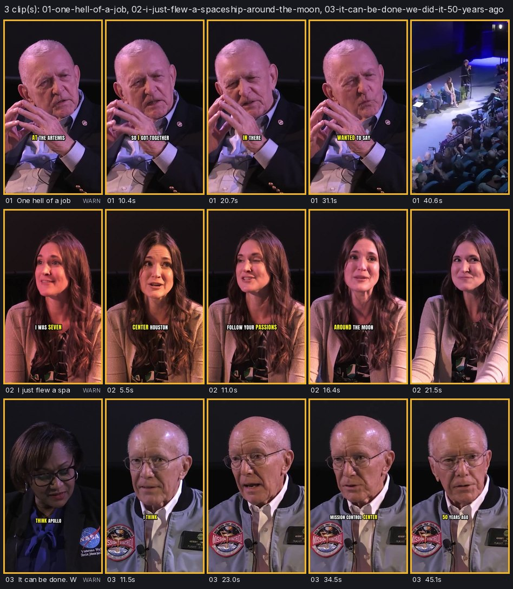

# 24 · A 58-minute panel, its best moments as three vertical clips



**Clips** (9:16 · 1080x1920 · 29.97 fps · bold-pop captions · -14.0 LUFS; repo copies under 6 MB, the masters are
27-48 MB):
- [`clips/01-one-hell-of-a-job.mp4`](clips/01-one-hell-of-a-job.mp4): 41.5 s · Gene Kranz to the Artemis team, ending
  on the applause · [`.srt`](clips/01-one-hell-of-a-job.srt)
- [`clips/02-i-just-flew-a-spaceship-around-the-moon.mp4`](clips/02-i-just-flew-a-spaceship-around-the-moon.mp4):
  21.9 s · Jessi Horelica, from a tour at seven to the flight control room ·
  [`.srt`](clips/02-i-just-flew-a-spaceship-around-the-moon.srt)
- [`clips/03-it-can-be-done-we-did-it-50-years-ago.mp4`](clips/03-it-can-be-done-we-did-it-50-years-ago.mp4):
  46.0 s · Vanessa Wyche asks what Apollo did that will help Artemis most, Gerry Griffin answers ·
  [`.srt`](clips/03-it-can-be-done-we-did-it-50-years-ago.srt)

## The request

> "Find the best 30-60 s moments of this 58-minute NASA panel (Apollo 17 legends and Artemis leaders) and make
> three vertical clips with captions"

**Mode:** quick. No questions: three clips, 9:16, captions, the platform set to Shorts (qa checks every clip
against it). Assumed and stated: clips of 20-60 s once the pauses are trimmed, words as said (verbatim captions,
fillers cut), nothing reordered.

**The recording** is NASA's video of a panel held at Space Center Houston on 16 December 2022, five days after
Artemis I splashed down: [`jsc2022m000291-Apollo_Legends_and_Artemis_Leaders_Event`](https://images.nasa.gov/details/jsc2022m000291-Apollo_Legends_and_Artemis_Leaders_Event)
in the NASA Image and Video Library (public domain), 57:48, 1920x1080, a multi-camera stage recording with a
live audience. Gene Kranz, Gerry Griffin and Charlie Duke (by video link) sit with Jessi Horelica, Antja Chambers
and Reid Wiseman; Johnson Space Center Director Vanessa Wyche moderates. It opens with a 3-minute tribute video and
welcomes, and ends with thanks. It was found with `showtime assets media search "panel discussion" --type video
--source nasa`, after the contact sheets of other candidates turned them down (an audio-only podcast over a still
image, a webcam interview, a lecture filmed on its slides with film stills in them).

## What `edit moments` found

`showtime edit moments <job> --count 10` read the transcript (8,239 words, 564 sentences) in 8 s, found 30 topic
segments and 2,255 candidates of 20-60 s, and listed ten ([`project/edit/moments-table.txt`](project/edit/moments-table.txt),
[`project/edit/moments-as-ranked.json`](project/edit/moments-as-ranked.json)):

| # | Score | Source time | Clip | Title (suggested) | Why, in short |
|---|---|---|---|---|---|
| m1 | 68 | 18:09-18:52 | 39 s | I'll say, hell of a job | a number in the first seconds (22-day), a line said twice, applause right after the end, 4 dB louder than Kranz's median with a lively pitch, one speaker |
| m2 | 67 | 54:54-55:42 | 44 s | Dream, aim high, and never surrender | a strong claim in the first sentence, a quotable line, applause after, one full turn |
| m3 | 62 | 54:18-54:46 | 27 s | Follow your dreams, and they can lead to you somewhere amazing | emotion in the first sentence, a quotable line, applause after, one full turn |
| m4 | 59 | 29:41-30:37 | 45 s | What do you think Apollo did that will help Artemis the most? | opens with a question, punchy lines; "the answer goes on after the end: check it" |
| m5 | 58 | 20:38-21:13 | 33 s | It's truly something I know I will never forget | a strong claim in the first seconds, a quotable line |
| m6 | 58 | 35:37-36:03 | 25 s | Flew just a few months before 17 | applause after; "starts on It's also: check it stands alone" |
| m7-m10 | 57 | | | | a backup-crew story, the moderator's question to Charlie Duke (answer cut off), rovers, Jessi's favourite moment |

The tribute video, the welcome, the introductions (each followed by applause) and the closing thanks are not in the
list: they rank lower by design (introductions and logistics score x0.7, music under the speech counts against).

## What was picked, and why

I read the ten moments' text (`text` in the JSON) before choosing. The ranking's top three were all good, but two of
them are Gene Kranz; for three voices I kept **m1** (Kranz) and **m3** (Horelica) and took **m4** (Griffin) instead of
m2, which stays the first alternative. Then I edited `moments.json` by hand
([`project/edit/moments.json`](project/edit/moments.json)):

- **m1** as found. Title: "One hell of a job".
- **m3**: the draft sheet showed its first five seconds on a wide shot from the back of the hall, with her outside the
  9:16 crop. I moved its start to "I was seven years old and I saw the white flight control room ...", where the
  camera is on her (27 s -> 21.9 s). Title in her words: "I just flew a spaceship around the moon".
- **m4**: its end moved one sentence later, from "It can be done." to "We did it 50 years ago.", the line that lands
  the answer (the ranking had flagged that the answer goes on). The moderator's quiet aside between question and
  answer, "It's kind of hard one.", is cut with `"remove": ["w4125-w4129"]`. Title: "It can be done. We did it 50
  years ago".

Before ranking, three misheard words were fixed in the transcript's `text` (times untouched), checked against NASA's
own caption file for the video: "I talked with my cause" is "I talked with Mike Hawes", and "options I had in there"
is "options they had in there" ([`project/tools/fix_spelling.py`](project/tools/fix_spelling.py)).

## What `edit clips` made

`showtime edit clips <job> --preview` made the three drafts in parallel (720x1280), each through qa, and a contact
sheet ([`project/review/drafts-sheet.jpg`](project/review/drafts-sheet.jpg)); `showtime edit clips <job>` made the
finals at 1080x1920. Per clip ([`project/edit/clips/`](project/edit/clips/)):

- **One EDL per moment**, cut with `edit cut`'s rules: "uh" out (2, 0 and 3 per clip), pauses over 0.5 s down to 0.3 s
  (9, 2 and 16 segments), every word whole. The edges never take a sliver of the word before or after the moment.
- **Endings with the audience.** Clips 1 and 2 end on the applause that followed the last line: 2.5 s of it, fading
  out over the last 1.5 s (a range `fade_out`). In clip 2 her trailing "So", said into the applause, is cut.
- **Face-tracked 9:16.** The 1080p frame is cropped to 607x1080 around the speaker and enlarged 1.78x to fill
  1080x1920, which the EDL accepts (`allow_upscale`); qa reports it as soft footage.
- **Captions** in bold-pop at 0.09 of the width (a little under the style's own size, so the line fits under the
  chin in these close-ups), moved off the face where they would cover it. For clip 3 `edit clips` chose 0.08: at
  0.09 the line had no room under Gerry Griffin's chin while he looks down (7.8-10.9 s) and would have jumped to his
  forehead for three seconds.
- **qa on every clip** and one sheet of all three ([`sheet.jpg`](sheet.jpg)); [`project/clips/clips.json`](project/clips/clips.json)
  lists each clip's moment, source range, EDL, qa verdict and findings.

## Commands, in order

`showtime` is `skills/showtime/bin/showtime`. `<job>` is `showtime-out/apollo17-highlights-20261007-214556`.

```bash
showtime assets media search "panel discussion" --type video --source nasa
showtime assets media fetch "nasa:jsc2022m000291-Apollo_Legends_and_Artemis_Leaders_Event" --quality orig --max-mb 2000 -o raw/
#   renamed to raw/apollo17-legends.mp4 (1.91 GB, sha256 in project/raw/*.license.json)
showtime footage scenes <the mobile rendition> --every 150            # while choosing: a multi-camera stage panel, close-ups
showtime job init apollo17-highlights --platform shorts --request "Find the best 30-60 s moments ..."
showtime transcribe raw/apollo17-legends.mp4 --edit-dir <job>/edit --speakers auto
python project/tools/fix_spelling.py <job>/edit/transcripts/apollo17-legends.json
showtime edit moments <job> --count 10                                # table + <job>/edit/moments.json
#   read the moments; hand edit moments.json: "pick" on m1, m3, m4, titles, m3 start, m4 end and "remove"
showtime edit clips <job> --preview                                   # drafts, qa, sheet
showtime snap <job>/clips/preview/<clip>.mp4 --at ... --sheet         # m3 opened on a wide shot: start moved
showtime edit clips <job> --preview                                   # again: unchanged EDLs keep their names
showtime edit clips <job>                                             # finals, qa, sheet
showtime snap <job>/clips/<clip>.mp4 --at <six times> --sheet --cols 6    # project/review/frames-0N.jpg
showtime deliver exports <job>/clips/<clip>.mp4 --targets github --max-mb 6
```

## Timings

on our test machine (64 cores, no GPU), shared with other jobs: the load average was 40-170 during these runs, so the
numbers are slower than on a quiet machine.

| Step | Time |
|---|---|
| Fetch (1.91 GB) | 44 s |
| Transcribe 57:48 of audio (Parakeet v3, filler scan, audio events), `--speakers auto` | 13:07 |
| The same without speakers (`--force`, into another folder) | 5:40 |
| `edit moments` (2,255 candidates, pitch and level of every word) | 4-8 s |
| `edit clips --preview` (3 drafts at 720x1280, in parallel, qa each, sheet) | 40 s |
| `edit clips` (3 finals at 1080x1920, in parallel, qa each, sheet) | 49-69 s |

**End to end for the hour** (transcribe, rank, three finished clips through qa): about 7 minutes without speakers,
about 14 with `--speakers auto`, plus the minutes spent reading the moments and looking at the drafts. Without
speaker labels the ranking's top four were the same four moments.

## QA summary

All three finals: **WARN**, 0 fail, at -14.0 LUFS (target -14) and -1.6 dBTP. Audio and picture are the same length
in each (41.475 s, 21.922 s, 45.979 s).

| Clip | Findings (all WARN) | Kept because |
|---|---|---|
| 01 (41.5 s, 9 segments) | `soft_footage` 5.2-40.4 s; `caption_fast` at 8.3 s (22 characters/s); `level_jump` at 13.3, 21.5, 29.3 s (+6.5 to +7.5 LU) | the 1.78x crop of 1080p footage is the 9:16 cost; the captions are his words as fast as he says them; the jumps are one take where a phrase trails off and the next starts strong after a trimmed pause |
| 02 (21.9 s, 2 segments) | `caption_fast` at 12.3 s (24 characters/s) | her pace, verbatim |
| 03 (46.0 s, 16 segments) | `soft_footage`; `caption_fast` at 33.4 s; `level_jump` at 4.6, 18.9, 27.5, 36.9 s (+7.9 to +10.4 LU) | as above; 4.6 s is the cut from the moderator's question to Griffin's answer, two microphones |

**Looked at:** the draft and final sheets, and six frames of every final at full size (opening, each caption
position, the ending; [`project/review/`](project/review/)): the speaker centred in the crop in every close-up, the
captions under the chin, clip 1 ending on the audience, clip 2 on her smile during the applause.
**Not checked:** listening; the sound was judged from qa's loudness, true peak and level findings. No critic
sub-agent was run for this example (a self-review of the frames above instead).

## What went wrong on the way

Each of these was found on this recording and fixed in showtime before the finals:

- The first draft of clip 1 had its sound 62 ms shorter than its picture (qa `av_length`): ffmpeg's `-frames:v` closed
  each segment file before the last audio was written, up to a frame per segment, so the sound drifted ahead of the
  picture at every cut. Segments now end their video with a `trim` filter; every edit render benefits.
- Clips that ended on applause stopped dead on the last frame (qa `abrupt_end`); they now fade out (`fade_out`).
- Captions jumped from the chest to the forehead and back within a clip: in these close-ups the default caption line
  did not fit under the chin above the platform's bottom zone. Tall clips now use a slightly smaller caption size,
  and a smaller one still for a clip where only that keeps the line under the chin throughout (clip 3).
- `--speakers auto` labelled this panel with 76 speakers. The ranking now smooths labels held for under four words,
  and a speaker change only splits a sentence after a pause; the moments no longer start on fragments such as "help
  Artemis the most?".
- The ranking first missed clip 2's moment: her trailing "So" stood between her last line and the applause, and the
  applause detector places onsets up to 2.5 s late. Both are allowed for now.
- Suggested titles ended mid-phrase ("a 22-day unmanned mission, I almost"); a title now ends on a clause boundary.

Left as they are: the source's burned-in name graphics are cut by the 9:16 crop in clip 3 (Vanessa Wyche's and Gerry
Griffin's), and the audio tagger heard no laughter in the hour (it found applause 18 times and music 11 times), so
laughter did not count here.

## Files

- `clips/*.mp4`: repo copies under 6 MB of the three finals; `clips/*.srt`: their caption sidecars.
- `sheet.jpg`: the contact sheet `edit clips` made of the finals (five frames per clip).
- `share.txt`: post copy per clip and the credit line; `credits.txt`: the source credit.
- `project/edit/transcripts/apollo17-legends.json`: the word-level transcript (three words fixed, times untouched).
- `project/edit/moments-as-ranked.json`, `project/edit/moments-table.txt`: what `edit moments` printed and wrote;
  `project/edit/moments.json`: the same file after my picks and edits.
- `project/edit/clips/*.json`: the three EDLs `edit clips` wrote; `project/clips/clips.json`: its manifest.
- `project/review/`: the draft sheet and the frames I looked at; `project/raw/*.license.json`: the fetch's license
  record (URLs, sha256); `project/tools/fix_spelling.py`: the spelling fix.

The recording is not committed (1.9 GB). To rebuild: fetch it into `project/raw/apollo17-legends.mp4`, then
`showtime edit clips <a job> --moments project/edit/moments.json` (or `showtime edit render project/edit/clips/<NN>-*.json`).

## Sources and license

- **Footage:** "Apollo 17 Legends and Artemis Leaders Event", NASA Johnson Space Center (item dated 2022-12-21; the
  panel took place at Space Center Houston on 2022-12-16), NASA Image and Video Library,
  https://images.nasa.gov/details/jsc2022m000291-Apollo_Legends_and_Artemis_Leaders_Event. Names and roles are from
  the item's description and the on-screen name graphics.
- **License:** NASA-produced media, public domain in the United States, used under NASA's media usage guidelines:
  https://www.nasa.gov/nasa-brand-center/images-and-media/. Attribution is given anyway.
- **No endorsement implied.** NASA, Space Center Houston and the speakers did not make, review or endorse these clips
  or showtime. No NASA logo or insignia is added; the patch on a jacket and the name graphics are in NASA's footage.
  Each clip keeps its speakers' words in order; only pauses, "uh" and one aside were cut.
- **Fonts:** Anton (captions), SIL OFL, bundled by showtime.
