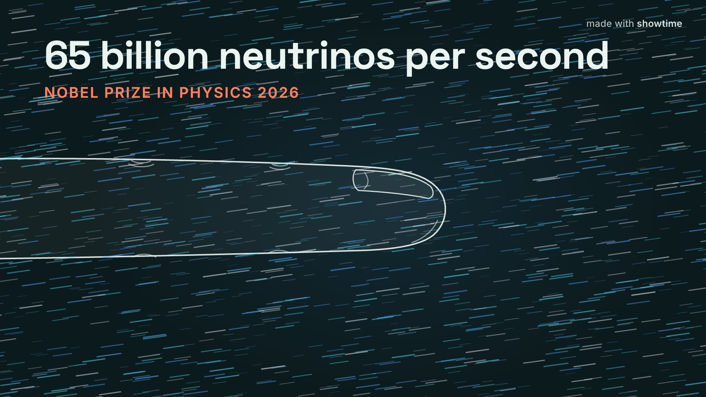

# 25 · A telescope made of ice: the 2026 Nobel Prize in Physics, an explainer that stops and asks (2:38)



**Video:** [`final.github.mp4`](final.github.mp4) · 1920x1080 · 30 fps · 157.5 s · 9.7 MB · -14.0 LUFS / -1.6 dBTP ·
narrated, burned-in captions. The master, `final.mp4` (177 MB), is the asset
`25-nobel-physics-ice-telescope--final.mp4` of the [media release](https://github.com/FavioVazquez/showtime-examples/releases/tag/examples-media-v1).

**HTML video that stops and asks:** [`interactive/`](interactive/index.html), a folder export (`index.html` and
`assets/`, 4.1 MB) that plays offline in any browser, at its address on the site
<https://faviovazquez.github.io/showtime/media/25-nobel-physics-ice-telescope/interactive/>. It stops at three
questions, waits for an answer, says why, and goes on; 8 chapters; links to a moment (`#t=1:05`) or to a stretch
that loops (`#t=1:12-1:20`); a link preview with the poster frame.

## The request

> "Physics 2026 explainer for nobel-2026-lab: a telescope made of ice, ~2 min, three stop-and-ask questions,
> interactive export, 60 s vertical cut; publish today"

**Mode:** quick, quality review. Made on 6 October 2026 with showtime 0.4.0 on a 6-core Intel Mac, from the
public lab repository `nobel-2026-lab` (MIT), whose own toy simulations give the film's numbers (kilometre-scale
interaction odds, a toy telescope's aim against string spacing). This folder has the 16:9 film and its HTML
export; the 60 s vertical cut is not part of the example.

## What it shows

- **Questions that stop and ask (0.4.0).** Three questions in `showtime.json`, each anchored to the narrator's line
  that asks it (`"at": "shot-3"`), so a re-voice moves the question with its line. The MP4 draws a pause-and-think
  beat with a 3 s ring; the HTML export stops there, shows the choices (A-C), marks the answer, says why, and plays
  on from the end of the beat:
  1. *A high-energy neutrino (100 TeV) crosses a whole kilometre of ice. What are the odds it hits anything?*
     About 1 in 100,000 is closest: in the toy model, about one in 65,000.
  2. *Strings twice as far apart, a quarter as many: how much worse does the toy telescope aim?* A few times worse:
     5.6x in the toy model (trend only, not IceCube's real aim).
  3. *IceCube records about 100,000 neutrinos a year. How many come from outer space?* About a hundred, the Nobel
     Committee says.
- **A storyboard table became the project (0.4.0).** `showtime new dom <dir> --from-storyboard storyboard.md` wrote
  one scene per shot (14), the narration with each line pinned where its shot starts, and `storyboard.json`; the
  shots were then built by hand in the Tidewater look signature.
- **A cold open, a roadmap and a tie-back.** The film opens on the puzzle (how do you catch a particle that goes
  through everything?), names four steps on a roadmap bar that stays on screen with the current step lit, and ends
  back on the opening fingertip.
- **Real data.** The 6 PeV shower of 8 December 2016 is replayed from IceCube's public data release; the sensor
  layout is IceCube's published geometry.
- **The findings gate (0.4.0).** Every critic finding had to be fixed or waived before delivery; the review rounds
  below.

## Commands, in order

`showtime` is `skills/showtime/bin/showtime`; reconstructed from the job's ledger and the project's files.

```bash
showtime job init nobel-physics --platform x --request "Physics 2026 explainer for nobel-2026-lab: ..."
showtime new dom <job>/project --from-storyboard storyboard.md --look tidewater    # 14 scenes, narration.md
#   the shots built by hand: scenes/s-shot-*.js and .css, assets/ (geometry, the event), the roadmap
showtime voice script <job>/project/narration.md -o <job>/project/voice           # Kokoro am_michael
showtime retime <job>/project --from-voice <job>/project/voice/timeline.json --total 150
#   showtime.json: "questions" (three, each "at" a narration line), "chapters" (eight)
showtime check <job>/project
showtime render <job>/project --job <job>                  # final.mp4, then final-2.mp4 and final-3.mp4
showtime qa <job>
showtime review-pack <job>                                 # round 1: a critic on the pack
showtime review-pack <job> --against <the earlier final>   # round 2: two critics, old and new, both orders
showtime review-respond <job> --fixed r1-S1 "..."          # one line per finding
showtime deliver exports <job> --targets github,x,linkedin

# 2026-10-08, on the 0.4.1 build: the HTML export again, as a folder with a link preview (no re-render)
showtime export html project --folder -o interactive --share-url https://faviovazquez.github.io/showtime/media/25-nobel-physics-ice-telescope/interactive/
```

## Timings

| Step | Where | Time |
|---|---|---|
| Three full renders (153.5-157.5 s of video, about 4,700 frames each, at 1080p) | the 6-core Intel Mac | 194.6 s, 195.5 s, 193.9 s |
| qa (six runs) | the Mac | 29-38 s each |
| Job start to the delivered final, review rounds included | the Mac | 1 h 21 min |
| `export html --folder` (14 voice lines and the bed mixed, 90 files packed) | a 64-core Linux machine, no GPU | 82 s |

## QA summary

- **At delivery** (0.4.0, final-3): **PASS** (0 fail, 0 warn), 157.50 s, -14.0 LUFS, -1.6 dBTP.
- **Today** (0.4.1, the same file): loudness, true peak, frame 0, black and frozen stretches all pass; qa now FAILs
  `too_long` against the job's platform, X, whose standard accounts take 140 s: the film is 2:37. Shorter cuts for
  X were part of the delivery and are not in this folder.
- **The HTML export,** checked in a headless browser from a server that answers range requests (as GitHub Pages
  does): the start screen, question 1 stopping at 37.2 s, an answer and its reply, Continue (on to 41.7 s), and the
  range link `#t=1:12-1:20` playing 72-80 s; 55 requests, none off the site, no console errors. The embedded
  soundtrack is AAC 96k at -14.1 LUFS.
- **The hearing pass** of round 1 ([`review/round-1/audio.txt`](review/round-1/audio.txt)): every voice line
  14.8-15.6 dB over the music, 135-200 words a minute.

## What the critic found

Two rounds, each critic a fresh agent given only the review pack (the harness refused their file writes, so the
findings were saved by the maker, condensed: [`review/`](review/)).

**Round 1, on final.mp4: ship after fixes**, 0 blockers, 10 should-fix, all fixed in final-2
([`FINDINGS`](review/round-1/FINDINGS.md), [`RESPONSE`](review/round-1/RESPONSE.md)):

| Finding | What changed |
|---|---|
| S1 the hook lacked its noun | "65 billion neutrinos per second", complete at frame 0 |
| S2 no captions for muted autoplay | karaoke captions burned in, above the roadmap |
| S3 the drill collided with the Step 2 title | the kicker raised, the ice surface lowered: 50 px clear |
| S4 the corner mark sat on a badge and a legend | both moved below y 110 |
| S5 "from space" ran into the 1 km bar | the label moved left of the dot, 380 px clear |
| S6 rounded numbers disagreed (70,000 vs 68,000; "about 6x" vs 5.64) | exact toy numbers: 1 in 65,000 and 5.6x |
| S7 "high-energy" was not in the source | dropped, on screen and in the voice |
| S8 the voice said "the rest"; the source says "most of the rest" | the line voiced again |
| S9 "5.7 sigma" was unexplained | "atmosphere alone ruled out" |
| S10 why the aim matters was never said | a new line: neutrinos fly straight, so the aim points back to the source |

**Round 2, pairwise: final.mp4 against final-2.mp4,** two critics, one per order, neither told which was newer
([`VERDICT`](review/round-2/VERDICT.md)): both preferred final-2, both would post it. The one should-fix both raised
(captions 0-3 px under the counter's subline at 5.5 s) was fixed in final-3 by moving the counter block up 74 px
([`RESPONSE`](review/round-2/RESPONSE.md)).

## Files

- `final.github.mp4`: the copy under 10 MB; `final.mp4`: the master, a release asset; `poster.jpg`: frame 0.
- `interactive/`: the HTML export (`index.html`, `assets/vfs.js` with the runtime, scripts and fonts,
  `assets/media/_export/soundtrack.m4a`, `assets/poster.jpg`, `socratic.json` with the three questions, `.nojekyll`).
- `project/`: `storyboard.md` and `storyboard.json` (the plan), `narration.md`, `showtime.json` (questions,
  chapters), `index.html`, `scenes/` (one script and style per shot, the roadmap, the corner mark), `assets/` (the
  sensor geometry, the toy telescope's geometry, the 2016 event), `audio/mix.json`, `voice/` (timeline, word times,
  captions; the WAVs are not committed).
- `review/`: round 1 (`FINDINGS.md`, `RESPONSE.md`, `audio.txt`) and round 2 (`VERDICT.md`, the two orders'
  `FINDINGS.md`, `RESPONSE.md`).
- `receipt.md`: what the job took, from what showtime recorded; `share.txt`, `credits.txt`.

To rebuild: `showtime voice script project/narration.md -o project/voice` (the voice WAVs), then `showtime render
project`; `showtime export html project --folder` for the web version.

## Sources and license

- **The film:** made with showtime for `nobel-2026-lab` (github.com/FavioVazquez/nobel-2026-lab, MIT): educational
  demos of the 2026 Nobel Prizes, not research. Unofficial: not affiliated with the Nobel Foundation or the IceCube
  Collaboration. Facts from nobelprize.org, with a claims ledger in the lab repository; the toy-model numbers come
  from the lab's own simulations.
- **Event data:** IceCube Collaboration, data release for the Glashow resonance event, DOI 10.21234/gr2021 (the
  event of 8 December 2016).
- **Sensor positions:** IceCube ppc geometry (geo-f2k), D. Chirkin, Zenodo, doi:10.5281/zenodo.10410725, CC BY 4.0.
- **Music:** "The space is big" by Komiku (CC0), from the album "Little Cat In The Big Wide Space".
- **Voice:** Kokoro (Apache-2.0), voice `am_michael`, made on the rendering machine.
- **Fonts:** Space Grotesk and Inter (the Tidewater look) and Geist Mono, SIL OFL 1.1, from the fonts showtime installs.
