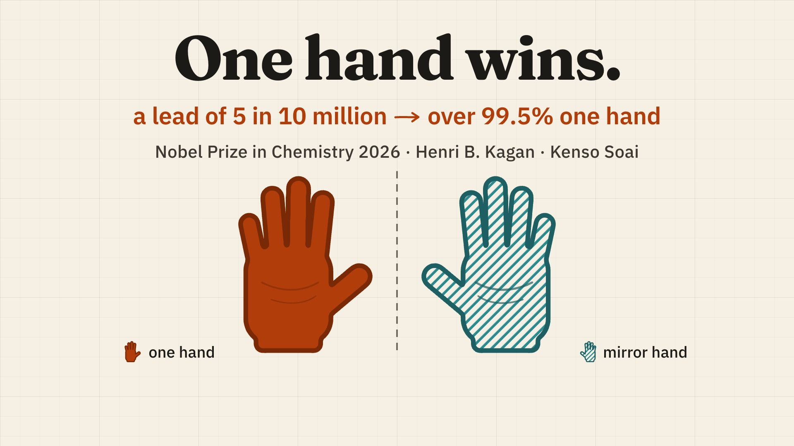
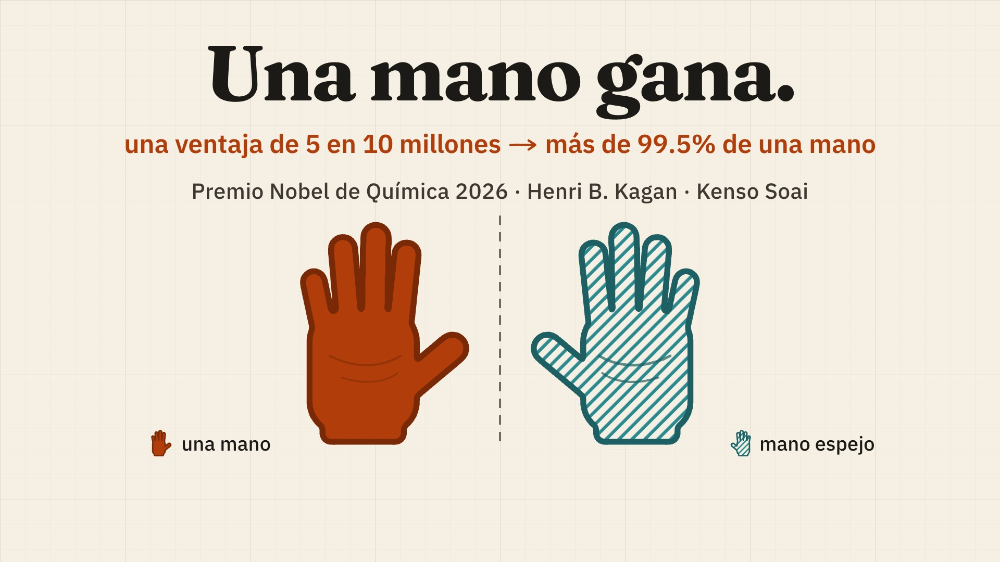

# 26 · One hand wins: the 2026 Nobel Prize in Chemistry, in English and in Spanish (2:30 + 2:34)



**Videos** (1920x1080, 30 fps, narrated, captions burned in):
- English: [`final.github.mp4`](final.github.mp4) · 149.6 s · 9.7 MB · -14.0 LUFS / -1.6 dBTP
- Spanish: [`final-es.github.mp4`](final-es.github.mp4) · 154.2 s · 9.6 MB · -14.0 LUFS / -1.6 dBTP

The masters, `final.mp4` (88 MB) and `final-es.mp4` (93 MB), are the assets `26-nobel-chemistry-en-es--final.mp4`
and `26-nobel-chemistry-en-es--final-es.mp4` of the [media release](https://github.com/FavioVazquez/showtime-examples/releases/tag/examples-media-v1).



## The requests

> "Full Chemistry 2026 explainer (~2:10, 16:9) for the nobel-2026-lab: Frank's recipe, Kagan's bend, Soai's
> copier, the 2003 staircase, the coin flip, our mirror-race toy, caveats, medicines. NOT socratic: no questions to
> the viewer. American voice (af_bella; not the British female). Paperback lab-notebook look, CC0 bed, showtime
> credited (corner mark, end card, closing line). Must look great; post soon."

> "Spanish version of the full Chemistry video for LinkedIn: translate narration and every on-screen string,
> Spanish voice, captions; same numbers and claims"

**Mode:** quick, quality review. Made on 7 October 2026 with showtime 0.4.0 on a 6-core Intel Mac, from the
public lab repository `nobel-2026-lab` (MIT), whose mirror-race toy model gives the simulation shots.

## What it shows

- **A 2:30 explainer from a storyboard table.** Twelve shots (`project/storyboard.md`, 145 s planned) became the
  project with `showtime new dom <dir> --from-storyboard`; the film runs on a persistent roadmap, Frank's three-box
  recipe from 1953, which each laureate's shot ticks (Kagan 1986, box two; Soai 1995, box three), then the 2003
  staircase, a coin flip, the lab's mirror-race toy model, what it does not show, and why medicines care.
- **A light look signature.** Paperback: warm paper, a burnt-orange accent, Fraunces with IBM Plex Sans, calm
  motion; one hand is always solid orange, its mirror hatched teal.
- **Honest labels on screen.** Illustrations say so ("shape only, not Kagan's data", "tints illustrative", "our toy
  model · trend only", "our drawing"); the quotes are attributed to the Nobel Committee.
- **Localisation of the whole film.** The Spanish version translates the narration (`project-es/narration.es.md`)
  and every on-screen string, with a Spanish voice (Kokoro `ef_dora`) and Spanish captions, the same numbers and
  claims, and every scene retimed to the Spanish voice (154.2 s against 149.6 s).

## Commands, in order

`showtime` is `skills/showtime/bin/showtime`; reconstructed from the jobs' ledgers and the projects' files.

```bash
showtime job init chem-full --platform x --request "Full Chemistry 2026 explainer (~2:10, 16:9) ..."
showtime new dom <job>/project --from-storyboard storyboard-full.md --look paperback   # 12 scenes, narration.md
#   the shots built by hand: scenes/s-shot-*.js and .css, assets/ (the toy model's runs and histograms)
showtime voice script <job>/project/narration.md -o <job>/project/voice                # Kokoro af_bella, x1.08
showtime retime <job>/project --from-voice <job>/project/voice/timeline.json --total 145
showtime check <job>/project
showtime render <job>/project --job <job>                      # final.mp4; spans spliced: final-2 ... final-4
showtime qa <job>
showtime review-pack <job> --against <the earlier final>       # round 1: pairwise, two critics, both orders
showtime review-pack <job>                                     # round 2
showtime review-respond <job> --fixed r1o1-B1 "..."            # every finding fixed or waived
showtime deliver exports <job> --targets github,x,linkedin

showtime job init chem-full-es --platform linkedin --request "Spanish version of the full Chemistry video ..."
#   project-es: a copy of the project with every string translated, narration.es.md
showtime voice script <job>/project/narration.es.md -o <job>/project/voice              # Kokoro ef_dora, x1.0-1.08
showtime retime <job>/project --from-voice <job>/project/voice/timeline.json
showtime render <job>/project --job <job>
showtime qa <job>
showtime review-pack <job>
showtime deliver exports <job> --targets github,linkedin
```

## Timings

On the 6-core Intel Mac:

| | English | Spanish |
|---|---|---|
| Full renders | 156.3 s, 169.1 s | 156.9 s, 166.1 s |
| Span renders spliced into a full video | 70.3 s, 76.8 s | 67.4 s |
| Render time in total | 7 min 52 s | 6 min 30 s |
| Job start to the delivered final | 2 h 23 min | 32 min 29 s |

## QA summary

- **English, at delivery** (final-4): PASS (0 fail, 0 warn), -14.0 LUFS, -1.6 dBTP. The job's platform was X,
  whose standard accounts take 140 s; the film is 2:30, so qa's `too_long` was waived as the owner's call (he
  approves before posting). Today (0.4.1, the same file) qa still FAILs `too_long` against X; loudness, true peak,
  frame 0, black and frozen stretches pass.
- **Spanish** (final-3, LinkedIn): PASS (0 fail, 0 warn), -14.0 LUFS, -1.6 dBTP, at delivery and again today.
- **The hearing pass** (English round 2, [`audio.txt`](review/en-round-2/audio.txt)): every voice line 16.8-18.0 dB
  over the bed, 129-182 words a minute; the one pause over 2 s (115.1-117.7 s) has the coin-flip result on screen.

## What the critic found

**English, round 1, pairwise** (final.mp4 against final-2.mp4, two critics, one per order, neither told which was
newer: [`review/en-round-1/`](review/en-round-1/)): both preferred final-2, but would not post it: 3 blockers (a
hidden quote, and the length twice) and 8 should-fix. Fixed in the next render ([`RESPONSE`](review/en-round-2/RESPONSE.md)):

| Finding | What changed |
|---|---|
| B1: the Nobel Committee quote was half hidden behind the captions (128.9-137.8 s) | the quote moved above the art (y 132) |
| S: the captions clipped the source note's descenders (34 s) | the note raised to y 806 |
| S: the captions cut across both hands and their labels (0.5-11.7 s) | the hands and the legend lifted above a caption band |
| S: the "seeds" label collided (84 s) | moved to the top right |
| S: the laureates' cards did not say they are this year's laureates | "2026 Nobel laureate" on the Kagan and Soai cards |
| B: 149.6 s against X's 140 s (raised twice here, once more in round 2) | waived: the length is the owner's call |

**English, round 2** ([`FINDINGS`](review/en-round-2/FINDINGS.md)): **ship**, would post: yes; every round-1 fix
confirmed; polish only.

**Spanish, round 1** ([`review/es-round-1/`](review/es-round-1/)): **ship after fixes**, no blockers, no English left
on screen, every number matching the English plan; 4 should-fix, all from the localisation, all fixed in final-3:
the captions split spelled-out years across chunks ("En mil novecientos cincuenta" / "y tres"), so numbers are now
one caption word in digits; an ungrammatical counter label ("5,049 veces / ganó la mano espejo"); and two lines
spoken too fast (243 and 211 words a minute), voiced again at x1.0.

## Files

- `final.github.mp4`, `final-es.github.mp4`: the copies under 10 MB; `final.mp4`, `final-es.mp4`: the masters,
  release assets; `poster.jpg`, `poster-es.jpg`: frame 0 of each.
- `project/` (English) and `project-es/` (Spanish): `storyboard.md` and `storyboard.json`, the narration
  (`narration.md`; `narration.es.md` in Spanish), `showtime.json`, `index.html`, `scenes/` (one script and style per
  shot), `assets/` (the toy model's runs and histograms), `audio/mix.json`, `voice/` (timeline, word times, captions;
  the WAVs are not committed). The English `showtime.json` title was the default "Project"; it now carries the
  film's title for exports.
- `review/`: English round 1 (pairwise: `VERDICT.md`, each order's `FINDINGS.md`), English round 2 (`FINDINGS.md`,
  `RESPONSE.md`, `audio.txt`), Spanish round 1 (`FINDINGS.md`, `RESPONSE.md`, `audio.txt`).
- `receipt.md`, `receipt-es.md`: what each job took, from what showtime recorded; `credits.txt`.

To rebuild: `showtime voice script project/narration.md -o project/voice` (and `project-es/narration.es.md`), then
`showtime render project` and `showtime render project-es`.

## Sources and license

- **The films:** made with showtime for `nobel-2026-lab` (github.com/FavioVazquez/nobel-2026-lab, MIT): educational
  demos of the 2026 Nobel Prizes, not research. Facts from nobelprize.org (the press release and the popular and
  scientific backgrounds); the simulation shots are the lab's own toy model.
- **Molecule:** L-alanine from PubChem CID 5950 3D coordinates (NCBI, public domain).
- **Music:** "I'm glad you are here with me" by Loyalty Freak Music (CC0), from the album "LOFI AMBIENT SONGS !".
- **Voices:** Kokoro (Apache-2.0), voices `af_bella` (English) and `ef_dora` (Spanish), made on the rendering machine.
- **Fonts:** Fraunces and IBM Plex Sans (the Paperback look) and IBM Plex Mono, SIL OFL 1.1, from the fonts showtime
  installs.
