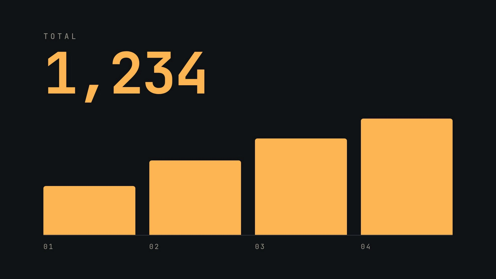
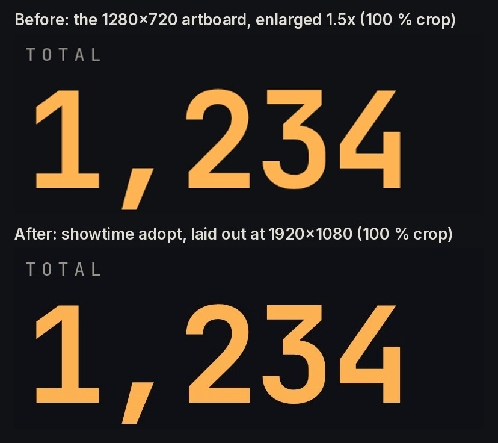
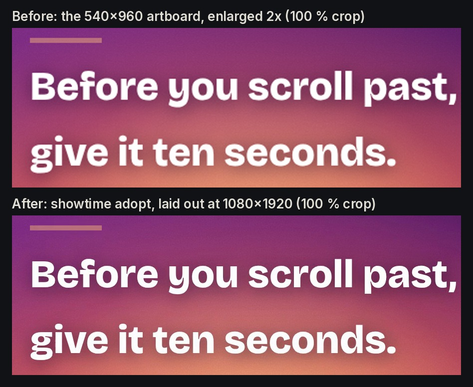

# 28 · Claude Design to MP4: two exported designs, adopted as they are (16:9 + 9:16)



**Videos:**
- [`showtime-test-16x9/final.mp4`](showtime-test-16x9/final.mp4): 16:9 · 1920x1080 · 30 fps · 12.00 s · 1.5 MB ·
  -14.0 LUFS / -1.6 dBTP · a typed title, a counter and four bars, a closing card
- [`wait-9x16/final.mp4`](https://github.com/FavioVazquez/showtime-examples/releases/download/examples-media-v1/28-claude-design-to-mp4--wait-9x16--final.mp4):
  9:16 · 1080x1920 · 30 fps · 20.00 s, one seamless loop · 16.5 MB (a release asset) · -14.0 LUFS / -1.6 dBTP ·
  GitHub copy [`wait-9x16/final.github.mp4`](wait-9x16/final.github.mp4) (8.2 MB)

Both designs are the owner's own, made in Claude Design and exported as HTML. The exported runtime (`support.js`
and `vendor/`) is Claude Design's, so the adopted projects' `src/` folders are not in this repository: this folder
has the videos, what `showtime adopt` found (`adopt.json`), the fonts it copied with their licences, the mix, the
review and the commands.

## The request

> "Make 'Showtime Test (12s, 16 9)-html.zip' an MP4, with a music bed."

> "Make 'WAIT 9 16 (10s loop)-html_final.zip' an MP4 for Reels, with a music bed."

The WAIT zip is the owner's second export of that design: the first one put WAIT and the first line past the right
edge of the vertical safe box (see "What the critic found"); he moved them inside it in Claude Design and exported
again. The video, files and numbers here are from the second export.

**Mode:** quick. No questions. Assumed and stated: the designs stay exactly as designed (adopt never edits a page),
no voice-over, so no captions (there is nothing spoken to caption); a quiet, produced catalog bed under each (CC BY
4.0 with its credit, or CC0), mastered to -14 LUFS.

## What `showtime adopt` found

| | Showtime Test (16:9) | WAIT (9:16) |
|---|---|---|
| Export | a 1280x720 artboard, a React logic class whose clock reads `performance.now()` | a 540x960 artboard, CSS `@keyframes` only |
| Contract | clock: the page runs on showtime's virtual clock | the same |
| Size | 1920x1080: laid out again at 1.5x with CSS zoom, so text stays sharp | 1080x1920: laid out again at 2x |
| Length | 12 s: `Math.min(t, 12)` inside a `% 13` loop, so the video ends where the animation ends | 20 s: `sky-drift` goes there and back every 20 s (`alternate`), the other six animations repeat every 10 s; frame 600 is frame 0 again (`seamless`) |
| Fonts | Bricolage Grotesque 700, JetBrains Mono 400/500/700, copied from Google Fonts with their OFL licences | Anton, Bricolage Grotesque 600/800, the same |
| Determinism | 4/4 sampled frames identical, captured in order and in reverse | the same |

Google serves one variable font file per script subset for all the weights a link asks for, so JetBrains Mono's
500 and 700 and Bricolage's 800 come from the same files as their lighter weights (`fonts/fonts.css` maps each
weight to them); nothing is synthesised.

**Before and after.** The same frame, at 100 %: on top, the artboard captured at its own size and enlarged to the
video's size (what a screen recording of the design gives); below, the frame `adopt` renders by laying the page out
again at that size.





(The 9:16 still is from the first WAIT export; in the second the lines are a little smaller and start 24 px
further left.)

## The music

`showtime audio music pick` and `search` gave the candidates; each mix was rendered and its report read before the
final render (`audio mix --check`), because the report says what the ear would hear at the end:

- **16:9: "Deep Haze" by Kevin MacLeod (CC BY 4.0)**, a cool, driving synth-and-drums groove at 120 bpm (a bar is
  2 s). From 30.02 s in (`"offset": 30.02`, a 0.3 s fade-in), on its downbeat grid, the fit ends it on the downbeat
  at 9.99 s, which is 40.0 s in the track: the end of a four-bar phrase there (the cut starts one bar before that
  phrase, so the mix report, counting from the cut, says five bars). That is as "That's a wrap." comes in
  (9.0-10.4 s), with a decay under the closing card. No limiting needed; -14.0 LUFS, -1.4 dBTP in the mix.
  It replaced the first bed, "Action Discovery" by Komiku (CC0): that bed had almost nothing above 300 Hz, so
  on a phone speaker it played 19.9 LU under the mix, close to silent, and 0.4.1's qa fails that
  (`speaker_loudness`). Even with the mixer's speaker-safe step it stayed 13.5 LU under. Deep Haze has real mids:
  3.0 LU under. Fourteen catalog beds were mixed and measured for this (`audio mix --check`, which prints the
  phone-speaker gap); the ones under about 4 LU were "Electric Dreams" (2.3), "Newer Wave" (2.6), "Fly" (2.5)
  and "Deep Haze" (3.0); Deep Haze suits the dark, amber design best and needs no limiting.
- **9:16: "Aeroplane" by Loyalty Freak Music (CC0)**, hazy lo-fi guitar (75 bpm, a bar is about 3.35 s). The first
  pick, "I'm glad you are here with me" by the same artist, fitted with an offset (24.13 s) so its phrase ended at
  17.02 s, was swapped after the first render: it is the bed of the Chemistry films (example 26), and two examples
  side by side should not share one. From 76.8 s in (`"offset": 76.8`, a 0.4 s fade-in) Aeroplane ends a 4-bar
  phrase at 19.19 s, as the lines fade out (19.3-20.0 s), then fades, so the loop starts again on a quiet join.

## Commands, in order

`showtime` is `skills/showtime/bin/showtime`. Each design has its own job.

```bash
showtime job init claude-design-16x9 --request "Make 'Showtime Test (12s, 16 9)-html.zip' an MP4, with a music bed."
showtime adopt "Showtime Test (12s, 16 9)-html.zip" --job <job>          # unpack, size, fonts, length, check
showtime audio music search --for tech --vocals none --dur 12            # then info on the candidates
showtime audio mix <job>/project/audio/mix.json -o <scratch>.wav --check  # each candidate: the report's phone-speaker gap
#   showtime.json "audio": "audio/mix.json"; mix.json: the catalog track, "offset": 30.02, "fade_in": 0.3, "fit": true
showtime check <job>/project
showtime render <job>/project --job <job>
showtime qa <job>
showtime review-pack <job>                                                # then the critic brief (see below)
showtime deliver poster <job> --at 8.5 --out <job>/poster-8.5.jpg

showtime job init claude-design-9x16 --platform reels --request "Make 'WAIT 9 16 (10s loop)-html_final.zip' an MP4 for Reels, with a music bed."
showtime adopt "WAIT 9 16 (10s loop)-html_final.zip" --job <job>
showtime audio music search --shelf ambient,lofi,cinematic,inspiring --mood hopeful,dreamy,calm,warm --license cc0 --dur 20
showtime audio beats <the track>                                           # 75 bpm: where the phrases fall
showtime check <job>/project
showtime render <job>/project --job <job>
showtime qa <job>
showtime review-pack <job>
showtime deliver exports <job> --targets github --max-mb 9
showtime deliver poster <job> --at 15.7 --out <job>/poster-15.7.png    # the PNG, saved as JPEG (see below)

# the before stills: the artboard at its own size
showtime adopt "Showtime Test (12s, 16 9)-html.zip" -o before/a-1280x720 --size 1280x720 --no-check
showtime snap before/a-1280x720 --at 8.5 -o before/a-artboard-8.5.png
showtime snap <job>/final.mp4 --at 8.5 -o before/a-final-8.5.png        # the same for WAIT at 15.7 s
```

## Timings

On a 64-core Linux machine with no GPU. The 16:9 column is the job made again on 0.4.1 for the new bed (adopted
again from the zip: the frames came out the same as the earlier render, the decoded video hashes the same); the 9:16
column is the second WAIT export, run alone on the machine:

| Step | 16:9 (12 s) | 9:16 (20 s) |
|---|---|---|
| `showtime adopt` (unpack, fonts, length, determinism, check) | 15 s | 33 s |
| `showtime render` (360 / 600 frames, 8 browsers, mix included) | 9 s | 19 s |
| `showtime qa` | 4 s | 7 s |

## QA summary

- **16:9: WARN** (0 fail, 1 warn), -14.0 LUFS, -1.6 dBTP; on a phone speaker -16.9 LUFS, 3.0 LU under the mix
  (`speaker_loudness` passes; the first bed was 19.9 LU under and failed it); check PASS (0 errors, 0 warnings).
  `black_segment` 9.00-9.30 s: the chart scene ends on one frame and the closing card starts a 1.4 s fade at 9.0 s,
  so 0.3 s is an empty dark frame. That is the design's own timeline; adopt renders it as authored.
- **9:16: WARN** (0 fail, 2 warn), -14.0 LUFS, -1.6 dBTP, aspect fits Reels; phone check PASS (smallest text
  27.3 pt, nothing under platform UI); check PASS with 1 warning.
  - Inside the vertical safe box (x 64-916): WAIT spans x 102-878 of 1080 at rest and x 84-895 at the widest
    point of its pop-in (about 0.8 s), the three lines x 72-875. The first export put WAIT at x 65-1005 (58-1022
    during the pop-in) and "Before you scroll past," to x 945: qa's `phone_zone` at 1.10 s and 3.33 s.
  - `dead_stop` at 10.03 s: the text fades out on an ease-in, so the fade is at full speed on its last frame
    (a 1.8-level change), barely visible at that opacity.
  - `poster_mismatch` at 5.54 s: the render's own `poster.jpg` is 6 levels darker than its frame. It is not the
    poster shipped here (see "What went wrong").
  - check's warning is a `look_repeat` against this machine's recent jobs.

## What the critic found

- **16:9: ship.** A fresh critic agent reviewed the pack of the render with the new bed:
  "ship after fixes", would post: yes, no blockers. Its one should-fix: the chart's only label is "TOTAL", so a
  stranger cannot tell what 1,234 counts. Waived: it is the owner's copy, and adopt never edits a design. Its polish
  on the sound was acted on: the bed came in at full level on frame 0, so it now fades in over 0.3 s (the picture is
  unchanged). The rest is in the design: the 0.3 s dark frame at 9.0 s, the lone cursor before typing starts at
  0.67 s, the 27 px axis labels. The poster is the 8.5 s frame (1,234, four bars), which the critic also picked;
  the render's own poster shows 1,233. [`showtime-test-16x9/review/`](showtime-test-16x9/review/) has the
  findings, the response and the hearing pass. The critic declined to judge how the bed sounds: it cannot listen,
  so a person's listen is still wanted.

The 9:16 round below was a self-review: the review pack's critic brief answered in the session that made the
video (no separate critic agent ran on the build machine), so a second look by a person is wanted before it counts
as reviewed.

- **9:16: ship.** Round 1, on the first export, found one blocker by the brief's rule, text outside the safe
  zone: WAIT and the first line crossed the right edge of the vertical safe box. Adopt does not edit designs, so
  the fix went to the owner: he moved both inside the safe area in Claude Design and exported again, and the
  blocker is fixed by that re-export, adopted unchanged (measured above; check and qa find nothing under platform
  UI). A should-fix ("It will be worth it." promises more than the loop shows) stays waived: a hook made to open a
  longer post, the copy is his. Round 2 checked the bed only: the phrase lands at 19.19 s, the end fades to
  -48 LUFS; on the re-export the same bed lands the same way ([`wait-9x16/review/`](wait-9x16/review/) has rounds
  1 and 2, both on the first export).

## What went wrong on the way

- The first 16:9 bed ("Action Discovery"), from the track's start, needed 7.1 dB of limiting; the first 9:16 bed
  ended mid-phrase. Both were caught in the mix report before any render (above). The 9:16 bed was later swapped so
  that no two examples share a track; the render took 19 s.
- The 16:9 shipped first with "Action Discovery" from its loudest stretch: fine on headphones, but it had almost
  nothing above 300 Hz, and 0.4.1's phone-speaker check failed it (19.9 LU under the mix). The bed was replaced
  (above) and the video rendered again.
- When these were first made, a catalog bed in a mix could not keep the song's own ending (`audio fit --ending
  song` existed, but a mix track's `fit` always ended on the last downbeat before a short decay); 0.4.1 adds
  `"ending": "song"` to mix tracks. Here an offset was enough to end on a phrase.
- `adopt.json` and `showtime.json` record the source zip's path relative to the project (absolute paths before
  0.4.1). It is trimmed to the zip's name here, since the zip is not in this repository.
- A JPEG poster made from the 9:16 video (`deliver poster --out x.jpg`, and the render's own `poster.jpg`) came out
  about 6 levels darker than the video frame (qa `poster_mismatch`); it looks like the BT.709 frame goes into the
  JPEG without the conversion to the BT.601 colours a JPEG viewer assumes. `wait-9x16/poster.jpg` is the PNG poster at
  15.7 s saved as JPEG, within 1.5 levels of the frame.

## Files

- `showtime-test-16x9/`, `wait-9x16/`: per design, the video (`final.mp4`; the 9:16 master is a release asset and
  `final.github.mp4` its copy under 9 MB), `poster.jpg`, `adopt.json` (what adopt found), `showtime.json`,
  `audio/mix.json` (the bed), `fonts/` (`fonts.css`, `fonts.json` with each file's URL and sha256, the font files,
  `LICENSE.txt` and a licence record per family), `credits.txt`, and `review/` (`FINDINGS.md`, the hearing pass in
  `audio.txt`, `RESPONSE.md` where a finding was waived).
- `before-after-16x9.jpg`, `before-after-9x16.jpg`: the stills above.

To rebuild: export the design from Claude Design as HTML (the zip), `showtime adopt <zip>`, copy `audio/mix.json`
in and set `"audio": "audio/mix.json"` in `showtime.json`, then `showtime render <project> --job <job>`.

## Sources and license

- **Designs:** "Showtime Test (12s, 16:9)" and "WAIT (9:16, 10 s loop)", made by the owner of this repository in
  Claude Design. The HTML export's runtime (`support.js`, `vendor/`) is Claude Design's and is not included.
- **Music (16:9):** "Deep Haze" by Kevin MacLeod (incompetech.com), licensed under Creative Commons: By Attribution
  4.0, https://creativecommons.org/licenses/by/4.0/ (the credit is required: keep it in the video's description;
  `showtime-test-16x9/credits.txt`).
- **Music (9:16):** "Aeroplane" by Loyalty Freak Music (CC0), from the album "LOFI AMBIENT SONGS !", from the CC0
  albums on the Internet Archive; credited as a courtesy.
- **Fonts:** Bricolage Grotesque, JetBrains Mono and Anton, SIL Open Font License 1.1, copied from Google Fonts by
  `showtime adopt` (licence files in each `fonts/` folder).
