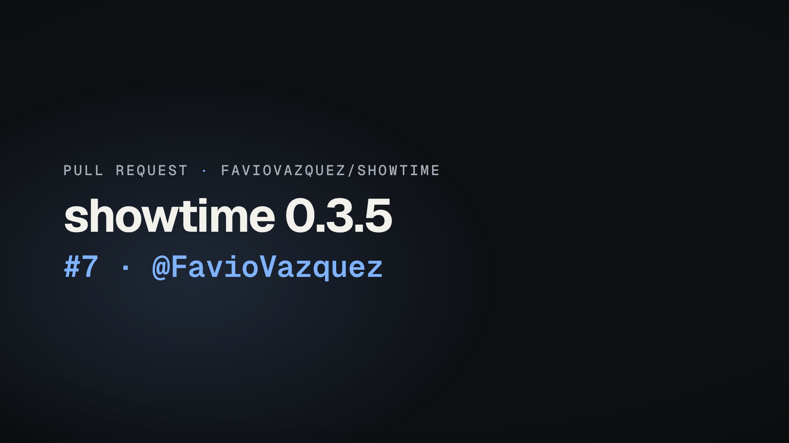

# 29 · A pull request becomes a video: showtime's own PR #7, in one command (40 s)



**Video:** [`pr-7.github.mp4`](pr-7.github.mp4) · 1920x1080 · 30 fps · 39.60 s · 9.4 MB, under GitHub's 10 MB
attachment limit · -14.0 LUFS / -1.6 dBTP · no voice. The master `pr-7.mp4` (11.8 MB, crf 22) is not kept here:
the copy is the file to paste.

**The Markdown to paste:** [`pr-7.md`](pr-7.md), the heading and the line to drop the file on:

```markdown
### What this pull request changes, in 40 s
<!-- drag pr-7.github.mp4 (9.4 MB) onto this line: GitHub uploads it and puts the video player here -->
```

## The request

> "Turn showtime's pull request #7 into a short video I can paste into its description."

**Mode:** quick, no agent in the loop: `showtime pr-video` reads the PR, writes the project, checks, renders and
exports by itself. PR #7 is showtime 0.3.5 (merged): fixes found by running showtime in a locked-down agent
sandbox, 68 files, +1,138 -159.

**On this machine `gh` was not signed in**, so the PR was read beforehand and saved: `gh pr view 7 --json
title,body,number,author,url,additions,deletions,files,commits,baseRefName,headRefName` as `pr7.json` and its diff as
`pr7.diff`. `--pr-json` and `--diff` take those files instead of asking GitHub; with `gh` signed in (or for a public
PR, GitHub's API without signing in) the command is just `showtime pr-video 7`.

## What it made

`pr-video` wrote one project in the release-video look, 8 scenes in 39.6 s, every word on screen from the PR:

| Scene | Time | What is on screen (from where) |
|---|---|---|
| hook | 0.00-2.80 s | FavioVazquez/showtime, pull request #7, "showtime 0.3.5", @FavioVazquez (title, number, author) |
| summary | 2.80-17.28 s | three of the eleven fixes the description lists, each by its bold lead, one card each; the third card adds "+ 8 more in the description" |
| files | 17.28-22.20 s | 68 files changed +1,138 -159, the largest files as a tree with +/- bars, the tests touched (the file list) |
| diff | 22.20-36.79 s | two real hunks, `skills/showtime/lib/st/brand/draft.py` line 623 and `skills/showtime/lib/st/cli_motion.py` line 300 (the diff, ranked by what it changes) |
| end | 36.79-39.60 s | the repository, the PR's URL, thanks to the author |

The three cards are the bullets' bold leads, as written: "onnxruntime's telemetry was on, while PRIVACY.md says
showtime has none.", "Site capture turned its private-address guard off for a site whose name did not resolve."
and "Node downloads ignored HTTPS_PROXY." The description's opening paragraph is longer than one card, so it is
left out, and so is its `## Checks` section (evidence, not a change); "+ 8 more" counts the fixes not shown.

**Secrets and private paths.** `pr-video` masks lines that look like secrets (keys, tokens, `.env` values) before
it writes anything and reports each one in `project/pr.json` (`"masked"`). Here the list is empty: the diff has
no such line (it mentions `.env` files, never a value). Every frame was looked at for anything private: a sheet of
one frame every 0.5 s ([`review/frames-every-0.5s.jpg`](review/frames-every-0.5s.jpg), 80 frames) and ten frames at
full size, one or two per scene. On screen there is the public repository, the public PR's words and code, a public
URL and the author's public handle; no local path, machine or account.

## Commands, in order

`showtime` is `skills/showtime/bin/showtime`.

```bash
showtime pr-video 7 --repo FavioVazquez/showtime --pr-json pr7.json --diff pr7.diff
#   wrote pr-7-video/project: 8 scenes, 39.6 s; 3 of 11 description lines, 68 files, 2 hunks
#   check PASS (0 errors, 0 warnings, 0 notes); render; pr-7.github.mp4 (9.4 MB); the Markdown to paste
showtime qa pr-7-video
showtime qa pr-7-video/pr-7.github.mp4
showtime snap pr-7-video/pr-7.github.mp4 --every 0.5 --cols 8 --thumb 360    # the sheet of every 0.5 s
```

## Timings

On a 64-core Linux machine with no GPU, nothing else running: **40.8 s from the command to the files**, of which
the check took 15.3 s, the capture of 1,188 frames 8.6 s (8 browsers), the encode 3.1 s after it, then the mix and
the GitHub copy. On a laptop expect a few minutes.

## QA summary

**PASS** (0 fail, 0 warn, 0 note), for the master and for the copy: -14.0 LUFS (target -14), -1.6 dBTP, no silent
gaps, no black or frozen stretches, frame 0 has a picture, the repository name it must show is on screen
0.00-2.97 s; phone check PASS (smallest text 7.2 pt).

## What the critic found

Self-review of the first version (0.4.0's `pr-video`, 33.7 s): the review pack's critic brief answered in the
session that made it (no separate critic agent ran on the build machine). **Ship**; would post: yes
([`review/FINDINGS.md`](review/FINDINGS.md)). Both its findings were fixed in `pr-video` for 0.4.1, and the video
here was made again with the same command ([`review/RESPONSE.md`](review/RESPONSE.md)):

- Should-fix: 15.2 s (45 % of the video) went to the description's first sentence, cut into four cards and stopped
  by "…" before its last word, while the eleven fixes the PR lists in bold appeared only as "+ 15 more". Now the
  summary is three fixes by their bold leads (14.5 s, three cards), no card is cut off.
- Polish: "+ 15 more" counted lines (the `## Checks` heading and its bullets too). Now "+ 8 more" counts the fixes
  not shown (11 in the description, 3 on screen).

Looked at again for this version: every frame on the 0.5 s sheet ([`review/frames-every-0.5s.jpg`](review/frames-every-0.5s.jpg),
80 frames) and ten full-size frames; nothing private on screen, `"masked": []` as before. One small thing: the
second hunk ends on two empty added lines, shown as bare "+" rows.

## Files

- `pr-7.github.mp4`: the video to drag into the PR (under 10 MB); `poster.jpg`: frame 0.
- `pr-7.md`: the Markdown to paste, as `pr-video` printed it.
- `project/`: what `pr-video` wrote: `index.html`, `pr.json` (the PR as read, the plan, the scenes and `masked`),
  `showtime.json`, `audio/mix.json` (a generated bed, no downloads).
- `review/`: the self-review of the first version (`FINDINGS.md`, `RESPONSE.md`, the hearing pass `audio.txt`)
  and the frame sheet of this one.

To make it again: `showtime pr-video 7 --repo FavioVazquez/showtime` with `gh` signed in, or `showtime render
project` for these exact frames.

## Sources and license

- **The pull request:** [FavioVazquez/showtime#7](https://github.com/FavioVazquez/showtime/pull/7), "showtime
  0.3.5", by the owner of this repository; its words and code are this repository's own (MIT).
- **Music:** generated by showtime on the rendering machine (no downloads, nothing to credit).
- **Fonts:** Geist and Geist Mono (showtime's neutral theme), SIL OFL 1.1, from the fonts showtime installs.
