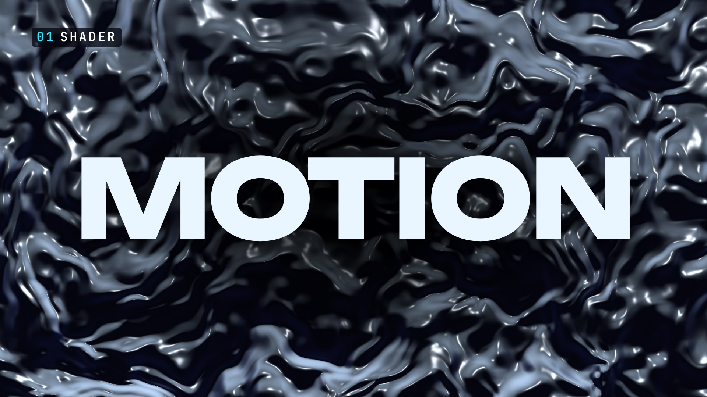
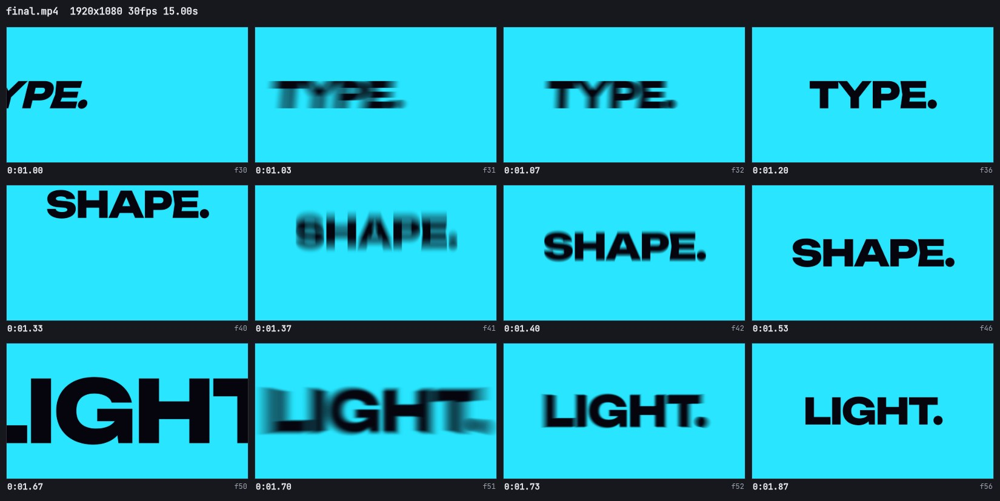

# 30 · The showreel template in four shapes, with no edits (16:9, 9:16, 1:1, 4:5)



**Videos** (15.00 s each, 30 fps; the masters are release assets, the copies under 9 MB are in this folder):

| Shape | Master | Copy | Loudness | qa |
|---|---|---|---|---|
| 16:9, 1920x1080 | [`16x9/final.mp4`](https://github.com/FavioVazquez/showtime-examples/releases/download/examples-media-v1/30-showreel-four-shapes--16x9--final.mp4) (15.4 MB) | [`16x9/final.github.mp4`](16x9/final.github.mp4) (8.3 MB) | -14.2 LUFS, -1.1 dBTP | PASS |
| 9:16, 1080x1920 | [`9x16/final.mp4`](https://github.com/FavioVazquez/showtime-examples/releases/download/examples-media-v1/30-showreel-four-shapes--9x16--final.mp4) (14.6 MB) | [`9x16/final.github.mp4`](9x16/final.github.mp4) (7.9 MB) | -14.0 LUFS, -1.3 dBTP | PASS |
| 1:1, 1080x1080 | [`1x1/final.mp4`](https://github.com/FavioVazquez/showtime-examples/releases/download/examples-media-v1/30-showreel-four-shapes--1x1--final.mp4) (10.9 MB) | [`1x1/final.github.mp4`](1x1/final.github.mp4) (8.3 MB) | -14.0 LUFS, -1.2 dBTP | PASS |
| 4:5, 1080x1350 | [`4x5/final.mp4`](https://github.com/FavioVazquez/showtime-examples/releases/download/examples-media-v1/30-showreel-four-shapes--4x5--final.mp4) (12.3 MB) | [`4x5/final.github.mp4`](4x5/final.github.mp4) (8.1 MB) | -14.0 LUFS, -1.1 dBTP | PASS |

## The request

> "Render the showreel template as it ships, with no edits, at 16:9, 9:16, 1:1 and 4:5."

**Mode:** quick, and deliberately no edits: the point is what `showtime new showreel` gives you in each shape
before you change a word. So the template's slots are as they ship, including the end card's "YOUR NAME." and
"MOTION DESIGNER" (search the page for `SLOT:` to put yours in).

## What it is

`showtime new showreel` writes the go-all-out recipe: fourteen shots in 15 s on a 120 BPM grid, each a different
technique (a liquid chrome shader, flash words, a particle burst, a three.js torus knot, a glitch, kinetic type
bands, live data, a morph, a tile grid, a tunnel, a spiro line, a halftone sphere, type as a mask, the end card),
a generated bed with a hit on every cut, and `"tone": "showreel"`, so check and qa judge density, variety and the
ending instead of a launch film's pacing. The page recomposes itself for tall and square frames: type scales by the
shorter side, the tags and centred words stay inside the vertical safe box, the name wraps to two lines, the tile
grid turns 4x8, two more type bands fill a tall frame and the 3D camera pulls back.

**The flash words snap in under a shutter blur** (0.4.1). Shot 2 is three words a third of a second each (TYPE.,
SHAPE., LIGHT.), each a 6-frame snap: a whip, a slam and a scale punch. `data-st-blur` on each word smears it over
its fast frames, as a 180° shutter would, and draws it sharp on the frame it lands. The sheets show four frames of
each word in each shape (the start pose, two smeared frames, the landing):



[9:16](review/flash-blur-9x16.jpg) · [1:1](review/flash-blur-1x1.jpg) · [4:5](review/flash-blur-4x5.jpg)

## Commands, in order

`showtime` is `skills/showtime/bin/showtime`; one job per shape.

```bash
showtime job init showreel-16x9 --request "Render the showreel template as it ships, with no edits, at 16:9, 9:16, 1:1 and 4:5."
showtime new showreel <job>/project --aspect 16:9 --job <job>     # and 9:16, 1:1, 4:5 in their own jobs
showtime check <job>/project
showtime render <job>/project --job <job>
showtime qa <job>
showtime snap <job>/final.mp4 --at 1.0,1.033,1.067,1.2,1.333,1.367,1.4,1.533,1.667,1.7,1.733,1.867 --sheet --cols 4
showtime review-pack <job>                                       # then the critic brief (see below)
showtime deliver exports <job>/final.mp4 --targets github --max-mb 9
showtime deliver poster <the 9:16 job> --at 0                    # see QA summary
```

## Timings

The four shapes rendered at the same time on a 64-core Linux machine with no GPU (the shaders and three.js run in
software WebGL there), with a load average around 140:

| Step | 16:9 | 9:16 | 1:1 | 4:5 |
|---|---|---|---|---|
| `showtime check` | 44 s | 60 s | 36 s | 33 s |
| `showtime render` (450 frames) | 55 s | 44 s | 57 s | 46 s |
| `showtime qa` | 7 s | 5 s | 8 s | 12 s |

The 1:1 and 4:5 were rendered again for 0.4.1 (see below), each alone on the same machine: check 33 s and 31 s,
render 19 s and 17 s, qa 4 s and 5 s.

## QA summary

- **check:** PASS in every shape, 0 errors; one warning each, `look_repeat`, because this machine had rendered the
  same template recently (its history, not a defect of the video). The phone check passes in each (smallest text
  7 pt in 16:9, 16.4 pt in 9:16, 12.4 pt in 1:1, 15.6 pt in 4:5); flash words are exempt from the reading time in
  this tone, and nothing sits under platform UI.
- **qa: PASS (0 fail, 0 warn) in all four**, with qa's showreel checks (density, ending, variety) passing.
  The 9:16's first qa was WARN `poster_mismatch`: the render's own `poster.jpg` is captured before the encode and
  came out 4 levels lighter than the encoded frame 0. The poster was taken again from the video
  (`deliver poster --at 0`) and qa passed.

## Rendered again for 0.4.1: the data shot in 1:1 and 4:5

The data shot (5.80-7.50 s) now lays out square and 4:5 frames as it does tall ones: the counter over the chart,
a smaller ring, the chart lower. The 1:1 and 4:5 were made again from new jobs with the same commands; 16:9 and
9:16 did not change and were not rendered again.

- **1:1:** the counter (000 to 900) used to run off the right edge for the whole shot (ink on the frame's edge in
  51 of its 52 frames). Now the counter sits at x 284-797 and its ring at x 105-997 at the end of the count; over
  the whole shot nothing drawn leaves x 64-1015 of 1080.
- **4:5:** the counter was inside the frame, but as the count ended the ring ran behind the `06 DATA` tag (its top
  at y 32 of 1350) and through the "FRAMES RENDERED" label. Now its top is at y 217, clear of the tag, and the
  label sits under it.
- **Nothing else moved:** against the earlier renders, the 52 frames of the data shot differ and every other frame
  matches (PSNR 62 dB or more at 270 px wide). The posters (frame 0) are byte for byte the ones before, so they were
  kept, and so were the flash-word sheets.
- **check:** PASS, 0 errors, the same `look_repeat` warning (this machine's history). **qa: PASS (0 fail, 0 warn,
  0 note)** in both: 1:1 -14.0 LUFS, -1.2 dBTP; 4:5 -14.0 LUFS, -1.1 dBTP. The new copies (`deliver exports
  --targets github --max-mb 9`) are 8.3 MB and 8.1 MB.

## What the critic found

Self-review: each shape's review pack answered with the showreel rubric, in the session that made the videos (no
separate critic agent ran on the build machine). One FINDINGS file per shape in [`review/`](review/).

- **16:9, 9:16, 4:5: ship.** Should-fix in all four, waived for this example: the end card shows the template's
  slot, "YOUR NAME." / "MOTION DESIGNER". Polish: 12-13 of the 26 hits sit under the bed.
- **1:1: ship after fixes, one blocker, now fixed.** In the data shot (5.80-7.50 s) the counter (000 to 900) and
  its ring were cut off by the right edge. The canvas chart picked its layout with `H > W`, so a square frame got
  the wide layout (the counter at 80 % of the width, 30 % of the frame tall) instead of the stacked one. check
  cannot see it (the chart is drawn on a canvas). Fixed in the template for 0.4.1 and the 1:1 rendered again (see
  above).

## Files

- `16x9/`, `9x16/`, `1x1/`, `4x5/`: `final.github.mp4` (the copy), `poster.jpg` (frame 0); `final.mp4` is the
  master, a release asset.
- `review/`: `flash-blur-<shape>.jpg` (the flash words frame by frame), `FINDINGS-<shape>.md` and
  `RESPONSE-<shape>.md` (the self-review and its waivers).

There is no `project/` here: with no edits, the project is the template,
[`skills/showtime/templates/showreel/`](https://github.com/FavioVazquez/showtime/tree/main/skills/showtime/templates/showreel), and `--aspect` changes only the
size in its `showtime.json`.

## Sources and license

- **The template:** showtime's own `showreel` template (MIT): original code, no outside media; the 3D object's
  lighting is generated in the page (three.js `RoomEnvironment`, MIT), nothing is fetched.
- **Music:** generated by showtime on the rendering machine (an `upbeat-tech` bed at 120 BPM and its hits), no
  downloads, nothing to credit.
- **Fonts:** Unbounded, Space Grotesk and JetBrains Mono (the neon theme), and Anton and Instrument Serif, which
  the page links; all SIL OFL 1.1, from the fonts showtime installs.
