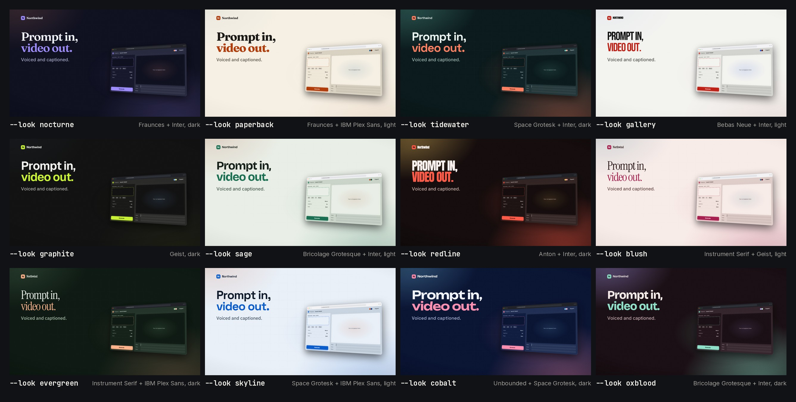

# 32 · Twelve looks, one project: the same launch film in every look signature (24 s loop + contact sheet)



**Video:** [`final.github.mp4`](final.github.mp4) · 1920x1080 · 30 fps · 24.00 s, a loop: the film in a new look
every 2 s, each look named in the corner · 7.6 MB · -14.2 LUFS / -1.6 dBTP. The master
[`final.mp4`](https://github.com/FavioVazquez/showtime-examples/releases/download/examples-media-v1/32-twelve-looks--final.mp4)
(15.1 MB, -14.3 LUFS / -1.2 dBTP) is a release asset. Rendered with showtime 0.4.1: the template's copy is the 0.4.1
copy ("Prompt in, video out."), so `new dom --look <id>` makes these twelve projects again.

**Contact sheet:** [`contact-sheet.jpg`](contact-sheet.jpg), above: the frame at 1.9 s (the template's poster) of
each project, with its look's id, type pair and ground.

## The request

> "Show one project in each of the twelve look signatures: a contact sheet of all twelve, and a 24-second loop that
> changes look every 2 seconds."

**Mode:** quick. The project is the `dom` template, a launch film for a fictional product, Northwind: one claim,
the product doing its verb, three features, the formats, an end card. Assumed and stated: the template as it ships
at its own 15 s, with one change, below; a quiet composed bed under the loop; labels in a neutral mono so they do not
belong to any look.

## What a look signature is

`showtime new dom <dir> --look <id>` starts a page template in one of twelve signatures: a palette, a type pair, a
motion feel and a ground, picked from a curated set (`showtime signature list`). The same project in each:

| Look | Ground | Type | Motion, ground |
|---|---|---|---|
| nocturne | dark: ink-blue night, lilac accent | Fraunces + Inter | smooth, soft light |
| paperback | light: warm paper, burnt orange | Fraunces + IBM Plex Sans | calm, flat |
| tidewater | dark: deep teal, coral | Space Grotesk + Inter | snappy, lit ground |
| gallery | light: white wall, poster red | Bebas Neue + Inter | snappy, flat |
| graphite | dark: charcoal, acid lime | Geist | precise, flat |
| sage | light: pale sage, deep green | Bricolage Grotesque + Inter | smooth, soft light |
| redline | dark: warm black, signal red | Anton + Inter | snappy, spotlit, deep edges |
| blush | light: rose paper, raspberry | Instrument Serif + Geist | calm, soft light |
| evergreen | dark: pine, peach | Instrument Serif + IBM Plex Sans | calm, soft light |
| skyline | light: blueprint paper, deep blue | Space Grotesk + IBM Plex Sans | precise, drafting grid |
| cobalt | dark: cobalt night, candy pink | Unbounded + Space Grotesk | bouncy, lit ground |
| oxblood | dark: wine, mint | Bricolage Grotesque + Inter | smooth, spotlit, deep edges |

`showtime signature apply <project> <id>` switches an existing project instead. Applied to a copy of the nocturne
project, `signature apply ... tidewater` gave `index.html`, `showtime.json` and `audio/mix.json` byte for byte the
same as `new dom --look tidewater`.

## How the loop is built

Each look renders only its own 2 s (a span render: 60 frames), and an EDL plays the twelve spans in order:

| Loop time | Look | Film time | |
|---|---|---|---|
| 0-2 s | nocturne | 0.8-2.8 s | the claim, settled on frame 0 |
| 2-4 s | paperback | 2-4 s | the product window comes to the centre |
| 4-6 s | tidewater | 4-6 s | the prompt types, Generate |
| 6-8 s | gallery | 6.8-8.8 s | the push to the features, which then hold |
| 8-10 s | graphite | 10.4-12.4 s | the formats fan in |
| 10-12 s | sage | 12.4-14.4 s | the end card |
| 12-24 s | redline, blush, evergreen, skyline, cobalt, oxblood | the same six windows | |

Inside each pass the windows mostly follow on (0.8-8.8 s, then 10.4-14.4 s), so the look changes mid-motion while
the layout stays; each pass ends on the end card and the next starts on the claim. The first and fourth windows
start later than the 2 s grid on the critic's word: from 0 the loop's first frame was an empty ground (from 0.5 s
the headline's second line was still growing), and from 6 s "Everything stays local." settled only 0.7 s before
the cut (now about 1.4 s); 2.0-2.8 s of the film plays twice, in two looks. Light and dark looks alternate as far as five light and seven dark allow (cobalt and oxblood
close the second pass, both dark). The spans are silent; one composed bed (deep house at 120 BPM, a bar every 2 s)
runs under all of them, so every change is on a downbeat. A pill names each look (`01/12  --look nocturne`, 46 px
mono), drawn by [`tools/labels.py`](tools/labels.py).

**No edits:** the twelve projects are what `new dom --look <id>` wrote. The template's sample URL is
`northwind.example`, a name reserved so it never resolves.

## Commands, in order

`showtime` is `skills/showtime/bin/showtime`. `<job>` is this example's job folder.

```bash
showtime job init twelve-looks --request "Show one project in each of the twelve look signatures: ..."
for id in nocturne paperback tidewater gallery graphite sage redline blush evergreen skyline cobalt oxblood; do
  showtime new dom <job>/looks/$id --look $id --job <job>
done
cp -r <job>/looks/nocturne apply-test && showtime signature apply apply-test tidewater   # = looks/tidewater
showtime check <job>/looks/<id>                                   # each of the twelve
showtime snap <job>/looks/<id> --at 1.9 -o <job>/stills/<id>.png  # each of the twelve
python tools/contact_sheet.py <job>/stills contact-sheet.jpg
showtime render <job>/looks/nocturne --from 0.8 --to 2.8 --no-audio -o <job>/spans/01-nocturne.mp4   # a span; the other eleven as in the table
python tools/labels.py <job>/labels
showtime edit check edit/loop.json
showtime edit render edit/loop.json -o <job>/final.mp4
showtime qa <job>/final.mp4
showtime review-pack <job>
showtime deliver exports <job>/final.mp4 --targets github --max-mb 8
```

## Timings

On a 64-core Linux machine with no GPU:

| Step | Time |
|---|---|
| `showtime check`, each project (four at a time) | 39-46 s |
| A span render, 60 frames at 1080p (one browser; six at a time) | 12-18 s |
| `showtime edit render` of the loop (12 sources, 12 overlays, the bed composed) | 8.7-10.3 s |
| `showtime qa` | 7.7 s |

## QA summary

- **check, each of the twelve projects:** PASS, 0 errors; one warning each, `look_repeat` (this machine's recent
  jobs share a type pair, a palette or the template's `upbeat-tech` bed: history, not a defect). The phone check
  passes.
- **qa of the loop: PASS** (0 fail, 0 warn, 1 note), -14.3 LUFS, -1.2 dBTP; on a phone speaker -17.9 LUFS, 3.6 LU
  under the mix. The note: qa's phone check needs a project, and an EDL render has none (each project was checked
  above). The first time this loop was made (on 0.4.0's template), two renders failed qa's bar and were fixed in
  the EDL, which is used unchanged here: the bed's intro came out 6.4 LU under its loudest section (lifted with
  `"section_gain": {"intro": 4}`), and its last hit still rang on the last frame, `abrupt_end` (a 1.2 s
  `fade_out`).

## What the critic found

Three rounds by a fresh critic agent, each on the pack of the render it judged ([`review/`](review/): findings,
responses and the hearing pass per round). Every round: would post, yes; no blockers.

- **Round 1** (the loop on the 2 s grid, 30 px pills): three should-fixes, all fixed. Frame 0 was the empty ground
  before the claim masks in; the pill that names each look was too small to read on a phone (now 46 px, more
  opaque); "Everything stays local." was readable for about 0.7 s (the fourth window now starts at 6.8 s).
- **Round 2**: all three confirmed fixed; one new should-fix, fixed: with the first window from 0.5 s, frame 0
  caught "video out." still growing (the first window now starts at 0.8 s).
- **Round 3**: that one confirmed fixed; one should-fix waived: on frame 0, "Voiced and captioned." is still a few
  pixels off its baseline as it rises. A later start would push the first window further into the headline's exit;
  `poster.jpg` is the settled 0.7 s frame. Polish left: the end of the first window shows the headline wiping out
  before paperback brings it back, the demo cursor starts at the frame's bottom edge (5.0 s), the pill covers a
  card's corner at 7.9 s, and cobalt's "Northwind" fills its 1:1 card. The critic declined to judge how the
  composed bed sounds: it cannot listen.

## What went wrong on the way

- The first plan was each look at `--duration 24`, so twelve consecutive 2 s windows would cover one 24 s film.
  On 0.4.0, check found a 5.4 s stretch in the hero where nothing new happens (the template held its scenes longer
  when stretched), so the films stay at the template's 15 s and the loop takes two passes of six windows. 0.4.1
  spreads the hero's beats when it gets longer, so `--duration 24` no longer holds still; the loop keeps its two
  passes.
- On 0.4.0, `render --from/--to` without `--job` ignored `-o` and named its file after the window
  (`span-2-4.mp4`), and two span renders started in the same second with the same title picked the same output
  folder, so one failed with missing frames. 0.4.1 honours `-o` for a span clip: this render wrote each span
  straight to `spans/NN-<id>.mp4`, six at a time, with no clash. Renders never overwrite, though: when the four
  spans were made again after the critic's round, `-o spans/01-nocturne.mp4` wrote `01-nocturne-2.mp4` beside the
  old one, and the first loop rendered from the old spans; the new ones were moved into place and the loop rendered
  again.

## Files

- `final.github.mp4`: the loop (copy under 8 MB); `final.mp4`: the master, a release asset; `poster.jpg`: 0.7 s.
- `contact-sheet.jpg`: the twelve looks at 1.9 s.
- `edit/loop.json`: the EDL (the twelve spans, muted, their labels, the composed bed, -14 LUFS).
- `tools/labels.py`, `tools/contact_sheet.py`: the label pills and the contact sheet.
- `review/round-1/` to `round-3/`: the critic's findings, the responses and the hearing pass of each round.

The twelve projects, their spans and the labels are not committed: the commands above make them again (the
projects are the `dom` template; `new dom --look <id>` writes the same files every time).

## Sources and license

- **Template and looks:** showtime's own `dom` template and look signatures (MIT); Northwind is its fictional sample
  product, not a real one.
- **Music:** composed by showtime on the rendering machine (`deep-house`, 120 BPM, seed 3), nothing to credit.
- **Fonts:** Fraunces, Inter, IBM Plex Sans, Space Grotesk, Bebas Neue, Geist, Bricolage Grotesque, Anton,
  Instrument Serif and Unbounded (the looks), JetBrains Mono (the labels); all SIL OFL 1.1, from the fonts showtime
  installs.
