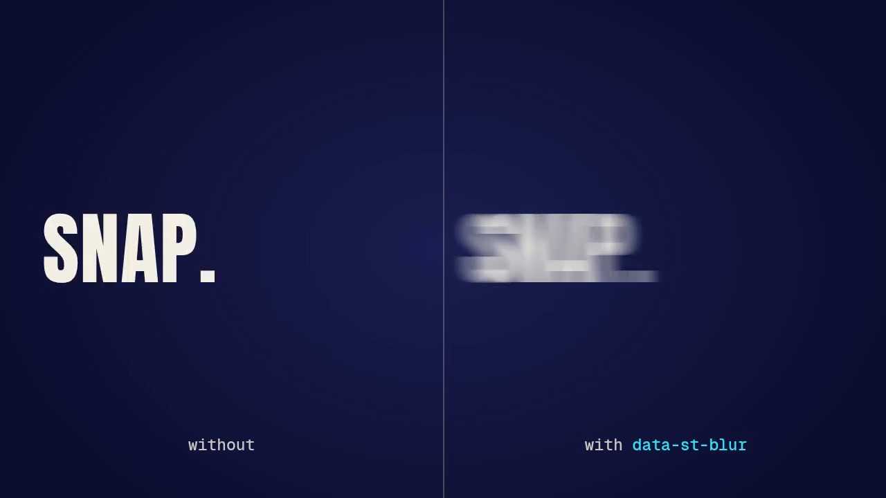

# Shutter blur: four snap beats

A 7.5-second page that shows the shutter blur of showtime 0.4.1 on four snap beats: a word whipped in from the
left, a word slammed down from above, a card punched in from three times its size, and the same whip twice,
without and with the blur. Each one is a single `data-st-blur` attribute on the element that moves: while it
moves fast, the frame shows eight copies of it posed between the frame and half a frame earlier, averaged, as a
180° camera shutter would smear it; on its slow frames and on the frame it lands it is drawn sharp, byte for
byte the same as without the attribute.



| File | What it is |
|---|---|
| `blur-720p.mp4` | the page rendered at 1280x720, 30 fps, 7.5 s, no sound |
| `poster.jpg` | the frame at 6.07 s (the comparison, mid-whip) |
| [`project/`](project/) | the page (`index.html`) and its `showtime.json` |

Render it again from the repository root:

```
skills/showtime/bin/showtime render examples/_blur/project --scale 0.6667 --crf 22 --no-audio -o examples/_blur/blur-720p.mp4
```

(`showtime render` never overwrites: delete the old file first, or it writes `blur-720p-2.mp4`. It also writes a
`blur-720p.poster.jpg` and a `blur-720p.work/` folder of logs to delete; `poster.jpg` here is
`showtime snap examples/_blur/blur-720p.mp4 --at 6.067 -o examples/_blur/poster.jpg`.)

## What each scene uses

Every move is a CSS `@keyframes` animation on a hard ease-out (`cubic-bezier(0.16, 1, 0.3, 1)`), the whole
distance in 6-9 frames, with `data-st-blur` (defaults: shutter 180°, 8 samples, threshold 6 px a frame, smear
at most half the element's shorter side) on the element that moves, never on its full-frame wrapper:

- **Whip** (0-1.9 s): `WHIP.` in from past the left edge with a little skew, 0.3 s. Blurred on 7 frames, the
  first smeared by about 150 px (capped at half its height), the last by 4.
- **Slam** (1.9-3.8 s): `SLAM.` down from above, 0.2 s, then a squash on the landing (`scale` from 1.06 x 0.9,
  a second animation on the same word). Blurred on 4 frames, sharp on the frame it lands, then softened by
  3-4 px on the first 3 frames of the squash, which moves its edges just over 6 px a frame.
- **Scale punch** (3.8-5.7 s): a card with a gradient, a shadow and its own text colour, in from `scale(3)` over
  0.3 s: the copies smear outward from its centre, like a zoom. Blurred on 6 frames.
- **Without and with** (5.7-7.5 s): the same whip in two halves of the frame, 0.26 s; only the right one carries
  `data-st-blur` (blurred on 5 frames). Both land on the same frame and hold identical.

How it works, its options (`shutter`, `samples`, `threshold`, `max`, `ST.blur(el, {pose})`) and its limits:
`skills/showtime/references/stage-api.md` § Shutter blur; when to use it: `motion-craft.md` §5.

## Checks

- `showtime check examples/_blur/project`: PASS, 0 warnings, 0 notes (the four elements move 0.6-4.5 times their
  shorter side in their fastest frame, are blurred 5-7 frames each and stay sharp for their reading time).
- `showtime qa examples/_blur/blur-720p.mp4`: WARN only for `no_audio` (the page is silent on purpose) and
  `poster_mismatch` against the auto-picked poster the render writes (not kept).
- Frame-exact: the blur's test (`skills/showtime/tests/test_blur.py`) renders a DOM page and a canvas film with 1
  and with 3 workers and compares every frame byte for byte, and against the same pages without the blur only the
  fast frames differ.
- Cost: this page renders in about 3 s on our test machine (64 cores, no GPU). A blurred frame costs about 8 ms
  more per blurred word at 1080p there (render.md § Speed); only the 4-7 fast frames of each snap pay it.

## Credits

No media. The type is Anton and Geist Mono, both SIL Open Font License 1.1, from the font files showtime installs.
