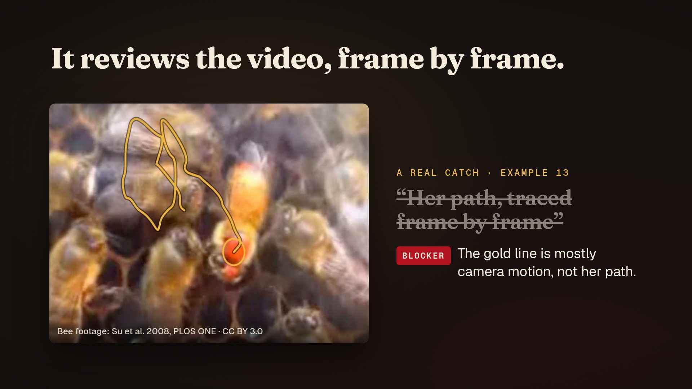

# The crew film

A 45-second film made with showtime that shows how the crew works. Your agent is the director. It
writes one member a brief in `TASK.md`, the member works alone and hands back `RESULT.md` with its
files, and the ten roles never talk to each other or to you. Then comes a real catch from
[example 13](../13-wikipedia-waggle-dance/): the critic, who didn't build that video, found that the
poster's caption "Her path, traced frame by frame" was false. The film ends on the rule that fixes go
back to the same member. There is no voice-over; the type carries it.

| File | What it is | Where it lives |
|---|---|---|
| `crew-16x9.mp4` | 1920x1080, 60 fps, 45 s, H.264 + AAC, -14 LUFS, 19 MB | release asset |
| `crew-1x1.mp4` | 1080x1080, laid out again for square feeds, 14 MB | release asset |
| `crew-9x16.mp4` | 1080x1920, laid out again for vertical feeds, 18 MB | release asset |
| `poster.jpg` | the frame at 31.4 s (the critic's BLOCKER note) | git |
| `credits.txt` | the music credit and the sources of the example 13 frames | git |
| [`project/`](project/) | the film: one HTML page (`index.html`, all three sizes), its settings, the mix and [`CLAIMS.md`](project/CLAIMS.md), a source for every line on screen | git |

The release assets are listed in [`../MEDIA.json`](../MEDIA.json) and published with
`python3 scripts/publish_media.py --upload`.

## What is and isn't claimed

- The `TASK.md` and `RESULT.md` cards use the real field names from `skills/showtime/references/crew.md`,
  with example values; they are labelled "example" on screen.
- The example 13 frames are real: before is the earlier render at 0:04.60, after is the shipped video at
  the same time.
- The film does not say the crew made the 22 examples. Those sessions had no sub-agent tool, so the
  director played each role from its brief, and each example's README says so. In example 13 the
  director applied the critic's fix.

## Credits

- Music: "Artemis" by Scott Buckley, [CC BY 4.0](https://creativecommons.org/licenses/by/4.0/)
  ([scottbuckley.com.au](https://www.scottbuckley.com.au/)). The music ships only inside the films, never
  as a separate audio file, and it must not be registered with Content ID or any other fingerprinting
  service.
- Bee footage inside the example 13 frames: Su et al. 2008, PLOS ONE,
  [CC BY 3.0](https://creativecommons.org/licenses/by/3.0/), via Wikimedia Commons. Example 13 adapts the
  English Wikipedia article "Waggle dance" and is [CC BY-SA 4.0](https://creativecommons.org/licenses/by-sa/4.0/).
- Type: Fraunces, Geist and Geist Mono (SIL Open Font License 1.1). The mark: showtime brand assets.

Full credits: [`credits.txt`](credits.txt).
