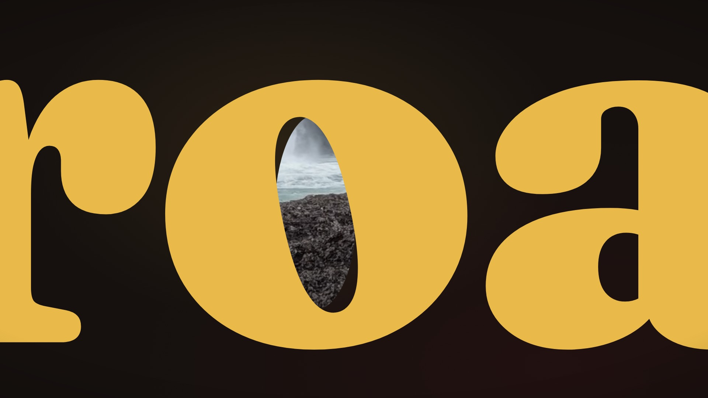

# The showtime launch film

A 40-second film made with showtime: three real one-line requests from the examples are set in big type,
and the camera flies through a letter of each into the video that request produced. It then pulls back to
a wall of more real results, shows an HTML video playing on a phone, and lands on the name. There are no
hard cuts; every move is continuous and cut to the music's phrases.

| File | What it is | Where it lives |
|---|---|---|
| `launch-16x9.mp4` | 1920x1080, 60 fps, 40 s, H.264 + AAC, -14 LUFS, 68 MB | release asset |
| `launch-1x1.mp4` | 1080x1080, a native square layout of the same film, 45 MB | release asset |
| `launch-9x16.mp4` | 1080x1920, a native vertical layout; type stays inside the feed safe zone, 65 MB | release asset |
| `launch-16x9.html` | the 16:9 film as one HTML file with 6 chapters and no network requests, 12 MB | release asset |
| `teaser-16x9.mp4`, `teaser-16x9.webm` | a silent 6-second loop (the flight through the o of "road"), for the site's hero | git |
| `poster.jpg` | the frame at 3.65 s | git |
| `credits.txt` | the music credit and the sources of every picture in the film | git |

The release assets are listed in [`../MEDIA.json`](../MEDIA.json) and published with
`python3 scripts/publish_media.py --upload`.

## Music

"With These Hands" by Scott Buckley, [CC BY 4.0](https://creativecommons.org/licenses/by/4.0/)
([scottbuckley.com.au](https://www.scottbuckley.com.au/library/with-these-hands/)). The composer's own terms
apply as well: the music ships only inside the film (the MP4s and the HTML video), never as a separate audio
file, and it must not be registered with Content ID or any other fingerprinting service. The teaser is silent.

## Pictures

Every picture in the film is a showtime example video, shown without its sound. `credits.txt` lists each
one's sources (public-domain, CC0 and project-owned material); each example's folder has the full credits.
