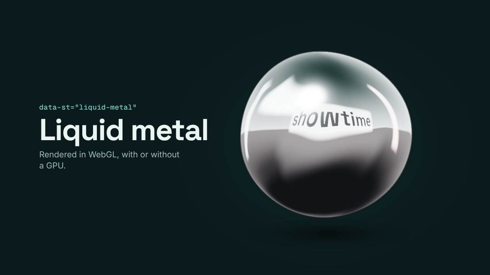

# Looks: fluted glass, tilt-shift, liquid metal, god rays, mesh gradient, marble, metaballs

An 18-second page that shows the seven WebGL looks of showtime 0.4.1, one scene each: a pane of fluted glass
that forms over a photo of Jökulsárlón, a tilt-shift band that travels from the street up to the door of
Hallgrímskirkja, a liquid-metal blob that reflects the word "showtime" from a soft box behind the viewer, god rays
that come up behind the word "Northlight", a mesh gradient drifting behind a title, white marble whose veins flow
slowly, and, after a gooey wipe across the cut, metaballs that grow in, drift apart and gather into one blob.
They are components like any other (`data-st="fluted-glass"`, `data-st="tilt-shift"`, `data-st="liquid-metal"`,
`data-st="god-rays"`, `data-st="mesh-gradient"`, `data-st="marble"`, `data-st="metaballs"`), drawn by showtime's
own WebGL layer, and need no GPU.



| File | What it is |
|---|---|
| `looks-720p.mp4` | the page rendered at 1280x720, 30 fps, 18.4 s, no sound |
| `poster.jpg` | the frame at 6.6 s |
| [`project/`](project/) | the page (`index.html`), its `showtime.json` and the two photos with their licence files |

Render it again from the repository root:

```
skills/showtime/bin/showtime render examples/_looks/project --scale 0.6667 --crf 22 --no-audio -o examples/_looks/looks-720p.mp4
```

(`showtime render` never overwrites: delete the old file first, or it writes `looks-720p-2.mp4`. It also writes
`looks-720p.poster.jpg`, kept here as `poster.jpg`, and a `looks-720p.work/` folder of logs to delete.)

## What each scene uses

- **Fluted glass** (0-2.8 s): the `fluted` preset over `media/jokulsarlon.jpg`, with `keys` that take the
  depth from 0 to 0.62 in the first 1.2 s, so the pane forms on screen; the photo then drifts in behind it.
- **Tilt-shift** (2.8-5.4 s): the `miniature` preset over `media/reykjavik.jpg`; one key moves the sharp band
  from the people in the street (`y` 0.86) up to the church door (0.66) over 1.6 s.
- **Liquid metal** (5.4-8 s): `shape="blob"`, `text="showtime"`, `liquid="0.45"` (low enough for the word to
  read), growing in over 0.7 s. The studio it reflects comes from the page's colours: the Tidewater look
  signature, a dark ground, so the `auto` preset picks chrome.
- **God rays** (8-10.6 s): the `dawn` preset with `text="Northlight"`: the light comes up over 1 s (`in`) behind
  the word and one key moves it from `x` 0.44 to 0.56, so the beams sweep across the letters.
- **Mesh gradient** (10.6-13.2 s): the `calm` preset (its default) on a pale ground, Tidewater's colours in a light
  scene (`--bg: #f2eee6`); the colour points drift at `speed` 5 (a loop of a few seconds: the default is a quiet half minute) behind the title.
- **Marble** (13.2-15.8 s): the `auto` preset, which picks white `carrara` on that pale ground, its veins flowing
  at `speed` 1.4.
- **Metaballs** (15.8-18.4 s): a `wipe` in a layer from 15.2 to 16.4 s covers the frame across the cut at 15.8 s;
  then the `merge` preset (`size` 0.13, right of the title) grows in over 0.5 s (`in`) and one key takes `spread`
  to 0.1, so the satellites gather into one blob.

Options, presets, costs and fallbacks: `skills/showtime/references/components.md` §7.

## Checks

- Frame-exact: the looks' test (`skills/showtime/tests/test_looks.py`) renders a page with the first three looks
  moving, and one with the four newer ones, with 1 and with 3 workers, with and without a GPU (and the newer
  ones without WebGL), and compares every frame byte for byte.
- Without WebGL each look draws its fallback; `showtime check` reports it (`look_fallback`).
- `showtime check` estimates what each look costs per frame without a GPU and warns above 50 ms
  (`look_budget`); every look on this page stays under it.

## Credits

- "Iceberg reflection in Jökulsárlón (Unsplash)" by Jeremy Bishop, via Wikimedia Commons, CC0 1.0.
- "Hallgrimskirkja, Reykjavík, Iceland (Unsplash)" by Ferdinand Stöhr, via Wikimedia Commons, CC0 1.0.

Both were resized to 1920 px wide for this page; their licence files sit next to them in `project/media/`.
