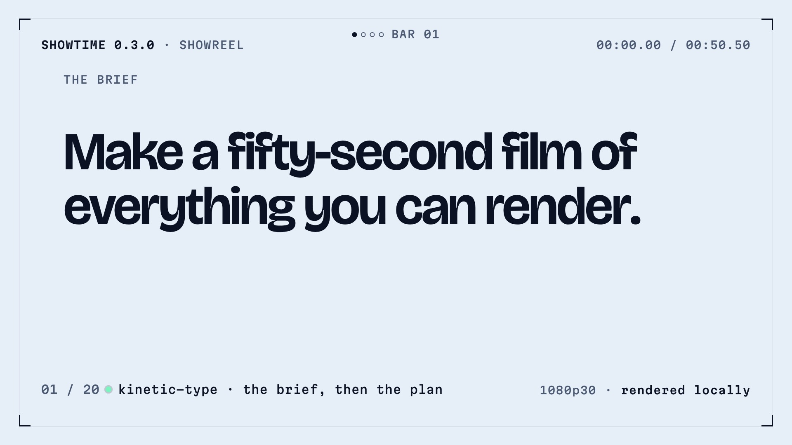

# The 0.3.0 showreel

A 50-second film made with showtime 0.3.0 on one machine, showing what it can render. It opens on a
brief set in big type, runs six words on the beat (Type, Depth, Data, Math, Voice, Proof), then gives each
one a shot: kinetic type, 60,000 points that assemble into a Möbius film strip in three.js, the Keeling
curve drawn from NOAA data, a Manim proof that 1/2 + 1/4 + 1/8 + ... = 1, a voice line made on the same
machine with word-synced captions, this film's own checks and its receipt. A thin HUD frame names the
feature each shot uses. It ends on the wordmark and the promise, on the music's last drum hit.

| File | What it is | Where it lives |
|---|---|---|
| `showreel-16x9.mp4` | 1920x1080, 30 fps, 50.5 s, H.264 + AAC, -14 LUFS, -1.5 dBTP, 41 MB | release asset |
| `showreel-16x9.html` | the same film as one HTML file with its sound, no network requests, 12 MB | release asset |
| `teaser-16x9.mp4`, `teaser-16x9.webm` | a silent 7.7-second loop (10.7-18.4 s: the film strip, then the chart), 1600x900, for the site's hero | git |
| `teaser-16x9.jpg` | the teaser's still (the film strip at 13.7 s), for viewers who ask for reduced motion | git |
| `poster.jpg` | the frame at 0 s | git |
| `credits.txt` | the music, data, voice and type credits | git |
| [`project/`](project/) | the film: one HTML page (`index.html`, `app.js`, `three-strip.js`), its settings, the mix and sound effects, the voice line, the data behind every number on screen, the Manim scene (`manim/`) and its 120 rendered frames, Martian Mono with its license | git |

The release assets are listed in [`../MEDIA.json`](../MEDIA.json) and published with
`python3 scripts/publish_media.py --upload`.

## How it was made

- One showtime 0.3.0 job on a 64-core Linux machine, with the default quality review: the critic compared
  each new render with the previous best in both orders, three rounds (the cap), and the newer render was
  preferred in both orders every time.
- 6 full renders, 3 partial renders spliced into a full one, 11 `showtime qa` runs. The final render took
  53 s for 1,515 frames, encode included. From the start of the job to the final film: 1 h 34 min.
- `showtime check`: 0 errors. `showtime qa`: 0 failures; -14.0 LUFS, -1.5 dBTP, phone check passed. Its
  two warnings (many scenes, many hard cuts) are the showreel's grammar, kept on purpose.
- The pacing (hard cuts on the music's 119.7 BPM beat grid, a HUD naming each shot's feature) followed a style reference
  for grammar only; the palette, type, subjects, layouts, opening, ending and music are this film's own.
- The Manim clip plays as 120 JPG frames swapped per film frame rather than a `<video>` layer, which showed
  a stale frame on some seeks in this page.

**Palette:** deep ink `#0A1224` (the ground), ice `#E6EEF8` (text, 15.96:1 on the ground), acid mint
`#7BF5C0` (the one accent, 13.93:1), muted `#8C9AB3` (HUD labels, 6.57:1), surface `#111C35` (panels).
**Type:** Bricolage Grotesque (display) and Martian Mono (HUD and data).

## What is and isn't claimed

- The opening sentence, "Make a fifty-second film of everything you can render.", is a stylised brief.
  The job's real request was a longer director's brief; the film doesn't claim it came from one line. Its
  closing line, "One sentence in. A finished film out.", is showtime's promise, not how this film was made.
- The numbers on screen come from this job: frames and length from `showtime.json`, loudness and peak from
  `showtime qa`, "full render: about 1 min" from the render logs (61 s for the first full render, 53 s for
  the final one), the cores from the machine, and the critic line from round 1's findings. They are in
  [`project/data/`](project/data/).
- The CO2 curve is NOAA GML's Mauna Loa annual mean (Scripps before 1974): 315.98 ppm in 1959, 427.35 ppm
  in 2025, so +111.37 ppm.
- The voice line is Kokoro (voice af_heart), made on the rendering machine. The thumbnails in the checks and
  closing shots are frames of this film.
- Left open after the third critic round: the 1-second globe shot opens dim for a few frames, the phone's
  screen overhangs its body slightly, "CO2" has no subscript, and the credit line sits close to the HUD
  footer on the end card.

## Credits

- Music: "Born Of The Sky" by Scott Buckley, [CC BY 4.0](https://creativecommons.org/licenses/by/4.0/)
  ([scottbuckley.com.au](https://www.scottbuckley.com.au/)). The music ships only inside the film, never as
  a separate audio file, and it must not be registered with Content ID or any other fingerprinting service.
- CO2 data: NOAA Global Monitoring Laboratory / Scripps Institution of Oceanography
  ([gml.noaa.gov](https://gml.noaa.gov/ccgg/trends/)), public domain. Globe: Natural Earth, public domain.
- Type: Bricolage Grotesque and Martian Mono (SIL Open Font License 1.1). The wordmark: showtime brand
  assets, recoloured.

Full credits: [`credits.txt`](credits.txt).
