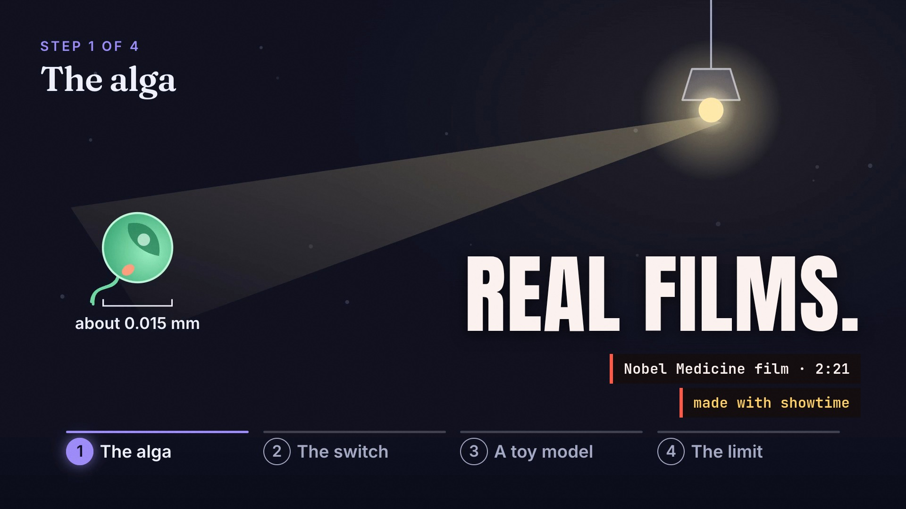

# The 0.4.1 showreel

A 56-second film (55.5 s) made with showtime 0.4.1, cut on the beat of Scott Buckley's "Supernova". It opens on
a chain of match cuts through real showtime films (the Nobel Medicine, Physics and Chemistry films, the maths film,
the same Chemistry film in Spanish), runs the toolkit two beats per shot (12 looks, 75 local voices, 8 languages,
captions, cutting pauses from a transcript, 297 music tracks, the hearing pass, the agent critic, qa, storyboard,
questions that stop and ask, talking-head cards, notes on frames, data stories, Manim, three.js, a word behind the
speaker, metaballs, Claude Design to MP4, range links, fluted glass, tilt-shift, liquid metal), lands on the proof
card ("Seven films. Two days."), pulls back to a wall of the films playing, and ends on the lockup and the promise.

| File | What it is | Where it lives |
|---|---|---|
| `showreel-16x9.mp4` | 1920x1080, 60 fps, 55.5 s, H.264 + AAC, -14.1 LUFS, -1.5 dBTP, 107 MB | release asset |
| `teaser-16x9.mp4`, `teaser-16x9.webm` | the silent 12.4-second hero loop (film 28.4-40.9 s: data stories to liquid metal), 1920x1080, 60 fps, 4.8 MB (H.264) and 4.6 MB (VP9), for the site's hero | git |
| `teaser-16x9.jpg` | the teaser's still (metaballs, 5.5 s into the loop), 1600x900, for viewers who ask for reduced motion | git |
| `poster.jpg` | the film's poster, the frame at 0 s | git |
| `credits.txt` | the music and footage credits | git |

The release asset is listed in [`../MEDIA.json`](../MEDIA.json) and published with
`python3 scripts/publish_media.py --upload`. The 0.3.0 showreel stays in [`../_showreel/`](../_showreel/).

## How it was made

- One showtime job (concept "Match Cut", with the default quality review): a storyboard of 47 shots on the music's
  beat grid, every cut two frames before a beat, each match cut checked on both sides at rest and mid-motion.
  One HTML page renders the 16:9 film and its 9:16 and 1:1 cuts.
- 36 preview renders and two critic rounds (16 should-fix findings: 15 fixed, 1 waived because the 1080p final
  rendered on a separate machine by plan). The end card states the final render: 2 min 23 s on a 64-core CPU,
  no GPU.
- `showtime qa` on the final: PASS on loudness (-14.1 LUFS, -1.5 dBTP; -16.6 LUFS on a phone speaker), no black or
  frozen stretches; one warning (the stacked caption boxes of example 06's burned-in captions at 23.6-29.1 s,
  which are that example's own captions).
- The hero loop is a silent render of 28.43-40.85 s of the same page (745 frames); its wrap is a hard cut on the
  same two-beat rhythm. `teaser-16x9.mp4` is `showtime deliver exports hero-loop-16x9.mp4 --targets web --max-mb 5`;
  `teaser-16x9.webm` is VP9 from the same master (two-pass, 3 Mbit/s, BT.709, no audio), the codec the 0.3.0
  teaser's WebM used; `teaser-16x9.jpg` is `showtime snap hero-loop-16x9.mp4 --at 5.5 --width 1600`.

## What is and isn't claimed

- Every number on screen was checked against the job ledgers, receipts and catalog before the render: the seven
  films (made 6 Oct 04:00 to 7 Oct 09:53, 2026, on one Mac), their lengths (whole seconds, floored), voices,
  languages and looks; 75 voices and 8 languages (Kokoro's built-in set, en-us and en-gb counted as one language);
  297 music tracks (most CC BY, never "all CC0"); example 06's cut (five pauses, 81.0 s to 72.3 s, no "ums").
- "REAL DATA" sits over the Physics film's IceCube event replay, which that film builds from the published event
  data. The notes page shot is the real `showtime review open` page with two staged notes.

## Credits

- Music: 'Supernova' by Scott Buckley – released under CC-BY 4.0. www.scottbuckley.com.au
  ([CC BY 4.0](https://creativecommons.org/licenses/by/4.0/)). Time-stretched +1.96 % to the film's grid. The music
  ships only inside the film, never as a separate audio file, and it must not be registered with Content ID or
  any other fingerprinting service.
- Footage: NASA (public domain): the Christina Koch interview (example 06) and the Sarah Jones GOLD mission
  interview (example 23); the Apollo 17 legends and Artemis leaders panel (example 24) is in the project's
  alternate T11 shot only.
- Data: IceCube event data, IceCube Collaboration (DOI 10.21234/gr2021), as credited in the Physics film.
- Photo in the tilt-shift shot: "Godafoss 3" by Tord Dellsen via Wikimedia Commons (CC0 1.0), as used in
  example 19.
- Everything else: real showtime films and frames made with showtime.

Full credits: [`credits.txt`](credits.txt).
